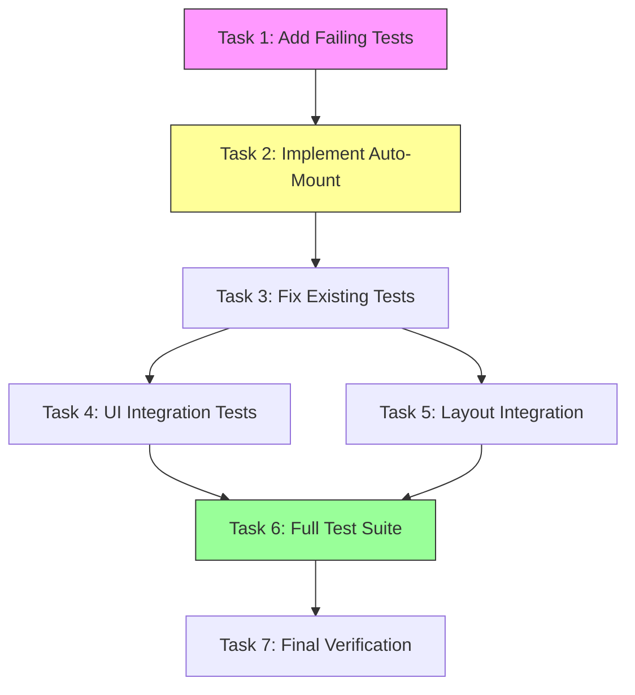
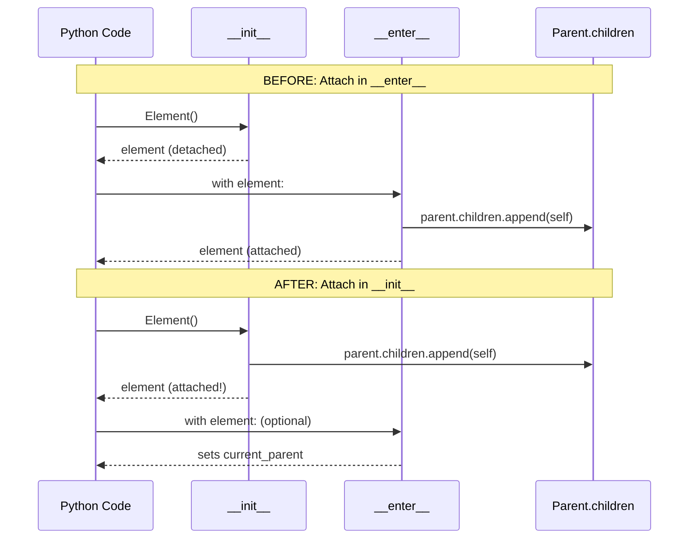
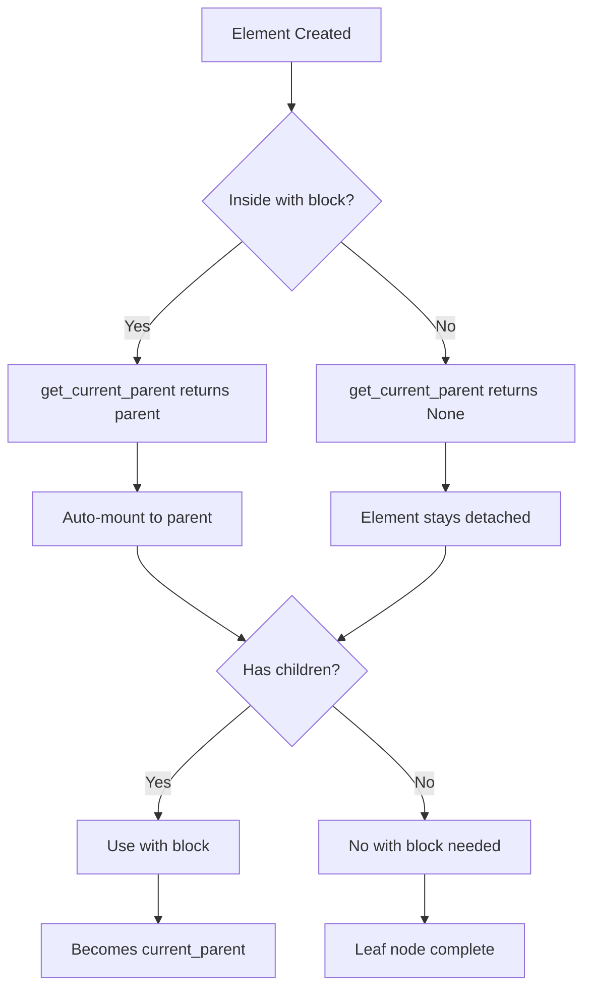

# Auto-Mount Leaf Nodes Implementation Plan

> **For Claude:** REQUIRED SUB-SKILL: Use super:executing-plans to implement this plan task-by-task.
> **Python Skills:** Reference python:python-testing-patterns for tests, python:uv-package-manager for commands.

**Goal:** Allow leaf nodes like `Text("Hello")` and `Input()` to auto-mount to the current parent without requiring `with` blocks.

**Architecture:** Move the "attach to parent" logic from `__enter__` to `__init__`. Elements immediately snap into the active parent on creation. The `with` block is only needed when an element has children. Detached elements (created outside any `with` block) remain unattached.

**Tech Stack:** Python 3.14+, pytest, contextvars

**Commands:** All Python commands use `uv run` prefix

---

## Diagrams

### Task Dependency Flow



### Element Lifecycle: Before vs After



### Auto-Mount Decision Tree



---

## Summary

Currently, every element requires a `with` block:
```python
with Div():
    with Text("Hello"):
        pass  # Noise!
```

After this change:
```python
with Div():
    Text("Hello")  # Clean!
```

The change is backwards-compatible: `with Text("Hello"):` still works for the rare case where Text needs children.

---

### Task 1: Add Failing Test for Auto-Mount Behavior

**Files:**
- Modify: `tests/test_element.py`

**Step 1: Write the failing test**

Add these tests to `tests/test_element.py`:

```python
def test_element_auto_mounts_to_current_parent():
    """Element created inside a with block auto-attaches to parent."""
    parent = Element()

    with parent:
        child = Element()  # No 'with' block needed

    assert child in parent.children
    assert child.parent is parent


def test_element_detached_when_no_parent():
    """Element created outside any with block is detached."""
    el = Element()

    assert el.parent is None
    assert el.children == []


def test_auto_mount_multiple_children():
    """Multiple elements auto-mount in creation order."""
    parent = Element()

    with parent:
        child1 = Element()
        child2 = Element()
        child3 = Element()

    assert parent.children == [child1, child2, child3]
    assert all(c.parent is parent for c in parent.children)


def test_auto_mount_mixed_with_context_manager():
    """Auto-mount works alongside traditional with blocks."""
    parent = Element()

    with parent:
        leaf1 = Element()  # Auto-mounted
        with Element() as container:  # Traditional with block
            nested_leaf = Element()  # Auto-mounted to container
        leaf2 = Element()  # Auto-mounted to parent

    assert parent.children == [leaf1, container, leaf2]
    assert container.children == [nested_leaf]
    assert nested_leaf.parent is container
```

**Step 2: Run tests to verify they fail**

Run: `uv run pytest tests/test_element.py -v -k "auto_mount or detached"`

Expected: FAIL - elements are not auto-mounting (children list empty)

**Step 3: Commit failing tests**

```bash
git add tests/test_element.py
git commit -m "$(cat <<'EOF'
test(element): add failing tests for auto-mount behavior

Tests verify that elements auto-attach to parent on creation,
supporting leaf node syntax without 'with' blocks.
EOF
)"
```

---

### Task 2: Implement Auto-Mount in Element.__init__

**Files:**
- Modify: `src/flow/element.py:22-38`

**Step 1: Update Element.__init__ to auto-mount**

Replace the `__init__` and `__enter__` methods in `src/flow/element.py`:

```python
def __init__(self, **props: Any) -> None:
    self.tag: str = self.__class__.__name__
    self.props: dict[str, Any] = props
    self.children: list[Element] = []
    self._token: Token[Element | None] | None = None

    # Auto-Mount: Immediately attach to the active container
    # This allows 'Text("Hi")' to work without a 'with' block
    self.parent = get_current_parent()
    if self.parent is not None:
        self.parent.children.append(self)

def __enter__(self) -> Element:
    # Context Entry: Only needed if this element HAS children
    # Element is already attached to parent via __init__
    self._token = set_current_parent(self)
    return self
```

**Step 2: Run tests to verify they pass**

Run: `uv run pytest tests/test_element.py -v`

Expected: All tests PASS

**Step 3: Commit implementation**

```bash
git add src/flow/element.py
git commit -m "$(cat <<'EOF'
feat(element): auto-mount elements to parent on creation

Elements now attach to the current parent in __init__ instead of
__enter__. This enables leaf node syntax:

    with Div():
        Text("Hello")  # No 'with' block needed

The 'with' block is now only required when an element has children.
Detached elements (created outside any context) remain unattached.
EOF
)"
```

---

### Task 3: Fix Existing Tests for New Behavior

**Files:**
- Modify: `tests/test_element.py:35-59`

The existing tests `test_element_nesting_builds_tree` and `test_multiple_children` use patterns that now behave differently. The test at line 37-44 creates elements BEFORE the `with` block, so they won't auto-mount.

**Step 1: Run existing tests to identify failures**

Run: `uv run pytest tests/test_element.py -v`

Expected: Some tests may fail due to changed behavior

**Step 2: Update tests to match new semantics**

Update `test_element_nesting_builds_tree` (lines 35-44):

```python
def test_element_nesting_builds_tree():
    """Nested context managers build parent-child relationships."""
    parent = Element()

    with parent:
        child = Element()  # Created INSIDE parent context

    assert child in parent.children
    assert child.parent is parent
```

Update `test_multiple_children` (lines 47-59):

```python
def test_multiple_children():
    """Multiple children can be added to a parent."""
    parent = Element()

    with parent:
        child1 = Element()
        child2 = Element()

    assert parent.children == [child1, child2]
```

**Step 3: Run tests to verify they pass**

Run: `uv run pytest tests/test_element.py -v`

Expected: All tests PASS

**Step 4: Commit test updates**

```bash
git add tests/test_element.py
git commit -m "$(cat <<'EOF'
test(element): update tests for auto-mount semantics

Tests now create child elements inside parent context to match
the new auto-mount behavior.
EOF
)"
```

---

### Task 4: Add UI Element Integration Tests

**Files:**
- Create: `tests/ui/test_leaf_syntax.py`

**Step 1: Write integration tests for UI elements**

Create `tests/ui/test_leaf_syntax.py`:

```python
"""Tests for leaf node syntax with UI elements."""

from flow.ui.elements import Button, Div, Input, Text, VStack


def test_text_auto_mounts():
    """Text element auto-mounts without with block."""
    with Div() as container:
        text = Text("Hello, World!")

    assert text in container.children
    assert text.content == "Hello, World!"


def test_input_auto_mounts():
    """Input element auto-mounts without with block."""
    with Div() as container:
        input_el = Input(placeholder="Enter name")

    assert input_el in container.children


def test_button_auto_mounts():
    """Button element auto-mounts without with block."""
    clicked = []

    with Div() as container:
        btn = Button("Click me", on_click=lambda: clicked.append(1))

    assert btn in container.children
    assert btn.label == "Click me"


def test_form_layout_with_leaf_syntax():
    """Complex form layout using leaf syntax."""
    with Div() as form:
        Text("Login Form")

        with VStack() as fields:
            Text("Username")
            Input(placeholder="Enter username")
            Text("Password")
            Input(placeholder="Enter password")

        Button("Submit")

    # Form has: Text, VStack, Button
    assert len(form.children) == 3
    assert isinstance(form.children[0], Text)
    assert isinstance(form.children[1], VStack)
    assert isinstance(form.children[2], Button)

    # VStack has: Text, Input, Text, Input
    assert len(fields.children) == 4


def test_nested_containers_with_leaf_nodes():
    """Deeply nested containers with auto-mounted leaves."""
    with Div() as root:
        with VStack() as outer:
            Text("Outer")
            with VStack() as inner:
                Text("Inner 1")
                Text("Inner 2")
            Text("After inner")

    assert len(outer.children) == 3  # Text, VStack, Text
    assert len(inner.children) == 2  # Text, Text
```

**Step 2: Run tests to verify they pass**

Run: `uv run pytest tests/ui/test_leaf_syntax.py -v`

Expected: All tests PASS

**Step 3: Commit integration tests**

```bash
git add tests/ui/test_leaf_syntax.py
git commit -m "$(cat <<'EOF'
test(ui): add integration tests for leaf node syntax

Tests verify that Text, Input, Button and other leaf elements
auto-mount correctly in realistic form layouts.
EOF
)"
```

---

### Task 5: Verify Layout and Render Integration

**Files:**
- Modify: `tests/test_element_layout.py` (if needed)

**Step 1: Run existing layout tests**

Run: `uv run pytest tests/test_element_layout.py -v`

Expected: All existing tests PASS (layout uses element.children which still works)

**Step 2: Add layout test with leaf syntax**

Add to `tests/test_element_layout.py`:

```python
def test_layout_with_leaf_syntax():
    """Layout computation works with auto-mounted elements."""
    from flow.layout.compute import compute_layout
    from flow.layout.types import Size
    from flow.ui.elements import Div, Text

    with Div(width=800, height=600) as root:
        Text("Header")
        with Div() as body:
            Text("Content")
        Text("Footer")

    layout_node = root.to_layout_node()
    compute_layout(layout_node, Size(800, 600))

    # Verify layout was computed for all children
    assert len(layout_node.children) == 3
    assert all(child.layout.width >= 0 for child in layout_node.children)
```

**Step 3: Run tests to verify**

Run: `uv run pytest tests/test_element_layout.py -v`

Expected: All tests PASS

**Step 4: Commit if changes were made**

```bash
git add tests/test_element_layout.py
git commit -m "$(cat <<'EOF'
test(layout): add test for layout with leaf node syntax

Verifies layout computation works correctly with auto-mounted elements.
EOF
)"
```

---

### Task 6: Run Full Test Suite and Type Checks

**Files:**
- None (verification only)

**Step 1: Run full test suite**

Run: `uv run pytest tests/ -v`

Expected: All tests PASS

**Step 2: Run type checking**

Run: `uv run mypy src/flow/element.py src/flow/context.py`

Expected: No type errors

**Step 3: Run linting**

Run: `uv run ruff check src/flow/element.py tests/test_element.py`

Expected: No linting errors

**Step 4: Run pre-commit hooks**

Run: `uv run pre-commit run --all-files`

Expected: All checks PASS

---

### Task 7: Final Commit and Summary

**Step 1: Create summary commit if not already done**

If all previous commits were made individually, no action needed.

**Step 2: Verify git log**

Run: `git log --oneline -5`

Expected: See commits for:
- test(element): add failing tests for auto-mount behavior
- feat(element): auto-mount elements to parent on creation
- test(element): update tests for auto-mount semantics
- test(ui): add integration tests for leaf node syntax
- test(layout): add test for layout with leaf node syntax

---

## Edge Cases Handled

1. **Detached elements**: `header = Text("Title")` at module level creates detached element (parent=None)
2. **Reusable components**: Elements can be created detached and mounted later
3. **Backwards compatibility**: `with Text("Hi"):` still works for rare cases needing children
4. **Thread safety**: Uses contextvars which are thread-safe by design

## Verification Checklist

- [ ] All existing tests pass
- [ ] New auto-mount tests pass
- [ ] UI element integration tests pass
- [ ] Layout integration works
- [ ] Type checks pass
- [ ] Linting passes
- [ ] Pre-commit hooks pass
