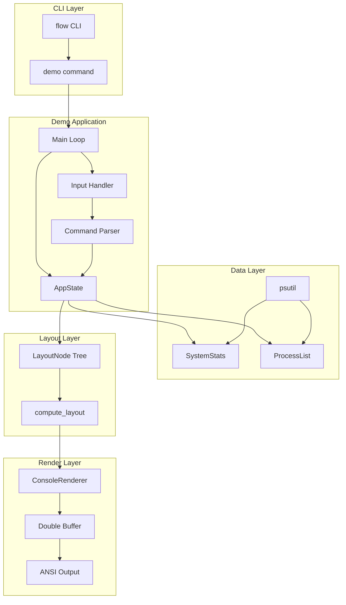

# Console Demo Implementation Plan

> **For Claude:** REQUIRED SUB-SKILL: Use super:executing-plans to implement this plan task-by-task.
> **Python Skills:** Reference python:python-testing-patterns for tests, python:uv-package-manager for commands.

**Goal:** Implement a System Monitor Dashboard as an interactive tutorial demonstrating the console renderer with Yoga layout integration.

**Access:** `uv run flow demo console`

**Dependencies:** `psutil` (added as optional dependency)

**Estimated Size:** ~360 lines in single file with step-by-step comments

---

## Architecture Diagram



## Dashboard Layout Structure

```
┌─ Root (column, height=100%) ─────────────────────────────┐
│ ┌─ Header (row, height=1, justify=space-between) ──────┐ │
│ │ "System Monitor"                        "12:34:56"   │ │
│ └──────────────────────────────────────────────────────┘ │
│ ┌─ Main (row, flex_grow=1, gap=1) ─────────────────────┐ │
│ │ ┌─ Sidebar (column, width=18) ─┐ ┌─ Content (grow=1)─┐│ │
│ │ │ CPU  [████████░░░░] 45%      │ │ PID   NAME    CPU │││
│ │ │ MEM  [████████░░░░] 8.2G     │ │ 1234  python  12% │││
│ │ │ DISK [███░░░░░░░░░] 120G     │ │ 5678  chrome   8% │││
│ │ │ ⠋ Refreshing...              │ │ ...               │││
│ │ └──────────────────────────────┘ └────────────────────┘│
│ └──────────────────────────────────────────────────────┘ │
│ ┌─ Footer (row, height=1, padding_left=1) ─────────────┐ │
│ │ > kill 1234_                                         │ │
│ └──────────────────────────────────────────────────────┘ │
└──────────────────────────────────────────────────────────┘
```

---

## Task Overview

| Task | Component | Files |
|------|-----------|-------|
| 1 | Add psutil dependency | `pyproject.toml` |
| 2 | Demo CLI command scaffold | `src/flow/cli/demo.py`, `src/flow/cli/__main__.py` |
| 3 | AppState dataclass | `src/flow/cli/demo.py` |
| 4 | System stats collection | `src/flow/cli/demo.py` |
| 5 | Layout tree builder | `src/flow/cli/demo.py` |
| 6 | Render functions | `src/flow/cli/demo.py` |
| 7 | Command parser | `src/flow/cli/demo.py` |
| 8 | Input handler | `src/flow/cli/demo.py` |
| 9 | Main async loop | `src/flow/cli/demo.py` |
| 10 | Integration test | `tests/test_cli_demo.py` |

---

### Task 1: Add psutil Dependency

**Files:**
- Modify: `pyproject.toml`

**Step 1: Update pyproject.toml**

Add psutil as an optional dependency for the demo feature:

```toml
[project.optional-dependencies]
demo = ["psutil>=5.9"]
```

**Step 2: Sync dependencies**

```bash
uv sync --all-extras
```

**Step 3: Verify installation**

```bash
uv run python -c "import psutil; print(psutil.cpu_percent())"
```

Expected: Prints a number (CPU percentage)

**Step 4: Commit**

```bash
git add pyproject.toml uv.lock
git commit -m "chore(deps): add psutil as optional demo dependency"
```

---

### Task 2: Demo CLI Command Scaffold

**Files:**
- Create: `src/flow/cli/demo.py`
- Modify: `src/flow/cli/__main__.py`
- Test: `tests/test_cli_demo.py`

**Step 1: Write the failing test**

```python
# tests/test_cli_demo.py
"""Tests for the console demo CLI command."""

import pytest
from unittest.mock import patch, MagicMock


def test_demo_module_exists():
    """Demo module can be imported."""
    from flow.cli import demo
    assert demo is not None


def test_demo_has_run_function():
    """Demo module has main entry point."""
    from flow.cli.demo import run_demo
    assert callable(run_demo)


def test_demo_command_registered():
    """Demo command is registered in CLI."""
    from flow.cli.__main__ import app
    # Check that 'demo' command exists
    command_names = [cmd.name for cmd in app.registered_commands]
    assert "demo" in command_names or hasattr(app, "demo")
```

**Step 2: Run test to verify it fails**

```bash
uv run pytest tests/test_cli_demo.py -v
```

Expected: FAIL with `ModuleNotFoundError` or `ImportError`

**Step 3: Create demo module scaffold**

```python
# src/flow/cli/demo.py
"""Console Demo - Interactive System Monitor Dashboard.

This module implements a tutorial-style TUI application that demonstrates
the ConsoleRenderer with Yoga layout integration.

Run with: uv run flow demo console

# ============================================================
# STEP 1: Imports and Basic Setup
# ============================================================
"""

from __future__ import annotations

import asyncio
import sys
from dataclasses import dataclass, field
from datetime import datetime
from typing import TYPE_CHECKING

if TYPE_CHECKING:
    pass

# Check for psutil availability
try:
    import psutil
    HAS_PSUTIL = True
except ImportError:
    HAS_PSUTIL = False


def run_demo() -> None:
    """Main entry point for the console demo.

    This function is called by the CLI when running:
        uv run flow demo console
    """
    if not HAS_PSUTIL:
        print("Error: psutil is required for the demo.")
        print("Install with: uv sync --extra demo")
        sys.exit(1)

    print("System Monitor Demo")
    print("(Full implementation in subsequent tasks)")
    print("Press Ctrl+C to exit")

    try:
        # Placeholder - will be replaced with actual async loop
        import time
        while True:
            time.sleep(1)
    except KeyboardInterrupt:
        print("\nExiting...")


if __name__ == "__main__":
    run_demo()
```

**Step 4: Update CLI main to register demo command**

First, read the current `__main__.py` to understand its structure, then add the demo command.

The demo command should be added as a subcommand. Typical pattern:

```python
# Add to src/flow/cli/__main__.py

@app.command()
def demo(
    target: str = typer.Argument("console", help="Demo to run (console)"),
) -> None:
    """Run interactive demos."""
    if target == "console":
        from flow.cli.demo import run_demo
        run_demo()
    else:
        print(f"Unknown demo: {target}")
        print("Available: console")
        raise typer.Exit(1)
```

**Step 5: Run test to verify it passes**

```bash
uv run pytest tests/test_cli_demo.py -v
```

Expected: PASS

**Step 6: Verify CLI works**

```bash
uv run flow demo console
# Should print "System Monitor Demo" and wait
# Press Ctrl+C to exit
```

**Step 7: Commit**

```bash
git add src/flow/cli/demo.py src/flow/cli/__main__.py tests/test_cli_demo.py
git commit -m "feat(cli): add demo command scaffold for console tutorial"
```

---

### Task 3: AppState Dataclass

**Files:**
- Modify: `src/flow/cli/demo.py`
- Test: `tests/test_cli_demo.py`

**Step 1: Write the failing test**

```python
# Add to tests/test_cli_demo.py

def test_app_state_creation():
    """AppState holds application state."""
    from flow.cli.demo import AppState

    state = AppState(width=80, height=24)
    assert state.width == 80
    assert state.height == 24
    assert state.running is True
    assert state.command_input == ""
    assert state.scroll_offset == 0


def test_app_state_focus_cycling():
    """AppState can cycle through focus areas."""
    from flow.cli.demo import AppState, FocusArea

    state = AppState(width=80, height=24)
    assert state.focus == FocusArea.PROCESSES

    state.cycle_focus()
    assert state.focus == FocusArea.COMMAND

    state.cycle_focus()
    assert state.focus == FocusArea.SIDEBAR

    state.cycle_focus()
    assert state.focus == FocusArea.PROCESSES


def test_app_state_command_editing():
    """AppState handles command input."""
    from flow.cli.demo import AppState

    state = AppState(width=80, height=24)

    state.type_char("k")
    state.type_char("i")
    state.type_char("l")
    state.type_char("l")
    assert state.command_input == "kill"

    state.backspace()
    assert state.command_input == "kil"

    state.clear_command()
    assert state.command_input == ""
```

**Step 2: Run test to verify it fails**

```bash
uv run pytest tests/test_cli_demo.py::test_app_state_creation -v
```

Expected: FAIL with `ImportError: cannot import name 'AppState'`

**Step 3: Write minimal implementation**

```python
# Add to src/flow/cli/demo.py after imports

# ============================================================
# STEP 2: Application State
# ============================================================

from enum import Enum, auto


class FocusArea(Enum):
    """Which UI area has keyboard focus."""
    SIDEBAR = auto()
    PROCESSES = auto()
    COMMAND = auto()


@dataclass
class ProcessInfo:
    """Information about a running process."""
    pid: int
    name: str
    cpu_percent: float
    memory_mb: float


@dataclass
class SystemStats:
    """Current system resource statistics."""
    cpu_percent: float = 0.0
    memory_used_gb: float = 0.0
    memory_total_gb: float = 0.0
    disk_used_gb: float = 0.0
    disk_total_gb: float = 0.0


@dataclass
class AppState:
    """Application state for the system monitor.

    This dataclass holds all mutable state for the dashboard:
    - Terminal dimensions
    - Current focus area
    - Command input buffer
    - Process list scroll position
    - System statistics cache
    - Running flag for main loop
    """

    width: int
    height: int
    running: bool = True
    focus: FocusArea = FocusArea.PROCESSES
    command_input: str = ""
    scroll_offset: int = 0
    filter_text: str = ""
    sort_by: str = "cpu"  # "cpu" or "mem" or "name"
    stats: SystemStats = field(default_factory=SystemStats)
    processes: list[ProcessInfo] = field(default_factory=list)
    status_message: str = ""
    spinner_frame: int = 0

    def cycle_focus(self) -> None:
        """Cycle to next focus area (Tab key)."""
        order = [FocusArea.PROCESSES, FocusArea.COMMAND, FocusArea.SIDEBAR]
        current_idx = order.index(self.focus)
        self.focus = order[(current_idx + 1) % len(order)]

    def type_char(self, char: str) -> None:
        """Add character to command input."""
        self.command_input += char

    def backspace(self) -> None:
        """Remove last character from command input."""
        self.command_input = self.command_input[:-1]

    def clear_command(self) -> None:
        """Clear command input buffer."""
        self.command_input = ""

    def scroll_up(self) -> None:
        """Scroll process list up."""
        if self.scroll_offset > 0:
            self.scroll_offset -= 1

    def scroll_down(self, max_items: int) -> None:
        """Scroll process list down."""
        visible_height = self.height - 4  # Account for header/footer
        if self.scroll_offset < max_items - visible_height:
            self.scroll_offset += 1
```

**Step 4: Run test to verify it passes**

```bash
uv run pytest tests/test_cli_demo.py -v -k "app_state"
```

Expected: PASS

**Step 5: Commit**

```bash
git add src/flow/cli/demo.py tests/test_cli_demo.py
git commit -m "feat(demo): add AppState dataclass for dashboard state management"
```

---

### Task 4: System Stats Collection

**Files:**
- Modify: `src/flow/cli/demo.py`
- Test: `tests/test_cli_demo.py`

**Step 1: Write the failing test**

```python
# Add to tests/test_cli_demo.py

def test_collect_system_stats():
    """collect_stats returns SystemStats with real data."""
    from flow.cli.demo import collect_stats, SystemStats

    stats = collect_stats()

    assert isinstance(stats, SystemStats)
    assert 0 <= stats.cpu_percent <= 100
    assert stats.memory_total_gb > 0
    assert stats.memory_used_gb >= 0
    assert stats.disk_total_gb > 0


def test_collect_processes():
    """collect_processes returns list of ProcessInfo."""
    from flow.cli.demo import collect_processes, ProcessInfo

    procs = collect_processes(limit=10)

    assert isinstance(procs, list)
    assert len(procs) <= 10
    if procs:  # At least one process should exist
        assert isinstance(procs[0], ProcessInfo)
        assert procs[0].pid > 0
        assert procs[0].name != ""


def test_collect_processes_sorted_by_cpu():
    """collect_processes sorts by CPU by default."""
    from flow.cli.demo import collect_processes

    procs = collect_processes(limit=20, sort_by="cpu")

    if len(procs) >= 2:
        # Should be sorted descending by CPU
        assert procs[0].cpu_percent >= procs[-1].cpu_percent
```

**Step 2: Run test to verify it fails**

```bash
uv run pytest tests/test_cli_demo.py::test_collect_system_stats -v
```

Expected: FAIL with `ImportError: cannot import name 'collect_stats'`

**Step 3: Write minimal implementation**

```python
# Add to src/flow/cli/demo.py

# ============================================================
# STEP 3: System Data Collection
# ============================================================

def collect_stats() -> SystemStats:
    """Collect current system statistics using psutil.

    Returns:
        SystemStats with CPU, memory, and disk usage.
    """
    if not HAS_PSUTIL:
        return SystemStats()

    # CPU (non-blocking, uses cached value from previous call)
    cpu = psutil.cpu_percent(interval=None)

    # Memory
    mem = psutil.virtual_memory()
    mem_used_gb = mem.used / (1024 ** 3)
    mem_total_gb = mem.total / (1024 ** 3)

    # Disk (root partition)
    try:
        disk = psutil.disk_usage("/")
        disk_used_gb = disk.used / (1024 ** 3)
        disk_total_gb = disk.total / (1024 ** 3)
    except Exception:
        disk_used_gb = 0.0
        disk_total_gb = 0.0

    return SystemStats(
        cpu_percent=cpu,
        memory_used_gb=mem_used_gb,
        memory_total_gb=mem_total_gb,
        disk_used_gb=disk_used_gb,
        disk_total_gb=disk_total_gb,
    )


def collect_processes(
    limit: int = 50,
    sort_by: str = "cpu",
    filter_text: str = "",
) -> list[ProcessInfo]:
    """Collect running processes using psutil.

    Args:
        limit: Maximum number of processes to return.
        sort_by: Sort key - "cpu", "mem", or "name".
        filter_text: Filter processes by name (case-insensitive).

    Returns:
        List of ProcessInfo sorted by the specified key.
    """
    if not HAS_PSUTIL:
        return []

    procs: list[ProcessInfo] = []

    for proc in psutil.process_iter(["pid", "name", "cpu_percent", "memory_info"]):
        try:
            info = proc.info
            name = info["name"] or "unknown"

            # Apply filter
            if filter_text and filter_text.lower() not in name.lower():
                continue

            mem_mb = (info["memory_info"].rss / (1024 ** 2)) if info["memory_info"] else 0

            procs.append(ProcessInfo(
                pid=info["pid"],
                name=name[:20],  # Truncate long names
                cpu_percent=info["cpu_percent"] or 0.0,
                memory_mb=mem_mb,
            ))
        except (psutil.NoSuchProcess, psutil.AccessDenied, psutil.ZombieProcess):
            continue

    # Sort
    if sort_by == "cpu":
        procs.sort(key=lambda p: p.cpu_percent, reverse=True)
    elif sort_by == "mem":
        procs.sort(key=lambda p: p.memory_mb, reverse=True)
    elif sort_by == "name":
        procs.sort(key=lambda p: p.name.lower())

    return procs[:limit]
```

**Step 4: Run test to verify it passes**

```bash
uv run pytest tests/test_cli_demo.py -v -k "collect"
```

Expected: PASS

**Step 5: Commit**

```bash
git add src/flow/cli/demo.py tests/test_cli_demo.py
git commit -m "feat(demo): add system stats and process collection via psutil"
```

---

### Task 5: Layout Tree Builder

**Files:**
- Modify: `src/flow/cli/demo.py`
- Test: `tests/test_cli_demo.py`

**Step 1: Write the failing test**

```python
# Add to tests/test_cli_demo.py

def test_build_layout_tree():
    """build_layout_tree creates LayoutNode hierarchy."""
    from flow.cli.demo import build_layout_tree, AppState
    from flow.layout.node import LayoutNode

    state = AppState(width=80, height=24)
    root = build_layout_tree(state)

    assert isinstance(root, LayoutNode)
    assert len(root.children) == 3  # header, main, footer


def test_layout_tree_has_correct_structure():
    """Layout tree matches dashboard structure."""
    from flow.cli.demo import build_layout_tree, AppState

    state = AppState(width=80, height=24)
    root = build_layout_tree(state)

    # Root should be column
    assert root.style.flex_direction.value == "column"

    # Main (second child) should be row with two children
    main = root.children[1]
    assert main.style.flex_direction.value == "row"
    assert len(main.children) == 2  # sidebar, content


def test_layout_computes_positions():
    """Layout computation assigns positions to nodes."""
    from flow.cli.demo import build_layout_tree, AppState
    from flow.layout.compute import compute_layout
    from flow.layout.types import Size

    state = AppState(width=80, height=24)
    root = build_layout_tree(state)

    compute_layout(root, Size(80, 24))

    # Root should fill available space
    assert root.layout.width == 80
    assert root.layout.height == 24

    # Header should be at top
    header = root.children[0]
    assert header.layout.top == 0
```

**Step 2: Run test to verify it fails**

```bash
uv run pytest tests/test_cli_demo.py::test_build_layout_tree -v
```

Expected: FAIL with `ImportError: cannot import name 'build_layout_tree'`

**Step 3: Write minimal implementation**

```python
# Add to src/flow/cli/demo.py

# ============================================================
# STEP 4: Layout Tree Builder
# ============================================================

from flow.layout.node import LayoutNode
from flow.layout.style import FlexStyle
from flow.layout.types import FlexDirection, JustifyContent, AlignItems, Size


def build_layout_tree(state: AppState) -> LayoutNode:
    """Build the Yoga layout tree for the dashboard.

    This demonstrates:
    - Row and column layouts
    - Fixed and flexible sizing
    - Nested containers
    - Gap and padding
    - Alignment properties

    Args:
        state: Current application state (for dimensions).

    Returns:
        Root LayoutNode ready for compute_layout().
    """
    # Calculate visible process count for content sizing
    visible_procs = state.height - 4  # header(1) + footer(1) + borders(2)

    # Sidebar stats labels (will be rendered as text)
    sidebar_content = _build_sidebar_content(state)

    # Process list content
    process_content = _build_process_content(state, visible_procs)

    # ============================================================
    # ROOT: Column layout filling terminal
    # ============================================================
    root = LayoutNode(
        name="root",
        style=FlexStyle(
            flex_direction=FlexDirection.COLUMN,
            width=state.width,
            height=state.height,
        ),
    )

    # ============================================================
    # HEADER: Row with space-between for title and clock
    # Demonstrates: justify_content=SPACE_BETWEEN
    # ============================================================
    header = LayoutNode(
        name="header",
        style=FlexStyle(
            flex_direction=FlexDirection.ROW,
            justify_content=JustifyContent.SPACE_BETWEEN,
            height=1,
            padding_left=1,
            padding_right=1,
        ),
    )
    header.data["title"] = "System Monitor"
    header.data["clock"] = datetime.now().strftime("%H:%M:%S")
    root.add_child(header)

    # ============================================================
    # MAIN: Row with sidebar and content
    # Demonstrates: flex_grow, fixed width, gap
    # ============================================================
    main = LayoutNode(
        name="main",
        style=FlexStyle(
            flex_direction=FlexDirection.ROW,
            flex_grow=1,
            gap=1,
        ),
    )
    root.add_child(main)

    # Sidebar: Fixed width column
    sidebar = LayoutNode(
        name="sidebar",
        style=FlexStyle(
            flex_direction=FlexDirection.COLUMN,
            width=18,
            padding_top=1,
            padding_left=1,
            gap=1,
        ),
    )
    sidebar.data["content"] = sidebar_content
    main.add_child(sidebar)

    # Content: Flexible width for process list
    content = LayoutNode(
        name="content",
        style=FlexStyle(
            flex_direction=FlexDirection.COLUMN,
            flex_grow=1,
        ),
    )
    content.data["processes"] = process_content
    content.data["header"] = f"{'PID':<8}{'NAME':<20}{'CPU%':<8}{'MEM':<10}"
    main.add_child(content)

    # ============================================================
    # FOOTER: Command input bar
    # Demonstrates: padding, text input area
    # ============================================================
    footer = LayoutNode(
        name="footer",
        style=FlexStyle(
            flex_direction=FlexDirection.ROW,
            height=1,
            padding_left=1,
        ),
    )
    cursor = "_" if state.focus == FocusArea.COMMAND else ""
    footer.data["prompt"] = f"> {state.command_input}{cursor}"
    root.add_child(footer)

    return root


def _build_sidebar_content(state: AppState) -> list[str]:
    """Build sidebar content strings."""
    stats = state.stats

    # Progress bar helper
    def bar(used: float, total: float, width: int = 10) -> str:
        if total == 0:
            return "░" * width
        ratio = min(used / total, 1.0)
        filled = int(ratio * width)
        return "█" * filled + "░" * (width - filled)

    lines = [
        f"CPU  {stats.cpu_percent:5.1f}%",
        f"[{bar(stats.cpu_percent, 100)}]",
        "",
        f"MEM  {stats.memory_used_gb:.1f}/{stats.memory_total_gb:.1f}G",
        f"[{bar(stats.memory_used_gb, stats.memory_total_gb)}]",
        "",
        f"DISK {stats.disk_used_gb:.0f}/{stats.disk_total_gb:.0f}G",
        f"[{bar(stats.disk_used_gb, stats.disk_total_gb)}]",
    ]

    # Add spinner if refreshing
    from flow.ui.spinner import BRAILLE_FRAMES
    spinner = BRAILLE_FRAMES[state.spinner_frame % len(BRAILLE_FRAMES)]
    lines.append("")
    lines.append(f"{spinner} Refreshing...")

    return lines


def _build_process_content(state: AppState, visible_count: int) -> list[str]:
    """Build process list content strings."""
    lines = []

    start = state.scroll_offset
    end = start + visible_count
    visible_procs = state.processes[start:end]

    for proc in visible_procs:
        mem_str = f"{proc.memory_mb:.0f}MB" if proc.memory_mb < 1024 else f"{proc.memory_mb/1024:.1f}GB"
        lines.append(f"{proc.pid:<8}{proc.name:<20}{proc.cpu_percent:<8.1f}{mem_str:<10}")

    return lines
```

**Step 4: Run test to verify it passes**

```bash
uv run pytest tests/test_cli_demo.py -v -k "layout"
```

Expected: PASS

**Step 5: Commit**

```bash
git add src/flow/cli/demo.py tests/test_cli_demo.py
git commit -m "feat(demo): add layout tree builder demonstrating Yoga flexbox patterns"
```

---

### Task 6: Render Functions

**Files:**
- Modify: `src/flow/cli/demo.py`
- Test: `tests/test_cli_demo.py`

**Step 1: Write the failing test**

```python
# Add to tests/test_cli_demo.py

def test_render_layout_to_buffer():
    """render_layout writes layout tree to ConsoleRenderer buffer."""
    from flow.cli.demo import build_layout_tree, render_layout, AppState
    from flow.renderer.console import ConsoleRenderer
    from flow.layout.compute import compute_layout
    from flow.layout.types import Size

    state = AppState(width=80, height=24)
    state.stats.cpu_percent = 45.0
    state.stats.memory_used_gb = 8.0
    state.stats.memory_total_gb = 16.0

    root = build_layout_tree(state)
    compute_layout(root, Size(80, 24))

    renderer = ConsoleRenderer(width=80, height=24)
    render_layout(renderer, root)

    output = renderer.flush()

    # Should contain dashboard elements
    assert "System Monitor" in output
    assert "CPU" in output


def test_render_with_colors():
    """render_layout applies theme colors."""
    from flow.cli.demo import build_layout_tree, render_layout, AppState
    from flow.renderer.console import ConsoleRenderer
    from flow.layout.compute import compute_layout
    from flow.layout.types import Size

    state = AppState(width=80, height=24)
    root = build_layout_tree(state)
    compute_layout(root, Size(80, 24))

    renderer = ConsoleRenderer(width=80, height=24)
    render_layout(renderer, root)

    output = renderer.flush()

    # Should contain ANSI color codes
    assert "\x1b[" in output  # ANSI escape present
```

**Step 2: Run test to verify it fails**

```bash
uv run pytest tests/test_cli_demo.py::test_render_layout_to_buffer -v
```

Expected: FAIL with `ImportError: cannot import name 'render_layout'`

**Step 3: Write minimal implementation**

```python
# Add to src/flow/cli/demo.py

# ============================================================
# STEP 5: Rendering
# ============================================================

from flow.renderer.console import ConsoleRenderer
from flow.layout.compute import compute_layout


def render_layout(renderer: ConsoleRenderer, node: LayoutNode) -> None:
    """Render a computed layout tree to the console renderer.

    Walks the layout tree and writes content to the renderer buffer
    at the computed positions.

    Args:
        renderer: ConsoleRenderer with back buffer.
        node: Root LayoutNode with computed layout positions.
    """
    _render_node(renderer, node, 0, 0)


def _render_node(
    renderer: ConsoleRenderer,
    node: LayoutNode,
    parent_x: int,
    parent_y: int,
) -> None:
    """Recursively render a layout node and its children."""
    # Calculate absolute position
    x = parent_x + int(node.layout.left)
    y = parent_y + int(node.layout.top)

    # Render based on node name
    if node.name == "header":
        _render_header(renderer, node, x, y)
    elif node.name == "sidebar":
        _render_sidebar(renderer, node, x, y)
    elif node.name == "content":
        _render_content(renderer, node, x, y)
    elif node.name == "footer":
        _render_footer(renderer, node, x, y)

    # Render children
    for child in node.children:
        _render_node(renderer, child, x, y)


def _render_header(
    renderer: ConsoleRenderer,
    node: LayoutNode,
    x: int,
    y: int,
) -> None:
    """Render the header with title and clock."""
    title = node.data.get("title", "")
    clock = node.data.get("clock", "")
    width = int(node.layout.width)

    # Title on left (bold, blue)
    renderer.render_text_at(x, y, title, cls="text-blue-500 bold")

    # Clock on right (dim)
    clock_x = x + width - len(clock) - 1
    renderer.render_text_at(clock_x, y, clock, cls="text-slate-400")


def _render_sidebar(
    renderer: ConsoleRenderer,
    node: LayoutNode,
    x: int,
    y: int,
) -> None:
    """Render the stats sidebar."""
    content = node.data.get("content", [])

    for i, line in enumerate(content):
        # Color based on content
        if "CPU" in line or "MEM" in line or "DISK" in line:
            cls = "text-green-400 bold"
        elif "█" in line:
            cls = "text-green-500"
        elif "Refreshing" in line:
            cls = "text-yellow-400 dim"
        else:
            cls = "text-slate-300"

        renderer.render_text_at(x, y + i, line, cls=cls)


def _render_content(
    renderer: ConsoleRenderer,
    node: LayoutNode,
    x: int,
    y: int,
) -> None:
    """Render the process list."""
    header = node.data.get("header", "")
    processes = node.data.get("processes", [])

    # Header row (bold)
    renderer.render_text_at(x, y, header, cls="text-slate-200 bold")

    # Separator
    width = int(node.layout.width)
    renderer.render_text_at(x, y + 1, "─" * width, cls="text-slate-600")

    # Process rows
    for i, line in enumerate(processes):
        row_y = y + 2 + i
        # Alternate row colors for readability
        cls = "text-slate-300" if i % 2 == 0 else "text-slate-400"
        renderer.render_text_at(x, row_y, line, cls=cls)


def _render_footer(
    renderer: ConsoleRenderer,
    node: LayoutNode,
    x: int,
    y: int,
) -> None:
    """Render the command input bar."""
    prompt = node.data.get("prompt", "> ")

    # Draw background bar
    width = int(node.layout.width)
    renderer.render_text_at(x, y, " " * width, cls="bg-slate-800")

    # Draw prompt text
    renderer.render_text_at(x, y, prompt, cls="text-green-400 bg-slate-800")
```

**Step 4: Run test to verify it passes**

```bash
uv run pytest tests/test_cli_demo.py -v -k "render"
```

Expected: PASS

**Step 5: Commit**

```bash
git add src/flow/cli/demo.py tests/test_cli_demo.py
git commit -m "feat(demo): add render functions for layout-to-buffer conversion"
```

---

### Task 7: Command Parser

**Files:**
- Modify: `src/flow/cli/demo.py`
- Test: `tests/test_cli_demo.py`

**Step 1: Write the failing test**

```python
# Add to tests/test_cli_demo.py

def test_parse_command_quit():
    """parse_command handles quit command."""
    from flow.cli.demo import parse_command, AppState, CommandResult

    state = AppState(width=80, height=24)
    result = parse_command("quit", state)

    assert result.action == "quit"
    assert state.running is False


def test_parse_command_filter():
    """parse_command handles filter command."""
    from flow.cli.demo import parse_command, AppState

    state = AppState(width=80, height=24)
    result = parse_command("filter python", state)

    assert result.action == "filter"
    assert state.filter_text == "python"


def test_parse_command_kill():
    """parse_command handles kill command."""
    from flow.cli.demo import parse_command, AppState

    state = AppState(width=80, height=24)
    result = parse_command("kill 1234", state)

    assert result.action == "kill"
    assert result.target_pid == 1234


def test_parse_command_top():
    """parse_command handles top (sort by CPU) command."""
    from flow.cli.demo import parse_command, AppState

    state = AppState(width=80, height=24)
    state.sort_by = "mem"
    result = parse_command("top", state)

    assert result.action == "sort"
    assert state.sort_by == "cpu"


def test_parse_command_unknown():
    """parse_command handles unknown commands gracefully."""
    from flow.cli.demo import parse_command, AppState

    state = AppState(width=80, height=24)
    result = parse_command("unknown command", state)

    assert result.action == "error"
    assert "Unknown" in result.message
```

**Step 2: Run test to verify it fails**

```bash
uv run pytest tests/test_cli_demo.py::test_parse_command_quit -v
```

Expected: FAIL with `ImportError: cannot import name 'parse_command'`

**Step 3: Write minimal implementation**

```python
# Add to src/flow/cli/demo.py

# ============================================================
# STEP 6: Command Parser
# ============================================================

@dataclass
class CommandResult:
    """Result of parsing and executing a command."""
    action: str
    message: str = ""
    target_pid: int | None = None


def parse_command(command: str, state: AppState) -> CommandResult:
    """Parse and execute a command string.

    Supported commands:
    - quit: Exit the application
    - refresh: Force refresh stats
    - top: Sort processes by CPU usage
    - filter <text>: Filter processes by name
    - kill <pid>: Kill a process

    Args:
        command: The command string to parse.
        state: Application state to modify.

    Returns:
        CommandResult with action taken and any messages.
    """
    parts = command.strip().lower().split()

    if not parts:
        return CommandResult(action="empty")

    cmd = parts[0]
    args = parts[1:]

    if cmd in ("quit", "exit", "q"):
        state.running = False
        return CommandResult(action="quit", message="Exiting...")

    if cmd == "refresh":
        return CommandResult(action="refresh", message="Refreshing...")

    if cmd == "top":
        state.sort_by = "cpu"
        return CommandResult(action="sort", message="Sorted by CPU")

    if cmd == "sort" and args:
        sort_key = args[0]
        if sort_key in ("cpu", "mem", "name"):
            state.sort_by = sort_key
            return CommandResult(action="sort", message=f"Sorted by {sort_key}")
        return CommandResult(action="error", message=f"Unknown sort key: {sort_key}")

    if cmd == "filter":
        filter_text = " ".join(args) if args else ""
        state.filter_text = filter_text
        msg = f"Filtering: {filter_text}" if filter_text else "Filter cleared"
        return CommandResult(action="filter", message=msg)

    if cmd == "kill" and args:
        try:
            pid = int(args[0])
            return CommandResult(action="kill", message=f"Kill PID {pid}?", target_pid=pid)
        except ValueError:
            return CommandResult(action="error", message=f"Invalid PID: {args[0]}")

    return CommandResult(action="error", message=f"Unknown command: {cmd}")


def execute_kill(pid: int) -> str:
    """Execute kill command on a process.

    Args:
        pid: Process ID to kill.

    Returns:
        Result message.
    """
    if not HAS_PSUTIL:
        return "psutil not available"

    try:
        proc = psutil.Process(pid)
        proc.terminate()
        return f"Terminated process {pid}"
    except psutil.NoSuchProcess:
        return f"Process {pid} not found"
    except psutil.AccessDenied:
        return f"Access denied for PID {pid}"
    except Exception as e:
        return f"Error: {e}"
```

**Step 4: Run test to verify it passes**

```bash
uv run pytest tests/test_cli_demo.py -v -k "parse_command"
```

Expected: PASS

**Step 5: Commit**

```bash
git add src/flow/cli/demo.py tests/test_cli_demo.py
git commit -m "feat(demo): add command parser for kill, filter, top, quit"
```

---

### Task 8: Input Handler

**Files:**
- Modify: `src/flow/cli/demo.py`
- Test: `tests/test_cli_demo.py`

**Step 1: Write the failing test**

```python
# Add to tests/test_cli_demo.py

def test_handle_key_quit():
    """handle_key processes quit keys."""
    from flow.cli.demo import handle_key, AppState
    from flow.renderer.console.input import KeyEvent

    state = AppState(width=80, height=24)
    event = KeyEvent(key="q")

    handle_key(event, state)

    assert state.running is False


def test_handle_key_tab_cycles_focus():
    """handle_key Tab cycles focus areas."""
    from flow.cli.demo import handle_key, AppState, FocusArea
    from flow.renderer.console.input import KeyEvent

    state = AppState(width=80, height=24)
    assert state.focus == FocusArea.PROCESSES

    event = KeyEvent(key="tab")
    handle_key(event, state)

    assert state.focus == FocusArea.COMMAND


def test_handle_key_arrows_scroll():
    """handle_key arrows scroll process list."""
    from flow.cli.demo import handle_key, AppState, FocusArea
    from flow.renderer.console.input import KeyEvent

    state = AppState(width=80, height=24)
    state.focus = FocusArea.PROCESSES
    state.processes = [None] * 100  # Fake processes for scrolling

    event = KeyEvent(key="down")
    handle_key(event, state)

    assert state.scroll_offset == 1


def test_handle_key_typing_in_command():
    """handle_key types characters when command focused."""
    from flow.cli.demo import handle_key, AppState, FocusArea
    from flow.renderer.console.input import KeyEvent

    state = AppState(width=80, height=24)
    state.focus = FocusArea.COMMAND

    for char in "kill":
        event = KeyEvent(key=char)
        handle_key(event, state)

    assert state.command_input == "kill"


def test_handle_key_enter_executes_command():
    """handle_key Enter executes command."""
    from flow.cli.demo import handle_key, AppState, FocusArea
    from flow.renderer.console.input import KeyEvent

    state = AppState(width=80, height=24)
    state.focus = FocusArea.COMMAND
    state.command_input = "top"

    event = KeyEvent(key="enter")
    handle_key(event, state)

    assert state.sort_by == "cpu"
    assert state.command_input == ""  # Cleared after execution
```

**Step 2: Run test to verify it fails**

```bash
uv run pytest tests/test_cli_demo.py::test_handle_key_quit -v
```

Expected: FAIL with `ImportError: cannot import name 'handle_key'`

**Step 3: Write minimal implementation**

```python
# Add to src/flow/cli/demo.py

# ============================================================
# STEP 7: Input Handler
# ============================================================

from flow.renderer.console.input import KeyEvent, parse_key_sequence


def handle_key(event: KeyEvent, state: AppState) -> None:
    """Handle a keyboard event and update state.

    Key bindings:
    - q, Ctrl+C: Quit
    - Tab: Cycle focus
    - Up/Down: Scroll (when processes focused)
    - Enter: Execute command (when command focused)
    - Backspace: Delete char (when command focused)
    - Any char: Type (when command focused)

    Args:
        event: Parsed keyboard event.
        state: Application state to modify.
    """
    # Global keys (work regardless of focus)
    if event.key == "q" or (event.key == "c" and event.ctrl):
        state.running = False
        return

    if event.key == "tab":
        state.cycle_focus()
        return

    # Focus-specific handling
    if state.focus == FocusArea.PROCESSES:
        _handle_process_list_key(event, state)
    elif state.focus == FocusArea.COMMAND:
        _handle_command_input_key(event, state)
    elif state.focus == FocusArea.SIDEBAR:
        _handle_sidebar_key(event, state)


def _handle_process_list_key(event: KeyEvent, state: AppState) -> None:
    """Handle keys when process list is focused."""
    if event.key == "up":
        state.scroll_up()
    elif event.key == "down":
        state.scroll_down(len(state.processes))
    elif event.key == "home":
        state.scroll_offset = 0
    elif event.key == "end":
        visible = state.height - 4
        state.scroll_offset = max(0, len(state.processes) - visible)


def _handle_command_input_key(event: KeyEvent, state: AppState) -> None:
    """Handle keys when command input is focused."""
    if event.key == "enter":
        if state.command_input:
            result = parse_command(state.command_input, state)
            state.status_message = result.message

            # Handle kill confirmation
            if result.action == "kill" and result.target_pid:
                # In a real app, would show confirmation dialog
                # For now, execute immediately
                msg = execute_kill(result.target_pid)
                state.status_message = msg

            state.clear_command()
    elif event.key == "backspace":
        state.backspace()
    elif len(event.key) == 1 and not event.ctrl and not event.alt:
        # Regular character
        state.type_char(event.key)


def _handle_sidebar_key(event: KeyEvent, state: AppState) -> None:
    """Handle keys when sidebar is focused."""
    # Sidebar doesn't have interactive elements in this version
    # Could add: expand/collapse sections, change refresh rate, etc.
    pass
```

**Step 4: Run test to verify it passes**

```bash
uv run pytest tests/test_cli_demo.py -v -k "handle_key"
```

Expected: PASS

**Step 5: Commit**

```bash
git add src/flow/cli/demo.py tests/test_cli_demo.py
git commit -m "feat(demo): add keyboard input handler with focus management"
```

---

### Task 9: Main Async Loop

**Files:**
- Modify: `src/flow/cli/demo.py`
- Test: `tests/test_cli_demo.py`

**Step 1: Write the failing test**

```python
# Add to tests/test_cli_demo.py

import asyncio


def test_update_stats_modifies_state():
    """update_stats refreshes system statistics."""
    from flow.cli.demo import update_stats, AppState

    state = AppState(width=80, height=24)
    assert state.stats.cpu_percent == 0.0

    update_stats(state)

    # Stats should be populated (actual values depend on system)
    assert state.stats.memory_total_gb > 0
    assert len(state.processes) > 0


@pytest.mark.asyncio
async def test_main_loop_exits_on_quit():
    """Main loop exits when state.running becomes False."""
    from flow.cli.demo import AppState

    state = AppState(width=80, height=24)

    # Simulate quit after short delay
    async def quit_soon():
        await asyncio.sleep(0.1)
        state.running = False

    asyncio.create_task(quit_soon())

    # This would timeout if loop doesn't exit
    # (In real test, we'd mock the loop more thoroughly)
    start = asyncio.get_event_loop().time()
    while state.running:
        await asyncio.sleep(0.01)
        if asyncio.get_event_loop().time() - start > 1:
            pytest.fail("Loop did not exit")
```

**Step 2: Run test to verify it fails**

```bash
uv run pytest tests/test_cli_demo.py::test_update_stats_modifies_state -v
```

Expected: FAIL with `ImportError: cannot import name 'update_stats'`

**Step 3: Write minimal implementation**

```python
# Add to src/flow/cli/demo.py

# ============================================================
# STEP 8: Main Loop
# ============================================================

def update_stats(state: AppState) -> None:
    """Refresh system statistics in state.

    Collects CPU, memory, disk stats and process list.
    Updates spinner frame for animation.

    Args:
        state: Application state to update.
    """
    state.stats = collect_stats()
    state.processes = collect_processes(
        limit=100,
        sort_by=state.sort_by,
        filter_text=state.filter_text,
    )
    state.spinner_frame += 1


async def input_loop(state: AppState) -> None:
    """Async loop for reading keyboard input.

    Runs in background, parsing key events and updating state.
    """
    from flow.renderer.console.input import read_key_async

    while state.running:
        try:
            seq = await read_key_async()
            event = parse_key_sequence(seq)
            handle_key(event, state)
        except Exception:
            # Ignore input errors
            pass


async def render_loop(
    state: AppState,
    renderer: ConsoleRenderer,
) -> None:
    """Async loop for rendering frames.

    Runs at ~12 FPS (80ms per frame) for smooth animation.
    """
    from flow.layout.types import Size

    while state.running:
        # Update stats periodically (every ~1 second)
        update_stats(state)

        # Build and compute layout
        root = build_layout_tree(state)
        compute_layout(root, Size(state.width, state.height))

        # Render to buffer
        renderer.clear()
        render_layout(renderer, root)

        # Flush differential output
        output = renderer.flush()
        renderer.write_to_stdout(output)

        # Wait for next frame (~12 FPS)
        await asyncio.sleep(0.08)


async def main_async(width: int, height: int) -> None:
    """Main async entry point.

    Sets up terminal, starts input and render loops,
    cleans up on exit.
    """
    from flow.renderer.console.terminal import TerminalContext
    from flow.renderer.console import ansi

    state = AppState(width=width, height=height)

    # Initialize with first stats collection
    update_stats(state)

    with TerminalContext(width=width, height=height) as ctx:
        renderer = ConsoleRenderer(width=ctx.width, height=ctx.height)

        # Run input and render loops concurrently
        input_task = asyncio.create_task(input_loop(state))
        render_task = asyncio.create_task(render_loop(state, renderer))

        try:
            # Wait for either to complete (quit signal)
            done, pending = await asyncio.wait(
                [input_task, render_task],
                return_when=asyncio.FIRST_COMPLETED,
            )

            # Cancel remaining tasks
            for task in pending:
                task.cancel()
                try:
                    await task
                except asyncio.CancelledError:
                    pass
        except KeyboardInterrupt:
            state.running = False


# ============================================================
# STEP 9: Entry Point
# ============================================================

def run_demo() -> None:
    """Main entry point for the console demo.

    This function is called by the CLI when running:
        uv run flow demo console

    Sets up the terminal environment and runs the async main loop.
    """
    if not HAS_PSUTIL:
        print("Error: psutil is required for the demo.")
        print("Install with: uv sync --extra demo")
        sys.exit(1)

    from flow.renderer.console.terminal import get_terminal_size

    width, height = get_terminal_size()

    try:
        asyncio.run(main_async(width, height))
    except KeyboardInterrupt:
        pass

    print("Goodbye!")
```

**Step 4: Run test to verify it passes**

```bash
uv run pytest tests/test_cli_demo.py -v -k "update_stats"
```

Expected: PASS

**Step 5: Commit**

```bash
git add src/flow/cli/demo.py tests/test_cli_demo.py
git commit -m "feat(demo): add main async loop with render and input handling"
```

---

### Task 10: Integration Test

**Files:**
- Create: `tests/test_cli_demo_integration.py`

**Step 1: Write the integration test**

```python
# tests/test_cli_demo_integration.py
"""Integration tests for the console demo."""

import asyncio
import pytest
from unittest.mock import patch, MagicMock


def test_demo_full_render_cycle():
    """Full render cycle produces valid output."""
    from flow.cli.demo import (
        AppState,
        build_layout_tree,
        render_layout,
        update_stats,
    )
    from flow.renderer.console import ConsoleRenderer
    from flow.layout.compute import compute_layout
    from flow.layout.types import Size

    # Setup
    state = AppState(width=80, height=24)
    update_stats(state)

    # Build layout
    root = build_layout_tree(state)
    compute_layout(root, Size(80, 24))

    # Render
    renderer = ConsoleRenderer(width=80, height=24)
    render_layout(renderer, root)
    output = renderer.flush()

    # Verify output contains expected elements
    assert "System Monitor" in output
    assert "CPU" in output
    assert "PID" in output
    assert ">" in output  # Command prompt

    # Verify ANSI codes present
    assert "\x1b[" in output


def test_demo_keyboard_workflow():
    """Keyboard input workflow functions correctly."""
    from flow.cli.demo import (
        AppState,
        handle_key,
        FocusArea,
    )
    from flow.renderer.console.input import KeyEvent

    state = AppState(width=80, height=24)

    # Tab to command input
    handle_key(KeyEvent(key="tab"), state)
    assert state.focus == FocusArea.COMMAND

    # Type a command
    for char in "filter py":
        handle_key(KeyEvent(key=char), state)

    assert state.command_input == "filter py"

    # Execute command
    handle_key(KeyEvent(key="enter"), state)

    assert state.filter_text == "py"
    assert state.command_input == ""


def test_demo_command_integration():
    """Commands integrate with state correctly."""
    from flow.cli.demo import (
        AppState,
        parse_command,
        update_stats,
    )

    state = AppState(width=80, height=24)
    update_stats(state)

    initial_processes = len(state.processes)

    # Filter should reduce process count (assuming 'python' exists)
    parse_command("filter python", state)
    update_stats(state)  # Re-collect with filter

    # Either same or fewer processes
    assert len(state.processes) <= initial_processes


@pytest.mark.skipif(
    not pytest.importorskip("psutil", reason="psutil required"),
    reason="psutil not installed",
)
def test_demo_real_system_data():
    """Demo collects real system data."""
    from flow.cli.demo import collect_stats, collect_processes

    stats = collect_stats()
    procs = collect_processes(limit=10)

    # Should have real data
    assert stats.memory_total_gb > 0
    assert len(procs) > 0

    # At least one process should have a name
    assert any(p.name for p in procs)
```

**Step 2: Run test**

```bash
uv run pytest tests/test_cli_demo_integration.py -v
```

Expected: PASS

**Step 3: Run full test suite**

```bash
uv run pytest tests/ -v --tb=short
```

Expected: All tests PASS

**Step 4: Verify CLI command works**

```bash
uv run flow demo console
```

Expected: Dashboard renders, responds to keyboard, exits on 'q'

**Step 5: Final commit**

```bash
git add tests/test_cli_demo_integration.py
git commit -m "test(demo): add integration tests for console demo"
```

---

## Verification Checklist

After completing all tasks, run these verification steps:

```bash
# All tests pass
uv run pytest tests/test_cli_demo*.py -v

# Type checking passes
uv run mypy src/flow/cli/demo.py

# Linting passes
uv run ruff check src/flow/cli/demo.py

# Format is correct
uv run ruff format --check src/flow/cli/demo.py

# Demo runs successfully
uv run flow demo console
```

---

## Summary

This plan implements a **System Monitor Dashboard** that serves as both:

1. **Learning Tutorial** - Single file with step-by-step comments explaining each concept
2. **Feature Demo** - Shows off ConsoleRenderer, Yoga layout, keyboard input, async loops

**Key educational elements:**
- Layout patterns: row, column, flex-grow, fixed width, gap, padding, alignment
- Double-buffered rendering with differential painting
- Real-time data collection via psutil
- Async input/render loops
- Command parsing and execution

**Access:** `uv run flow demo console`
