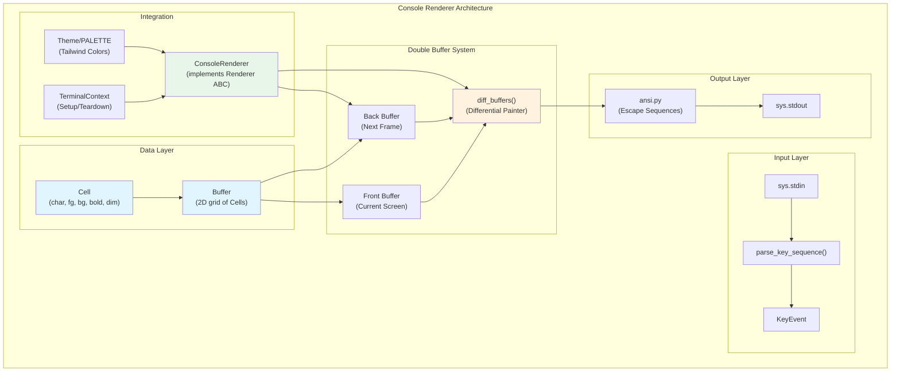
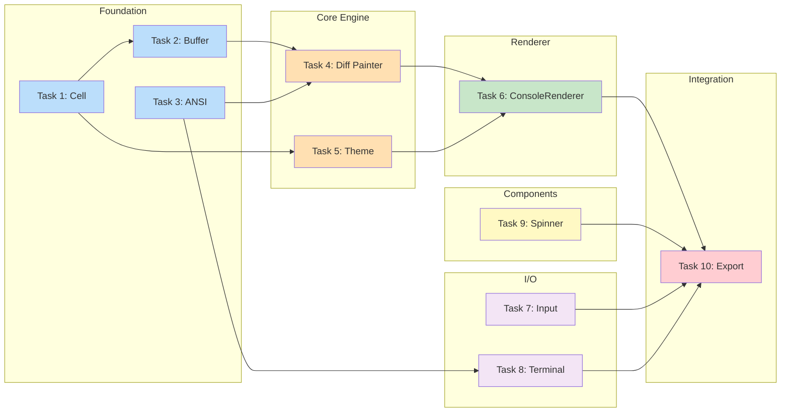
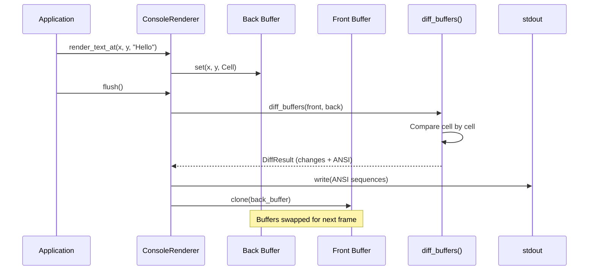

# Console Renderer Implementation Plan

> **For Claude:** REQUIRED SUB-SKILL: Use super:executing-plans to implement this plan task-by-task.
> **Python Skills:** Reference python:python-testing-patterns for tests, python:uv-package-manager for commands.

**Goal:** Implement a high-fidelity terminal renderer with double-buffered differential painting for smooth animations and dynamic layouts.

**Architecture:** Double-buffered ANSI renderer treating the terminal as a GPU framebuffer. The `Cell` is the atomic unit (char + fg/bg + attributes). `Buffer` holds the screen state. `DifferentialPainter` compares buffers and emits minimal ANSI escape sequences. Integrates with the existing Yoga-style `LayoutNode` system for positioning.

**Tech Stack:** Python 3.14+, asyncio, pytest, Flow's existing layout/signal systems

**Commands:** All Python commands use `uv run` prefix

---

## Diagrams

### Architecture Diagram



### Task Dependencies Flowchart



### Render Loop Sequence



---

## Task Overview

| Task | Component | Files |
|------|-----------|-------|
| 1 | Cell dataclass | `src/flow/renderer/console/cell.py` |
| 2 | Buffer class | `src/flow/renderer/console/buffer.py` |
| 3 | ANSI escape generator | `src/flow/renderer/console/ansi.py` |
| 4 | Differential painter | `src/flow/renderer/console/diff.py` |
| 5 | Theme/color palette | `src/flow/renderer/console/theme.py` |
| 6 | ConsoleRenderer class | `src/flow/renderer/console/renderer.py` |
| 7 | Input loop (stdin) | `src/flow/renderer/console/input.py` |
| 8 | Terminal size handling | `src/flow/renderer/console/terminal.py` |
| 9 | Spinner component | `src/flow/ui/spinner.py` |
| 10 | Integration with existing Renderer protocol | Update `src/flow/renderer/__init__.py` |

---

### Task 1: Cell Dataclass

**Files:**
- Create: `src/flow/renderer/console/__init__.py`
- Create: `src/flow/renderer/console/cell.py`
- Test: `tests/test_console_cell.py`

**Step 1: Write the failing test**

```python
# tests/test_console_cell.py
"""Tests for console Cell - the atomic unit of terminal rendering."""

from flow.renderer.console.cell import Cell


def test_cell_default_values():
    """Cell has sensible defaults for empty space."""
    cell = Cell()
    assert cell.char == " "
    assert cell.fg is None
    assert cell.bg is None
    assert cell.bold is False
    assert cell.dim is False


def test_cell_with_char_and_color():
    """Cell can hold character with foreground color."""
    cell = Cell(char="A", fg=(255, 0, 0))
    assert cell.char == "A"
    assert cell.fg == (255, 0, 0)


def test_cell_equality():
    """Two cells with same values are equal."""
    cell1 = Cell(char="X", fg=(0, 255, 0), bold=True)
    cell2 = Cell(char="X", fg=(0, 255, 0), bold=True)
    assert cell1 == cell2


def test_cell_inequality_on_char():
    """Cells with different chars are not equal."""
    cell1 = Cell(char="A")
    cell2 = Cell(char="B")
    assert cell1 != cell2


def test_cell_inequality_on_style():
    """Cells with different styles are not equal."""
    cell1 = Cell(char="A", bold=True)
    cell2 = Cell(char="A", bold=False)
    assert cell1 != cell2


def test_cell_uses_slots():
    """Cell uses __slots__ for memory efficiency."""
    cell = Cell()
    assert hasattr(Cell, "__slots__") or hasattr(cell, "__dataclass_fields__")
```

**Step 2: Run test to verify it fails**

```bash
uv run pytest tests/test_console_cell.py -v
```

Expected: FAIL with `ModuleNotFoundError: No module named 'flow.renderer.console'`

**Step 3: Create package init**

```python
# src/flow/renderer/console/__init__.py
"""Console Renderer - Terminal-based rendering with double buffering."""

from flow.renderer.console.cell import Cell

__all__ = ["Cell"]
```

**Step 4: Write minimal implementation**

```python
# src/flow/renderer/console/cell.py
"""Cell - The atomic unit of terminal rendering."""

from __future__ import annotations

from dataclasses import dataclass


@dataclass(slots=True)
class Cell:
    """A single character cell in the terminal buffer.

    Represents one character position with associated styling.
    Uses slots for memory efficiency (terminal buffers can be large).
    """

    char: str = " "
    fg: tuple[int, int, int] | None = None  # RGB TrueColor foreground
    bg: tuple[int, int, int] | None = None  # RGB TrueColor background
    bold: bool = False
    dim: bool = False
    italic: bool = False
    underline: bool = False
```

**Step 5: Run test to verify it passes**

```bash
uv run pytest tests/test_console_cell.py -v
```

Expected: PASS

**Step 6: Commit**

```bash
git add src/flow/renderer/console/ tests/test_console_cell.py
git commit -m "feat(console): add Cell dataclass for terminal buffer"
```

---

### Task 2: Buffer Class

**Files:**
- Create: `src/flow/renderer/console/buffer.py`
- Modify: `src/flow/renderer/console/__init__.py`
- Test: `tests/test_console_buffer.py`

**Step 1: Write the failing test**

```python
# tests/test_console_buffer.py
"""Tests for console Buffer - the terminal framebuffer."""

import pytest

from flow.renderer.console.buffer import Buffer
from flow.renderer.console.cell import Cell


def test_buffer_creation():
    """Buffer initializes with given dimensions."""
    buf = Buffer(width=80, height=24)
    assert buf.width == 80
    assert buf.height == 24


def test_buffer_get_cell_default():
    """Unset cells return empty Cell."""
    buf = Buffer(width=10, height=5)
    cell = buf.get(0, 0)
    assert cell.char == " "
    assert cell.fg is None


def test_buffer_set_cell():
    """Can set a cell at position."""
    buf = Buffer(width=10, height=5)
    cell = Cell(char="X", fg=(255, 0, 0))
    buf.set(3, 2, cell)

    result = buf.get(3, 2)
    assert result.char == "X"
    assert result.fg == (255, 0, 0)


def test_buffer_out_of_bounds_get():
    """Out of bounds get returns default cell."""
    buf = Buffer(width=10, height=5)
    cell = buf.get(100, 100)
    assert cell.char == " "


def test_buffer_out_of_bounds_set():
    """Out of bounds set is silently ignored."""
    buf = Buffer(width=10, height=5)
    cell = Cell(char="X")
    buf.set(100, 100, cell)  # Should not raise


def test_buffer_clear():
    """Clear resets all cells to default."""
    buf = Buffer(width=10, height=5)
    buf.set(0, 0, Cell(char="A"))
    buf.set(5, 2, Cell(char="B"))

    buf.clear()

    assert buf.get(0, 0).char == " "
    assert buf.get(5, 2).char == " "


def test_buffer_write_text():
    """Write text horizontally starting at position."""
    buf = Buffer(width=20, height=5)
    buf.write_text(2, 1, "Hello", fg=(255, 255, 255))

    assert buf.get(2, 1).char == "H"
    assert buf.get(3, 1).char == "e"
    assert buf.get(4, 1).char == "l"
    assert buf.get(5, 1).char == "l"
    assert buf.get(6, 1).char == "o"
    assert buf.get(2, 1).fg == (255, 255, 255)


def test_buffer_clone():
    """Clone creates independent copy."""
    buf = Buffer(width=10, height=5)
    buf.set(0, 0, Cell(char="X"))

    clone = buf.clone()
    clone.set(0, 0, Cell(char="Y"))

    assert buf.get(0, 0).char == "X"
    assert clone.get(0, 0).char == "Y"
```

**Step 2: Run test to verify it fails**

```bash
uv run pytest tests/test_console_buffer.py -v
```

Expected: FAIL with `ModuleNotFoundError: No module named 'flow.renderer.console.buffer'`

**Step 3: Write minimal implementation**

```python
# src/flow/renderer/console/buffer.py
"""Buffer - The terminal framebuffer for double-buffered rendering."""

from __future__ import annotations

from typing import TYPE_CHECKING

from flow.renderer.console.cell import Cell

if TYPE_CHECKING:
    pass


class Buffer:
    """A 2D grid of Cells representing terminal screen state.

    Used for double-buffering: maintain Buffer A (current screen)
    and Buffer B (next frame), then diff to minimize writes.
    """

    __slots__ = ("width", "height", "_cells")

    def __init__(self, width: int, height: int) -> None:
        """Initialize buffer with given dimensions.

        Args:
            width: Number of columns.
            height: Number of rows.
        """
        self.width = width
        self.height = height
        # Pre-allocate grid as flat list for cache efficiency
        self._cells: list[Cell] = [Cell() for _ in range(width * height)]

    def _index(self, x: int, y: int) -> int | None:
        """Convert (x, y) to flat index, or None if out of bounds."""
        if 0 <= x < self.width and 0 <= y < self.height:
            return y * self.width + x
        return None

    def get(self, x: int, y: int) -> Cell:
        """Get cell at (x, y). Returns default Cell if out of bounds."""
        idx = self._index(x, y)
        if idx is not None:
            return self._cells[idx]
        return Cell()

    def set(self, x: int, y: int, cell: Cell) -> None:
        """Set cell at (x, y). Silently ignores out of bounds."""
        idx = self._index(x, y)
        if idx is not None:
            self._cells[idx] = cell

    def clear(self) -> None:
        """Reset all cells to default (empty space)."""
        self._cells = [Cell() for _ in range(self.width * self.height)]

    def write_text(
        self,
        x: int,
        y: int,
        text: str,
        fg: tuple[int, int, int] | None = None,
        bg: tuple[int, int, int] | None = None,
        bold: bool = False,
    ) -> None:
        """Write text horizontally starting at (x, y).

        Args:
            x: Starting column.
            y: Row.
            text: Text to write.
            fg: Foreground color (RGB).
            bg: Background color (RGB).
            bold: Bold attribute.
        """
        for i, char in enumerate(text):
            self.set(x + i, y, Cell(char=char, fg=fg, bg=bg, bold=bold))

    def clone(self) -> Buffer:
        """Create an independent copy of this buffer."""
        new_buf = Buffer(self.width, self.height)
        new_buf._cells = [
            Cell(
                char=c.char,
                fg=c.fg,
                bg=c.bg,
                bold=c.bold,
                dim=c.dim,
                italic=c.italic,
                underline=c.underline,
            )
            for c in self._cells
        ]
        return new_buf
```

**Step 4: Update package init**

```python
# src/flow/renderer/console/__init__.py
"""Console Renderer - Terminal-based rendering with double buffering."""

from flow.renderer.console.buffer import Buffer
from flow.renderer.console.cell import Cell

__all__ = ["Buffer", "Cell"]
```

**Step 5: Run test to verify it passes**

```bash
uv run pytest tests/test_console_buffer.py -v
```

Expected: PASS

**Step 6: Commit**

```bash
git add src/flow/renderer/console/ tests/test_console_buffer.py
git commit -m "feat(console): add Buffer class for terminal framebuffer"
```

---

### Task 3: ANSI Escape Generator

**Files:**
- Create: `src/flow/renderer/console/ansi.py`
- Modify: `src/flow/renderer/console/__init__.py`
- Test: `tests/test_console_ansi.py`

**Step 1: Write the failing test**

```python
# tests/test_console_ansi.py
"""Tests for ANSI escape sequence generation."""

from flow.renderer.console.ansi import (
    cursor_move,
    cursor_hide,
    cursor_show,
    clear_screen,
    set_fg_rgb,
    set_bg_rgb,
    reset_style,
    set_bold,
    set_dim,
)


def test_cursor_move():
    """Move cursor to (col, row) using 1-based ANSI coordinates."""
    # ANSI uses 1-based indexing, (row;col)
    assert cursor_move(0, 0) == "\x1b[1;1H"
    assert cursor_move(10, 5) == "\x1b[6;11H"


def test_cursor_hide_show():
    """Hide and show cursor."""
    assert cursor_hide() == "\x1b[?25l"
    assert cursor_show() == "\x1b[?25h"


def test_clear_screen():
    """Clear entire screen."""
    assert clear_screen() == "\x1b[2J"


def test_set_fg_rgb():
    """Set foreground color using 24-bit RGB."""
    assert set_fg_rgb(255, 0, 0) == "\x1b[38;2;255;0;0m"
    assert set_fg_rgb(0, 255, 128) == "\x1b[38;2;0;255;128m"


def test_set_bg_rgb():
    """Set background color using 24-bit RGB."""
    assert set_bg_rgb(0, 0, 255) == "\x1b[48;2;0;0;255m"


def test_reset_style():
    """Reset all style attributes."""
    assert reset_style() == "\x1b[0m"


def test_set_bold():
    """Enable bold text."""
    assert set_bold() == "\x1b[1m"


def test_set_dim():
    """Enable dim text."""
    assert set_dim() == "\x1b[2m"
```

**Step 2: Run test to verify it fails**

```bash
uv run pytest tests/test_console_ansi.py -v
```

Expected: FAIL with `ModuleNotFoundError: No module named 'flow.renderer.console.ansi'`

**Step 3: Write minimal implementation**

```python
# src/flow/renderer/console/ansi.py
"""ANSI escape sequence generators for terminal control.

References:
- https://en.wikipedia.org/wiki/ANSI_escape_code
- https://invisible-island.net/xterm/ctlseqs/ctlseqs.html
"""

from __future__ import annotations

# Escape character
ESC = "\x1b"
CSI = f"{ESC}["  # Control Sequence Introducer


def cursor_move(x: int, y: int) -> str:
    """Move cursor to (x, y) position.

    Args:
        x: Column (0-based).
        y: Row (0-based).

    Returns:
        ANSI escape sequence (converts to 1-based internally).
    """
    # ANSI format: ESC[row;colH (1-based)
    return f"{CSI}{y + 1};{x + 1}H"


def cursor_hide() -> str:
    """Hide the cursor."""
    return f"{CSI}?25l"


def cursor_show() -> str:
    """Show the cursor."""
    return f"{CSI}?25h"


def clear_screen() -> str:
    """Clear the entire screen."""
    return f"{CSI}2J"


def clear_line() -> str:
    """Clear the current line."""
    return f"{CSI}2K"


def set_fg_rgb(r: int, g: int, b: int) -> str:
    """Set foreground color using 24-bit RGB (TrueColor).

    Args:
        r: Red component (0-255).
        g: Green component (0-255).
        b: Blue component (0-255).
    """
    return f"{CSI}38;2;{r};{g};{b}m"


def set_bg_rgb(r: int, g: int, b: int) -> str:
    """Set background color using 24-bit RGB (TrueColor).

    Args:
        r: Red component (0-255).
        g: Green component (0-255).
        b: Blue component (0-255).
    """
    return f"{CSI}48;2;{r};{g};{b}m"


def reset_style() -> str:
    """Reset all text attributes to defaults."""
    return f"{CSI}0m"


def set_bold() -> str:
    """Enable bold text."""
    return f"{CSI}1m"


def set_dim() -> str:
    """Enable dim/faint text."""
    return f"{CSI}2m"


def set_italic() -> str:
    """Enable italic text."""
    return f"{CSI}3m"


def set_underline() -> str:
    """Enable underlined text."""
    return f"{CSI}4m"


def enter_alt_screen() -> str:
    """Enter alternate screen buffer (used by TUI apps)."""
    return f"{CSI}?1049h"


def exit_alt_screen() -> str:
    """Exit alternate screen buffer."""
    return f"{CSI}?1049l"
```

**Step 4: Update package init**

```python
# src/flow/renderer/console/__init__.py
"""Console Renderer - Terminal-based rendering with double buffering."""

from flow.renderer.console import ansi
from flow.renderer.console.buffer import Buffer
from flow.renderer.console.cell import Cell

__all__ = ["Buffer", "Cell", "ansi"]
```

**Step 5: Run test to verify it passes**

```bash
uv run pytest tests/test_console_ansi.py -v
```

Expected: PASS

**Step 6: Commit**

```bash
git add src/flow/renderer/console/ tests/test_console_ansi.py
git commit -m "feat(console): add ANSI escape sequence generators"
```

---

### Task 4: Differential Painter

**Files:**
- Create: `src/flow/renderer/console/diff.py`
- Modify: `src/flow/renderer/console/__init__.py`
- Test: `tests/test_console_diff.py`

**Step 1: Write the failing test**

```python
# tests/test_console_diff.py
"""Tests for differential buffer painting."""

from flow.renderer.console.buffer import Buffer
from flow.renderer.console.cell import Cell
from flow.renderer.console.diff import diff_buffers, DiffResult


def test_diff_empty_buffers():
    """Two empty buffers produce no diff."""
    buf_a = Buffer(width=10, height=5)
    buf_b = Buffer(width=10, height=5)

    result = diff_buffers(buf_a, buf_b)

    assert result.changes == []
    assert result.ansi_output == ""


def test_diff_single_change():
    """Single cell change produces minimal output."""
    buf_a = Buffer(width=10, height=5)
    buf_b = Buffer(width=10, height=5)
    buf_b.set(3, 2, Cell(char="X"))

    result = diff_buffers(buf_a, buf_b)

    assert len(result.changes) == 1
    assert result.changes[0] == (3, 2)
    assert "X" in result.ansi_output


def test_diff_multiple_changes():
    """Multiple changes are batched efficiently."""
    buf_a = Buffer(width=10, height=5)
    buf_b = Buffer(width=10, height=5)
    buf_b.set(0, 0, Cell(char="A"))
    buf_b.set(1, 0, Cell(char="B"))
    buf_b.set(2, 0, Cell(char="C"))

    result = diff_buffers(buf_a, buf_b)

    assert len(result.changes) == 3
    # Adjacent cells should ideally be written together
    assert "ABC" in result.ansi_output or all(c in result.ansi_output for c in "ABC")


def test_diff_with_colors():
    """Color changes are included in output."""
    buf_a = Buffer(width=10, height=5)
    buf_b = Buffer(width=10, height=5)
    buf_b.set(0, 0, Cell(char="X", fg=(255, 0, 0)))

    result = diff_buffers(buf_a, buf_b)

    # Should include RGB color escape sequence
    assert "38;2;255;0;0" in result.ansi_output


def test_diff_identical_cells_no_change():
    """Identical cells produce no diff."""
    buf_a = Buffer(width=10, height=5)
    buf_b = Buffer(width=10, height=5)

    cell = Cell(char="Y", fg=(0, 255, 0))
    buf_a.set(5, 3, cell)
    buf_b.set(5, 3, Cell(char="Y", fg=(0, 255, 0)))  # Same content

    result = diff_buffers(buf_a, buf_b)

    assert (5, 3) not in result.changes


def test_diff_respects_style_changes():
    """Style-only changes (bold, dim) are detected."""
    buf_a = Buffer(width=10, height=5)
    buf_b = Buffer(width=10, height=5)

    buf_a.set(0, 0, Cell(char="X", bold=False))
    buf_b.set(0, 0, Cell(char="X", bold=True))

    result = diff_buffers(buf_a, buf_b)

    assert len(result.changes) == 1
```

**Step 2: Run test to verify it fails**

```bash
uv run pytest tests/test_console_diff.py -v
```

Expected: FAIL with `ModuleNotFoundError: No module named 'flow.renderer.console.diff'`

**Step 3: Write minimal implementation**

```python
# src/flow/renderer/console/diff.py
"""Differential painting - minimize terminal writes by comparing buffers."""

from __future__ import annotations

from dataclasses import dataclass, field
from typing import TYPE_CHECKING

from flow.renderer.console import ansi
from flow.renderer.console.cell import Cell

if TYPE_CHECKING:
    from flow.renderer.console.buffer import Buffer


@dataclass
class DiffResult:
    """Result of comparing two buffers.

    Attributes:
        changes: List of (x, y) positions that changed.
        ansi_output: Optimized ANSI string to apply changes.
    """

    changes: list[tuple[int, int]] = field(default_factory=list)
    ansi_output: str = ""


def diff_buffers(old: Buffer, new: Buffer) -> DiffResult:
    """Compare two buffers and generate minimal ANSI output.

    This is the core of the differential painting engine.
    Only cells that differ between old and new are written.

    Args:
        old: The current screen state (Buffer A).
        new: The desired next frame (Buffer B).

    Returns:
        DiffResult with change positions and ANSI string.
    """
    changes: list[tuple[int, int]] = []
    output_parts: list[str] = []

    # Track last style to avoid redundant escape sequences
    last_fg: tuple[int, int, int] | None = None
    last_bg: tuple[int, int, int] | None = None
    last_bold: bool = False
    last_dim: bool = False

    # Track cursor position to minimize cursor movements
    cursor_x: int = -1
    cursor_y: int = -1

    for y in range(new.height):
        for x in range(new.width):
            old_cell = old.get(x, y)
            new_cell = new.get(x, y)

            if old_cell != new_cell:
                changes.append((x, y))

                # Move cursor if not at expected position
                if cursor_x != x or cursor_y != y:
                    output_parts.append(ansi.cursor_move(x, y))

                # Apply style changes
                style_parts = _build_style_sequence(
                    new_cell, last_fg, last_bg, last_bold, last_dim
                )
                if style_parts:
                    output_parts.append(style_parts)
                    last_fg = new_cell.fg
                    last_bg = new_cell.bg
                    last_bold = new_cell.bold
                    last_dim = new_cell.dim

                # Write character
                output_parts.append(new_cell.char)

                # Update cursor position (moves right after writing)
                cursor_x = x + 1
                cursor_y = y

    # Reset style at end if we made any changes
    if output_parts:
        output_parts.append(ansi.reset_style())

    return DiffResult(
        changes=changes,
        ansi_output="".join(output_parts),
    )


def _build_style_sequence(
    cell: Cell,
    last_fg: tuple[int, int, int] | None,
    last_bg: tuple[int, int, int] | None,
    last_bold: bool,
    last_dim: bool,
) -> str:
    """Build ANSI style sequence, only including changed attributes."""
    parts: list[str] = []

    # Check if we need to reset (style attributes going from on to off)
    need_reset = (last_bold and not cell.bold) or (last_dim and not cell.dim)

    if need_reset:
        parts.append(ansi.reset_style())
        # After reset, we need to re-apply all current styles
        if cell.fg:
            parts.append(ansi.set_fg_rgb(*cell.fg))
        if cell.bg:
            parts.append(ansi.set_bg_rgb(*cell.bg))
        if cell.bold:
            parts.append(ansi.set_bold())
        if cell.dim:
            parts.append(ansi.set_dim())
    else:
        # Only emit changed attributes
        if cell.fg != last_fg and cell.fg:
            parts.append(ansi.set_fg_rgb(*cell.fg))
        if cell.bg != last_bg and cell.bg:
            parts.append(ansi.set_bg_rgb(*cell.bg))
        if cell.bold and not last_bold:
            parts.append(ansi.set_bold())
        if cell.dim and not last_dim:
            parts.append(ansi.set_dim())

    return "".join(parts)
```

**Step 4: Update package init**

```python
# src/flow/renderer/console/__init__.py
"""Console Renderer - Terminal-based rendering with double buffering."""

from flow.renderer.console import ansi
from flow.renderer.console.buffer import Buffer
from flow.renderer.console.cell import Cell
from flow.renderer.console.diff import DiffResult, diff_buffers

__all__ = ["Buffer", "Cell", "DiffResult", "ansi", "diff_buffers"]
```

**Step 5: Run test to verify it passes**

```bash
uv run pytest tests/test_console_diff.py -v
```

Expected: PASS

**Step 6: Commit**

```bash
git add src/flow/renderer/console/ tests/test_console_diff.py
git commit -m "feat(console): add differential buffer painter"
```

---

### Task 5: Theme/Color Palette

**Files:**
- Create: `src/flow/renderer/console/theme.py`
- Test: `tests/test_console_theme.py`

**Step 1: Write the failing test**

```python
# tests/test_console_theme.py
"""Tests for console theme and color palette."""

from flow.renderer.console.cell import Cell
from flow.renderer.console.theme import PALETTE, apply_cls_to_cell


def test_palette_has_tailwind_colors():
    """Palette includes standard Tailwind colors."""
    assert "red-500" in PALETTE
    assert "blue-600" in PALETTE
    assert "slate-900" in PALETTE
    assert "green-400" in PALETTE


def test_palette_colors_are_rgb_tuples():
    """All palette values are RGB tuples."""
    for name, color in PALETTE.items():
        assert isinstance(color, tuple), f"{name} should be tuple"
        assert len(color) == 3, f"{name} should have 3 components"
        assert all(0 <= c <= 255 for c in color), f"{name} should be 0-255"


def test_apply_bg_class():
    """Apply background color class."""
    cell = Cell()
    apply_cls_to_cell(cell, "bg-red-500")
    assert cell.bg == PALETTE["red-500"]


def test_apply_text_class():
    """Apply text (foreground) color class."""
    cell = Cell()
    apply_cls_to_cell(cell, "text-blue-600")
    assert cell.fg == PALETTE["blue-600"]


def test_apply_bold_class():
    """Apply bold class."""
    cell = Cell()
    apply_cls_to_cell(cell, "bold")
    assert cell.bold is True


def test_apply_multiple_classes():
    """Apply multiple classes at once."""
    cell = Cell()
    apply_cls_to_cell(cell, "bg-slate-900 text-green-400 bold")
    assert cell.bg == PALETTE["slate-900"]
    assert cell.fg == PALETTE["green-400"]
    assert cell.bold is True


def test_unknown_class_ignored():
    """Unknown classes are silently ignored."""
    cell = Cell()
    apply_cls_to_cell(cell, "unknown-class bg-red-500")
    # Should not raise, and should apply known class
    assert cell.bg == PALETTE["red-500"]
```

**Step 2: Run test to verify it fails**

```bash
uv run pytest tests/test_console_theme.py -v
```

Expected: FAIL with `ModuleNotFoundError: No module named 'flow.renderer.console.theme'`

**Step 3: Write minimal implementation**

```python
# src/flow/renderer/console/theme.py
"""Console theme - Tailwind-style color palette for terminal rendering.

Maps Tailwind CSS color classes to RGB values for TrueColor terminals.
"""

from __future__ import annotations

from typing import TYPE_CHECKING

if TYPE_CHECKING:
    from flow.renderer.console.cell import Cell

# Standard Tailwind CSS palette mapped to RGB
# https://tailwindcss.com/docs/customizing-colors
PALETTE: dict[str, tuple[int, int, int]] = {
    # Slate
    "slate-50": (248, 250, 252),
    "slate-100": (241, 245, 249),
    "slate-200": (226, 232, 240),
    "slate-300": (203, 213, 225),
    "slate-400": (148, 163, 184),
    "slate-500": (100, 116, 139),
    "slate-600": (71, 85, 105),
    "slate-700": (51, 65, 85),
    "slate-800": (30, 41, 59),
    "slate-900": (15, 23, 42),
    "slate-950": (2, 6, 23),
    # Red
    "red-50": (254, 242, 242),
    "red-100": (254, 226, 226),
    "red-200": (254, 202, 202),
    "red-300": (252, 165, 165),
    "red-400": (248, 113, 113),
    "red-500": (239, 68, 68),
    "red-600": (220, 38, 38),
    "red-700": (185, 28, 28),
    "red-800": (153, 27, 27),
    "red-900": (127, 29, 29),
    # Green
    "green-50": (240, 253, 244),
    "green-100": (220, 252, 231),
    "green-200": (187, 247, 208),
    "green-300": (134, 239, 172),
    "green-400": (74, 222, 128),
    "green-500": (34, 197, 94),
    "green-600": (22, 163, 74),
    "green-700": (21, 128, 61),
    "green-800": (22, 101, 52),
    "green-900": (20, 83, 45),
    # Blue
    "blue-50": (239, 246, 255),
    "blue-100": (219, 234, 254),
    "blue-200": (191, 219, 254),
    "blue-300": (147, 197, 253),
    "blue-400": (96, 165, 250),
    "blue-500": (59, 130, 246),
    "blue-600": (37, 99, 235),
    "blue-700": (29, 78, 216),
    "blue-800": (30, 64, 175),
    "blue-900": (30, 58, 138),
    # Yellow
    "yellow-50": (254, 252, 232),
    "yellow-100": (254, 249, 195),
    "yellow-200": (254, 240, 138),
    "yellow-300": (253, 224, 71),
    "yellow-400": (250, 204, 21),
    "yellow-500": (234, 179, 8),
    "yellow-600": (202, 138, 4),
    "yellow-700": (161, 98, 7),
    "yellow-800": (133, 77, 14),
    "yellow-900": (113, 63, 18),
    # White/Black
    "white": (255, 255, 255),
    "black": (0, 0, 0),
}


def apply_cls_to_cell(cell: Cell, cls: str) -> None:
    """Apply Tailwind-style classes to a Cell.

    Parses class string like "bg-red-500 text-white bold"
    and modifies cell attributes accordingly.

    Args:
        cell: The cell to modify (in place).
        cls: Space-separated class names.
    """
    parts = cls.split()
    for part in parts:
        if part.startswith("bg-"):
            color_name = part[3:]
            if color_name in PALETTE:
                cell.bg = PALETTE[color_name]
        elif part.startswith("text-"):
            color_name = part[5:]
            if color_name in PALETTE:
                cell.fg = PALETTE[color_name]
        elif part == "bold":
            cell.bold = True
        elif part == "dim":
            cell.dim = True
        elif part == "italic":
            cell.italic = True
        elif part == "underline":
            cell.underline = True
```

**Step 4: Update package init**

```python
# src/flow/renderer/console/__init__.py
"""Console Renderer - Terminal-based rendering with double buffering."""

from flow.renderer.console import ansi
from flow.renderer.console.buffer import Buffer
from flow.renderer.console.cell import Cell
from flow.renderer.console.diff import DiffResult, diff_buffers
from flow.renderer.console.theme import PALETTE, apply_cls_to_cell

__all__ = [
    "Buffer",
    "Cell",
    "DiffResult",
    "PALETTE",
    "ansi",
    "apply_cls_to_cell",
    "diff_buffers",
]
```

**Step 5: Run test to verify it passes**

```bash
uv run pytest tests/test_console_theme.py -v
```

Expected: PASS

**Step 6: Commit**

```bash
git add src/flow/renderer/console/ tests/test_console_theme.py
git commit -m "feat(console): add Tailwind color palette and style resolver"
```

---

### Task 6: ConsoleRenderer Class

**Files:**
- Create: `src/flow/renderer/console/renderer.py`
- Test: `tests/test_console_renderer.py`

**Step 1: Write the failing test**

```python
# tests/test_console_renderer.py
"""Tests for ConsoleRenderer - the main console rendering class."""

import pytest

from flow.renderer.console.buffer import Buffer
from flow.renderer.console.renderer import ConsoleRenderer
from flow.renderer.protocol import Renderer
from flow.ui import Div, Text


def test_console_renderer_implements_protocol():
    """ConsoleRenderer implements the Renderer ABC."""
    renderer = ConsoleRenderer(width=80, height=24)
    assert isinstance(renderer, Renderer)


def test_console_renderer_has_buffers():
    """ConsoleRenderer maintains front and back buffers."""
    renderer = ConsoleRenderer(width=80, height=24)
    assert renderer.front_buffer is not None
    assert renderer.back_buffer is not None
    assert renderer.front_buffer.width == 80
    assert renderer.back_buffer.height == 24


def test_console_renderer_render_node():
    """ConsoleRenderer can render a RenderNode to buffer."""
    renderer = ConsoleRenderer(width=80, height=24)
    div = Div(cls="container")
    node = div.to_render_node()

    # Should not raise
    renderer.render_node(node)


def test_console_renderer_render_text():
    """ConsoleRenderer writes text to buffer."""
    renderer = ConsoleRenderer(width=80, height=24)
    renderer.render_text_at(0, 0, "Hello")

    assert renderer.back_buffer.get(0, 0).char == "H"
    assert renderer.back_buffer.get(4, 0).char == "o"


def test_console_renderer_flush_produces_diff():
    """flush() generates ANSI output from buffer diff."""
    renderer = ConsoleRenderer(width=80, height=24)
    renderer.render_text_at(0, 0, "Test")

    output = renderer.flush()

    assert "Test" in output


def test_console_renderer_swap_buffers():
    """After flush, front buffer reflects changes."""
    renderer = ConsoleRenderer(width=80, height=24)
    renderer.render_text_at(5, 5, "X")
    renderer.flush()

    # After flush, front should match back
    assert renderer.front_buffer.get(5, 5).char == "X"


def test_console_renderer_clear():
    """clear() resets back buffer."""
    renderer = ConsoleRenderer(width=80, height=24)
    renderer.render_text_at(0, 0, "Data")
    renderer.clear()

    assert renderer.back_buffer.get(0, 0).char == " "
```

**Step 2: Run test to verify it fails**

```bash
uv run pytest tests/test_console_renderer.py -v
```

Expected: FAIL with `ModuleNotFoundError: No module named 'flow.renderer.console.renderer'`

**Step 3: Write minimal implementation**

```python
# src/flow/renderer/console/renderer.py
"""ConsoleRenderer - Terminal-based renderer with double buffering."""

from __future__ import annotations

import sys
from typing import TYPE_CHECKING, Any

from flow.renderer.console.buffer import Buffer
from flow.renderer.console.cell import Cell
from flow.renderer.console.diff import diff_buffers
from flow.renderer.console.theme import apply_cls_to_cell
from flow.renderer.protocol import Renderer, RenderNode

if TYPE_CHECKING:
    from flow.element import Element


class ConsoleRenderer(Renderer):
    """Terminal renderer using double-buffered differential painting.

    Maintains two buffers:
    - front_buffer: What is currently displayed on screen
    - back_buffer: What the next frame will look like

    flush() computes the diff and emits minimal ANSI sequences.
    """

    def __init__(self, width: int, height: int) -> None:
        """Initialize renderer with terminal dimensions.

        Args:
            width: Terminal width in columns.
            height: Terminal height in rows.
        """
        self.width = width
        self.height = height
        self.front_buffer = Buffer(width, height)
        self.back_buffer = Buffer(width, height)

    def render(self, element: Element) -> str:
        """Render an element tree to ANSI string.

        Note: This is a convenience method. For animations,
        use render_node + flush for differential updates.
        """
        self.clear()
        node = element.to_render_node()
        self.render_node(node)
        return self.flush()

    def render_node(self, node: RenderNode, x: int = 0, y: int = 0) -> None:
        """Render a RenderNode to the back buffer.

        Args:
            node: The RenderNode to render.
            x: X offset for positioning.
            y: Y offset for positioning.
        """
        # Get style from cls prop
        cls = node.props.get("cls", "")

        # Handle text content
        if node.text_content:
            self.render_text_at(x, y, node.text_content, cls=cls)
            return

        if node.label:
            self.render_text_at(x, y, node.label, cls=cls)
            return

        # Render children at same position (layout should offset)
        for child in node.children:
            self.render_node(child, x, y)

    def render_node_with_layout(
        self,
        node: RenderNode,
        parent_x: int = 0,
        parent_y: int = 0,
    ) -> None:
        """Render a RenderNode using layout position from style.

        Expects node.props["style"] to contain layout coordinates.

        Args:
            node: The RenderNode with layout style.
            parent_x: Parent's absolute x position.
            parent_y: Parent's absolute y position.
        """
        style = node.props.get("style", {})

        # Get position from layout (already computed by Yoga)
        # Style contains "top", "left" from layout computation
        left = int(style.get("left", "0").replace("px", ""))
        top = int(style.get("top", "0").replace("px", ""))

        abs_x = parent_x + left
        abs_y = parent_y + top

        cls = node.props.get("cls", "")

        # Handle text content
        if node.text_content:
            self.render_text_at(abs_x, abs_y, node.text_content, cls=cls)
        elif node.label:
            self.render_text_at(abs_x, abs_y, node.label, cls=cls)

        # Render children
        for child in node.children:
            self.render_node_with_layout(child, abs_x, abs_y)

    def render_text(self, content: str) -> str:
        """Render text content (protocol compliance)."""
        return content

    def render_text_at(
        self,
        x: int,
        y: int,
        text: str,
        cls: str = "",
        fg: tuple[int, int, int] | None = None,
        bg: tuple[int, int, int] | None = None,
    ) -> None:
        """Write text to back buffer at position.

        Args:
            x: Column position.
            y: Row position.
            text: Text to write.
            cls: Tailwind-style classes.
            fg: Override foreground color.
            bg: Override background color.
        """
        for i, char in enumerate(text):
            cell = Cell(char=char, fg=fg, bg=bg)
            if cls:
                apply_cls_to_cell(cell, cls)
            self.back_buffer.set(x + i, y, cell)

    def flush(self) -> str:
        """Compute diff and generate ANSI output.

        After flush, front buffer is updated to match back buffer.

        Returns:
            ANSI escape sequence string to update terminal.
        """
        result = diff_buffers(self.front_buffer, self.back_buffer)

        # Swap buffers (back becomes front for next frame)
        self.front_buffer = self.back_buffer.clone()

        return result.ansi_output

    def clear(self) -> None:
        """Clear the back buffer."""
        self.back_buffer.clear()

    def write_to_stdout(self, output: str) -> None:
        """Write ANSI output to stdout."""
        sys.stdout.write(output)
        sys.stdout.flush()

    def resize(self, width: int, height: int) -> None:
        """Handle terminal resize.

        Args:
            width: New width.
            height: New height.
        """
        self.width = width
        self.height = height
        self.front_buffer = Buffer(width, height)
        self.back_buffer = Buffer(width, height)
```

**Step 4: Update package init**

```python
# src/flow/renderer/console/__init__.py
"""Console Renderer - Terminal-based rendering with double buffering."""

from flow.renderer.console import ansi
from flow.renderer.console.buffer import Buffer
from flow.renderer.console.cell import Cell
from flow.renderer.console.diff import DiffResult, diff_buffers
from flow.renderer.console.renderer import ConsoleRenderer
from flow.renderer.console.theme import PALETTE, apply_cls_to_cell

__all__ = [
    "Buffer",
    "Cell",
    "ConsoleRenderer",
    "DiffResult",
    "PALETTE",
    "ansi",
    "apply_cls_to_cell",
    "diff_buffers",
]
```

**Step 5: Run test to verify it passes**

```bash
uv run pytest tests/test_console_renderer.py -v
```

Expected: PASS

**Step 6: Commit**

```bash
git add src/flow/renderer/console/ tests/test_console_renderer.py
git commit -m "feat(console): add ConsoleRenderer with double buffering"
```

---

### Task 7: Input Loop (stdin)

**Files:**
- Create: `src/flow/renderer/console/input.py`
- Test: `tests/test_console_input.py`

**Step 1: Write the failing test**

```python
# tests/test_console_input.py
"""Tests for console input handling."""

import pytest

from flow.renderer.console.input import (
    KeyEvent,
    parse_key_sequence,
    CTRL_O,
    CTRL_C,
    ESCAPE,
)


def test_key_event_creation():
    """KeyEvent holds key information."""
    event = KeyEvent(key="a", ctrl=False, alt=False)
    assert event.key == "a"
    assert event.ctrl is False


def test_parse_regular_key():
    """Regular keys are parsed directly."""
    event = parse_key_sequence("a")
    assert event.key == "a"
    assert event.ctrl is False


def test_parse_ctrl_key():
    """Ctrl+key combinations are detected."""
    event = parse_key_sequence(CTRL_O)  # Ctrl+O = \x0f
    assert event.key == "o"
    assert event.ctrl is True


def test_parse_ctrl_c():
    """Ctrl+C is parsed correctly."""
    event = parse_key_sequence(CTRL_C)  # \x03
    assert event.key == "c"
    assert event.ctrl is True


def test_parse_escape():
    """Escape key is recognized."""
    event = parse_key_sequence(ESCAPE)
    assert event.key == "escape"


def test_parse_arrow_up():
    """Arrow up sequence is parsed."""
    event = parse_key_sequence("\x1b[A")
    assert event.key == "up"


def test_parse_arrow_down():
    """Arrow down sequence is parsed."""
    event = parse_key_sequence("\x1b[B")
    assert event.key == "down"


def test_parse_enter():
    """Enter key (CR/LF) is recognized."""
    event = parse_key_sequence("\r")
    assert event.key == "enter"
```

**Step 2: Run test to verify it fails**

```bash
uv run pytest tests/test_console_input.py -v
```

Expected: FAIL with `ModuleNotFoundError: No module named 'flow.renderer.console.input'`

**Step 3: Write minimal implementation**

```python
# src/flow/renderer/console/input.py
"""Console input handling for stdin key events."""

from __future__ import annotations

from dataclasses import dataclass

# Common control characters
CTRL_C = "\x03"
CTRL_D = "\x04"
CTRL_O = "\x0f"  # Used for sub-terminal toggle
CTRL_Z = "\x1a"
ESCAPE = "\x1b"
ENTER = "\r"
BACKSPACE = "\x7f"


@dataclass
class KeyEvent:
    """Represents a keyboard input event.

    Attributes:
        key: The key pressed (character or special name).
        ctrl: Whether Ctrl was held.
        alt: Whether Alt was held.
        shift: Whether Shift was held.
    """

    key: str
    ctrl: bool = False
    alt: bool = False
    shift: bool = False


# ANSI escape sequences for special keys
ESCAPE_SEQUENCES: dict[str, str] = {
    "\x1b[A": "up",
    "\x1b[B": "down",
    "\x1b[C": "right",
    "\x1b[D": "left",
    "\x1b[H": "home",
    "\x1b[F": "end",
    "\x1b[3~": "delete",
    "\x1b[5~": "page_up",
    "\x1b[6~": "page_down",
    "\x1bOP": "f1",
    "\x1bOQ": "f2",
    "\x1bOR": "f3",
    "\x1bOS": "f4",
}


def parse_key_sequence(seq: str) -> KeyEvent:
    """Parse a key sequence into a KeyEvent.

    Args:
        seq: Raw bytes/string from stdin.

    Returns:
        Parsed KeyEvent.
    """
    if not seq:
        return KeyEvent(key="")

    # Check escape sequences first
    if seq in ESCAPE_SEQUENCES:
        return KeyEvent(key=ESCAPE_SEQUENCES[seq])

    # Single escape
    if seq == ESCAPE:
        return KeyEvent(key="escape")

    # Enter/Return
    if seq in ("\r", "\n"):
        return KeyEvent(key="enter")

    # Backspace
    if seq == BACKSPACE or seq == "\x08":
        return KeyEvent(key="backspace")

    # Tab
    if seq == "\t":
        return KeyEvent(key="tab")

    # Ctrl+key (ASCII 1-26 = Ctrl+A through Ctrl+Z)
    if len(seq) == 1:
        code = ord(seq)
        if 1 <= code <= 26:
            char = chr(code + 96)  # Convert to lowercase letter
            return KeyEvent(key=char, ctrl=True)

    # Regular character
    if len(seq) == 1:
        return KeyEvent(key=seq)

    # Unknown sequence
    return KeyEvent(key=seq)


async def read_key_async() -> str:
    """Read a key or escape sequence from stdin asynchronously.

    Returns:
        The raw key sequence string.

    Note:
        This requires terminal to be in raw mode.
        Use with InputLoop for proper setup.
    """
    import asyncio
    import sys

    loop = asyncio.get_event_loop()

    # Read first character
    char = await loop.run_in_executor(None, lambda: sys.stdin.read(1))

    if char == ESCAPE:
        # Might be escape sequence, try to read more
        try:
            # Set stdin to non-blocking temporarily
            import select
            if select.select([sys.stdin], [], [], 0.05)[0]:
                # More data available - likely escape sequence
                extra = ""
                while select.select([sys.stdin], [], [], 0.01)[0]:
                    extra += sys.stdin.read(1)
                return char + extra
        except Exception:
            pass

    return char
```

> **V1 Limitation (Council Review):** The `read_key_async` timeout-based heuristic (50ms initial, 10ms continuation) works for local terminals but may fail when multi-byte escape sequences (Arrow Keys, Alt+Key, F-keys) arrive in fragmented packets over SSH connections with high latency. **V2 Requirement:** Implement a state-machine parser that can accumulate partial sequences across reads and emit complete `KeyEvent`s only when the sequence is unambiguously complete or times out.

**Step 4: Run test to verify it passes**

```bash
uv run pytest tests/test_console_input.py -v
```

Expected: PASS

**Step 5: Commit**

```bash
git add src/flow/renderer/console/input.py tests/test_console_input.py
git commit -m "feat(console): add keyboard input parsing"
```

---

### Task 8: Terminal Size Handling

**Files:**
- Create: `src/flow/renderer/console/terminal.py`
- Test: `tests/test_console_terminal.py`

**Step 1: Write the failing test**

```python
# tests/test_console_terminal.py
"""Tests for terminal utilities."""

import pytest
from unittest.mock import patch, MagicMock

from flow.renderer.console.terminal import (
    get_terminal_size,
    setup_raw_mode,
    restore_terminal,
    TerminalContext,
)


def test_get_terminal_size_returns_tuple():
    """get_terminal_size returns (width, height) tuple."""
    size = get_terminal_size()
    assert isinstance(size, tuple)
    assert len(size) == 2
    width, height = size
    assert isinstance(width, int)
    assert isinstance(height, int)


def test_get_terminal_size_has_reasonable_defaults():
    """Terminal size has reasonable minimums."""
    width, height = get_terminal_size()
    assert width >= 1
    assert height >= 1


def test_terminal_context_manager():
    """TerminalContext provides setup/teardown."""
    # Just test it doesn't crash (actual terminal setup needs a TTY)
    ctx = TerminalContext(width=80, height=24)
    assert ctx.width == 80
    assert ctx.height == 24


@patch("flow.renderer.console.terminal.os.get_terminal_size")
def test_get_terminal_size_uses_os_call(mock_get_size):
    """Uses os.get_terminal_size when available."""
    mock_get_size.return_value = MagicMock(columns=120, lines=40)

    width, height = get_terminal_size()

    mock_get_size.assert_called()
    assert width == 120
    assert height == 40
```

**Step 2: Run test to verify it fails**

```bash
uv run pytest tests/test_console_terminal.py -v
```

Expected: FAIL with `ModuleNotFoundError: No module named 'flow.renderer.console.terminal'`

**Step 3: Write minimal implementation**

```python
# src/flow/renderer/console/terminal.py
"""Terminal utilities for console rendering."""

from __future__ import annotations

import os
import sys
from typing import TYPE_CHECKING

if TYPE_CHECKING:
    import termios
    from types import TracebackType

# Store original terminal settings for restoration
_original_termios: list[int] | None = None


def get_terminal_size() -> tuple[int, int]:
    """Get current terminal size.

    Returns:
        Tuple of (width, height) in characters.
    """
    try:
        size = os.get_terminal_size()
        return (size.columns, size.lines)
    except OSError:
        # Fallback for non-TTY (e.g., piped input)
        return (80, 24)


def setup_raw_mode() -> None:
    """Put terminal in raw mode for character-by-character input.

    Raw mode disables:
    - Line buffering (input available immediately)
    - Echo (typed chars not shown)
    - Signal generation (Ctrl+C doesn't raise SIGINT)
    """
    global _original_termios

    if not sys.stdin.isatty():
        return

    try:
        import termios
        import tty

        fd = sys.stdin.fileno()
        _original_termios = termios.tcgetattr(fd)
        tty.setraw(fd)
    except (ImportError, termios.error):
        pass


def restore_terminal() -> None:
    """Restore terminal to original settings."""
    global _original_termios

    if _original_termios is None:
        return

    if not sys.stdin.isatty():
        return

    try:
        import termios

        fd = sys.stdin.fileno()
        termios.tcsetattr(fd, termios.TCSADRAIN, _original_termios)
        _original_termios = None
    except (ImportError, termios.error):
        pass


class TerminalContext:
    """Context manager for terminal-mode applications.

    Handles:
    - Entering alternate screen buffer
    - Raw mode setup
    - Cleanup on exit

    Usage:
        with TerminalContext() as ctx:
            renderer = ConsoleRenderer(ctx.width, ctx.height)
            # ... render loop
    """

    def __init__(
        self,
        width: int | None = None,
        height: int | None = None,
        alt_screen: bool = True,
    ) -> None:
        """Initialize terminal context.

        Args:
            width: Override width (uses terminal size if None).
            height: Override height (uses terminal size if None).
            alt_screen: Whether to use alternate screen buffer.
        """
        detected_w, detected_h = get_terminal_size()
        self.width = width if width is not None else detected_w
        self.height = height if height is not None else detected_h
        self.alt_screen = alt_screen
        self._setup_done = False

    def __enter__(self) -> TerminalContext:
        """Enter terminal mode."""
        from flow.renderer.console import ansi

        if self.alt_screen:
            sys.stdout.write(ansi.enter_alt_screen())

        sys.stdout.write(ansi.cursor_hide())
        sys.stdout.write(ansi.clear_screen())
        sys.stdout.flush()

        setup_raw_mode()
        self._setup_done = True

        return self

    def __exit__(
        self,
        exc_type: type[BaseException] | None,
        exc_val: BaseException | None,
        exc_tb: TracebackType | None,
    ) -> None:
        """Exit terminal mode and restore settings."""
        from flow.renderer.console import ansi

        restore_terminal()

        sys.stdout.write(ansi.cursor_show())
        sys.stdout.write(ansi.reset_style())

        if self.alt_screen:
            sys.stdout.write(ansi.exit_alt_screen())

        sys.stdout.flush()
```

**Step 4: Run test to verify it passes**

```bash
uv run pytest tests/test_console_terminal.py -v
```

Expected: PASS

**Step 5: Commit**

```bash
git add src/flow/renderer/console/terminal.py tests/test_console_terminal.py
git commit -m "feat(console): add terminal setup and teardown utilities"
```

---

### Task 9: Spinner Component

**Files:**
- Create: `src/flow/ui/spinner.py`
- Modify: `src/flow/ui/__init__.py`
- Test: `tests/test_ui_spinner.py`

**Step 1: Write the failing test**

```python
# tests/test_ui_spinner.py
"""Tests for Spinner UI component."""

import pytest

from flow.ui.spinner import Spinner, BRAILLE_FRAMES, DOT_FRAMES


def test_spinner_has_default_frames():
    """Spinner has default animation frames."""
    spinner = Spinner()
    assert spinner.frames is not None
    assert len(spinner.frames) > 0


def test_spinner_braille_frames():
    """Braille spinner frames are available."""
    assert len(BRAILLE_FRAMES) == 10
    assert "⠋" in BRAILLE_FRAMES


def test_spinner_dot_frames():
    """Dot spinner frames are available."""
    assert len(DOT_FRAMES) > 0


def test_spinner_current_frame():
    """Spinner tracks current frame index."""
    spinner = Spinner()
    frame1 = spinner.current_frame
    spinner.advance()
    frame2 = spinner.current_frame

    # Should cycle through frames
    assert frame1 != frame2 or len(spinner.frames) == 1


def test_spinner_advance_wraps():
    """Spinner wraps around when reaching end."""
    spinner = Spinner(frames=["A", "B", "C"])

    for _ in range(10):
        spinner.advance()

    # Should be valid frame index
    assert 0 <= spinner._frame_idx < 3


def test_spinner_to_render_node():
    """Spinner produces RenderNode."""
    spinner = Spinner()
    node = spinner.to_render_node()

    assert node.text_content is not None
    assert node.text_content in spinner.frames


def test_spinner_custom_frames():
    """Spinner accepts custom frames."""
    custom = ["-", "\\", "|", "/"]
    spinner = Spinner(frames=custom)

    assert spinner.frames == custom


def test_spinner_cls_prop():
    """Spinner accepts style classes."""
    spinner = Spinner(cls="text-blue-500")
    node = spinner.to_render_node()

    assert node.props.get("cls") == "text-blue-500"
```

**Step 2: Run test to verify it fails**

```bash
uv run pytest tests/test_ui_spinner.py -v
```

Expected: FAIL with `ModuleNotFoundError: No module named 'flow.ui.spinner'`

**Step 3: Write minimal implementation**

```python
# src/flow/ui/spinner.py
"""Spinner - Animated loading indicator for terminal UI."""

from __future__ import annotations

from typing import TYPE_CHECKING

from flow.element import Element
from flow.renderer.protocol import RenderNode

if TYPE_CHECKING:
    pass


# Common spinner frame sets
BRAILLE_FRAMES = ["⠋", "⠙", "⠹", "⠸", "⠼", "⠴", "⠦", "⠧", "⠇", "⠏"]
DOT_FRAMES = ["⣾", "⣽", "⣻", "⢿", "⡿", "⣟", "⣯", "⣷"]
LINE_FRAMES = ["-", "\\", "|", "/"]
ARROW_FRAMES = ["←", "↖", "↑", "↗", "→", "↘", "↓", "↙"]


class Spinner(Element):
    """Animated spinner component.

    The spinner cycles through animation frames, typically
    rendered at ~12 FPS (80ms per frame) for smooth animation.

    Usage with Signal/Effect for animation:
        spinner = Spinner()

        async def animate():
            while True:
                spinner.advance()
                await asyncio.sleep(0.08)

        Effect(animate)
    """

    def __init__(
        self,
        frames: list[str] | None = None,
        cls: str = "",
        **kwargs: object,
    ) -> None:
        """Initialize spinner.

        Args:
            frames: Animation frames (defaults to braille).
            cls: CSS class string for styling.
            **kwargs: Additional props.
        """
        super().__init__(cls=cls, **kwargs)
        self.frames = frames if frames is not None else BRAILLE_FRAMES
        self._frame_idx = 0
        self.cls = cls

    @property
    def current_frame(self) -> str:
        """Get the current animation frame."""
        return self.frames[self._frame_idx]

    def advance(self) -> None:
        """Advance to next frame (wraps at end)."""
        self._frame_idx = (self._frame_idx + 1) % len(self.frames)

    def reset(self) -> None:
        """Reset to first frame."""
        self._frame_idx = 0

    def to_render_node(self) -> RenderNode:
        """Convert to RenderNode for rendering."""
        return RenderNode(
            tag="Spinner",
            element_id=id(self),
            props={"cls": self.cls},
            text_content=self.current_frame,
        )
```

**Step 4: Update UI package init**

First, check current exports:

```python
# Append to src/flow/ui/__init__.py
from flow.ui.spinner import Spinner, BRAILLE_FRAMES, DOT_FRAMES, LINE_FRAMES

# Update __all__ to include:
# "Spinner", "BRAILLE_FRAMES", "DOT_FRAMES", "LINE_FRAMES"
```

**Step 5: Run test to verify it passes**

```bash
uv run pytest tests/test_ui_spinner.py -v
```

Expected: PASS

**Step 6: Commit**

```bash
git add src/flow/ui/spinner.py src/flow/ui/__init__.py tests/test_ui_spinner.py
git commit -m "feat(ui): add Spinner component with animation frames"
```

---

### Task 10: Integration with Renderer Protocol

**Files:**
- Modify: `src/flow/renderer/__init__.py`
- Test: `tests/test_console_integration.py`

**Step 1: Write the failing test**

```python
# tests/test_console_integration.py
"""Integration tests for ConsoleRenderer with Flow elements."""

import pytest

from flow.renderer import ConsoleRenderer, HTMLRenderer
from flow.renderer.protocol import Renderer
from flow.ui import Div, Text, VStack
from flow.ui.spinner import Spinner


def test_console_renderer_exported():
    """ConsoleRenderer is exported from flow.renderer."""
    from flow.renderer import ConsoleRenderer
    assert ConsoleRenderer is not None


def test_both_renderers_share_protocol():
    """HTML and Console renderers implement same protocol."""
    html_r = HTMLRenderer()
    console_r = ConsoleRenderer(width=80, height=24)

    assert isinstance(html_r, Renderer)
    assert isinstance(console_r, Renderer)


def test_render_nested_elements():
    """ConsoleRenderer handles nested element trees."""
    renderer = ConsoleRenderer(width=80, height=24)

    with Div(cls="container") as root:
        with VStack():
            Text("Line 1")
            Text("Line 2")

    # Should not raise
    output = renderer.render(root)
    assert isinstance(output, str)


def test_render_spinner_component():
    """ConsoleRenderer can render Spinner."""
    renderer = ConsoleRenderer(width=80, height=24)
    spinner = Spinner(cls="text-blue-500")

    node = spinner.to_render_node()
    renderer.render_node(node)

    output = renderer.flush()
    # Output should contain spinner frame
    assert any(frame in output for frame in spinner.frames)


def test_double_buffer_animation():
    """Multiple renders only emit changes."""
    renderer = ConsoleRenderer(width=80, height=24)

    # First frame
    renderer.render_text_at(0, 0, "Frame 1")
    output1 = renderer.flush()

    # Second frame - same position, different text
    renderer.render_text_at(0, 0, "Frame 2")
    output2 = renderer.flush()

    # Both should have content
    assert "Frame 1" in output1
    assert "Frame 2" in output2

    # Second output should be minimal (diff only)
    # The "F" is same in both, so might be skipped
    assert len(output2) <= len(output1) * 2  # Reasonable bound
```

**Step 2: Run test to verify it fails**

```bash
uv run pytest tests/test_console_integration.py -v
```

Expected: FAIL with `ImportError: cannot import name 'ConsoleRenderer' from 'flow.renderer'`

**Step 3: Update renderer package init**

```python
# src/flow/renderer/__init__.py
"""Renderer module - Abstract rendering for Universal Runtime."""

from flow.renderer.console import ConsoleRenderer
from flow.renderer.html import HTMLRenderer
from flow.renderer.protocol import Renderer, RenderNode

__all__ = [
    "ConsoleRenderer",
    "HTMLRenderer",
    "Renderer",
    "RenderNode",
]
```

**Step 4: Run test to verify it passes**

```bash
uv run pytest tests/test_console_integration.py -v
```

Expected: PASS

**Step 5: Run full test suite**

```bash
uv run pytest tests/ -v --tb=short
```

Expected: All tests PASS

**Step 6: Final commit**

```bash
git add src/flow/renderer/__init__.py tests/test_console_integration.py
git commit -m "feat(renderer): export ConsoleRenderer from package"
```

---

## Verification Checklist

After completing all tasks, run these verification steps:

```bash
# All tests pass
uv run pytest tests/ -v

# Type checking passes
uv run mypy src/flow/renderer/console/

# Linting passes
uv run ruff check src/flow/renderer/console/

# Format is correct
uv run ruff format --check src/flow/renderer/console/
```

## Future Enhancements (Not in Scope)

These are mentioned in the terminal-apps.md but NOT part of this plan:

1. **Async Event Loop** - Full asyncio-based input/render loop
2. **SIGWINCH Handler** - Terminal resize signals
3. **Layout Integration** - Visitor pattern for Yoga node tree
4. **Focus Management** - Tab navigation between elements
5. **Scrolling** - Virtual scrolling for content larger than terminal
6. **State-Machine Input Parser (V2)** - Replace timeout-based escape sequence detection with a proper state machine that handles fragmented packets over SSH (see Task 7 note)

These would be separate implementation plans building on this foundation.
