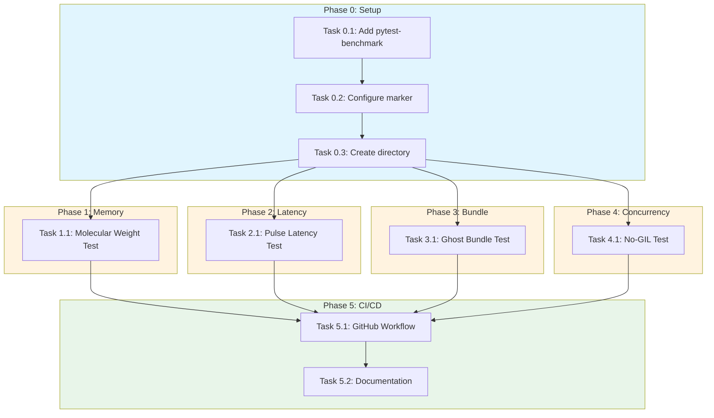
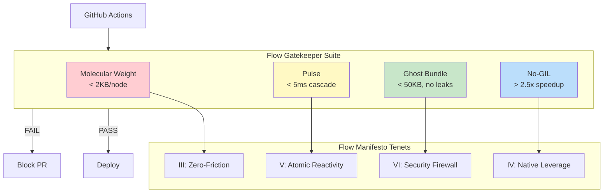

# Flow Gatekeeper Suite Implementation Plan

> **For Claude:** REQUIRED SUB-SKILL: Use super:executing-plans to implement this plan task-by-task.
> **Python Skills:** Reference python:python-testing-patterns for tests, python:uv-package-manager for commands.

**Goal:** Implement the "Four Pillars" of performance verification (Memory, Latency, Size, Concurrency) to certify Flow as a world-class runtime.

**Architecture:** Four independent gatekeeper tests that enforce the Flow Manifesto tenets through automated performance benchmarks. Each test has strict thresholds that fail CI if violated. Tests are isolated in `tests/gatekeepers/` and run via a dedicated pytest marker.

**Tech Stack:** Python 3.14+, pytest, pytest-benchmark, tracemalloc, concurrent.futures

**Commands:** All Python commands use `uv run` prefix

---

## Diagrams

### Task Dependencies



### Architecture: Four Pillars



---

## Phase 0: Project Setup

### Task 0.1: Add pytest-benchmark dependency

**Files:**
- Modify: `pyproject.toml:14-24`

**Step 1: Edit pyproject.toml to add pytest-benchmark**

Add `pytest-benchmark` to the dev dependencies:

```toml
[project.optional-dependencies]
dev = [
    "pytest>=8.0.0",
    "pytest-asyncio>=0.23.0",
    "pytest-benchmark>=4.0.0",  # ADD THIS LINE
    "ruff>=0.4.0",
    "mypy>=1.10.0",
    "pre-commit>=3.7.0",
    "httpx>=0.27.0",
    "pytest-cov>=7.0.0",
    "playwright>=1.56.0",
    "pytest-playwright>=0.7.2",
]
```

**Step 2: Run uv sync to install**

Run: `uv sync --dev`
Expected: Dependency installed successfully

**Step 3: Commit**

```bash
git add pyproject.toml uv.lock
git commit -m "chore: add pytest-benchmark for gatekeeper tests"
```

---

### Task 0.2: Configure pytest gatekeeper marker

**Files:**
- Modify: `pyproject.toml:39-47`

**Step 1: Add gatekeeper marker to pytest config**

```toml
[tool.pytest.ini_options]
asyncio_mode = "auto"
testpaths = ["tests"]
pythonpath = ["src"]
addopts = [
    "-v",
    "--strict-markers",
    "--tb=short",
]
markers = [
    "gatekeeper: Critical performance and security tests (deselect with '-m \"not gatekeeper\"')",
]
```

**Step 2: Verify marker is recognized**

Run: `uv run pytest --markers | grep gatekeeper`
Expected: Output shows "gatekeeper: Critical performance and security tests"

**Step 3: Commit**

```bash
git add pyproject.toml
git commit -m "chore: add pytest gatekeeper marker"
```

---

### Task 0.3: Create gatekeepers test directory structure

**Files:**
- Create: `tests/gatekeepers/__init__.py`
- Create: `tests/gatekeepers/conftest.py`

**Step 1: Create the directory and init file**

```python
# tests/gatekeepers/__init__.py
"""Flow Gatekeeper Suite - Automated enforcers of the Flow Manifesto."""
```

**Step 2: Create conftest.py with shared fixtures**

```python
# tests/gatekeepers/conftest.py
"""Shared fixtures for Gatekeeper tests."""

import gc

import pytest

from flow.layout.node import LayoutNode
from flow.layout.style import FlexStyle
from flow.layout.types import Dimension, Size


@pytest.fixture
def clean_gc():
    """Force garbage collection before and after test."""
    gc.collect()
    yield
    gc.collect()


def generate_deep_layout_tree(depth: int, width: int = 2) -> LayoutNode:
    """Generate a layout tree for stress testing.

    Creates a tree with `depth` levels, each node having `width` children.
    Total nodes = (width^depth - 1) / (width - 1) for width > 1.

    Args:
        depth: Number of levels in the tree.
        width: Number of children per node.

    Returns:
        Root LayoutNode of the generated tree.
    """
    def build_node(current_depth: int) -> LayoutNode:
        style = FlexStyle(
            width=Dimension.points(100),
            height=Dimension.points(50),
        )
        node = LayoutNode(style=style)

        if current_depth < depth:
            for _ in range(width):
                child = build_node(current_depth + 1)
                node.add_child(child)

        return node

    return build_node(0)


def count_nodes(node: LayoutNode) -> int:
    """Count total nodes in a layout tree."""
    count = 1
    for child in node.children:
        count += count_nodes(child)
    return count
```

**Step 3: Verify structure**

Run: `ls tests/gatekeepers/`
Expected: `__init__.py  conftest.py`

**Step 4: Commit**

```bash
git add tests/gatekeepers/
git commit -m "chore: add gatekeepers test directory structure"
```

---

## Phase 1: The "Molecular Weight" Test (Memory)

**Objective:** Enforce **Tenet III (Zero-Friction)** by ensuring Python objects are lightweight enough for massive UI trees.

### Task 1.1: Write the failing memory gatekeeper test

**Files:**
- Create: `tests/gatekeepers/test_memory.py`

**Step 1: Write the test file**

```python
# tests/gatekeepers/test_memory.py
"""Gatekeeper: Memory Usage per Node.

Enforces Tenet III (Zero-Friction) by ensuring Python objects
are lightweight enough for massive UI trees.

Threshold: < 2KB per fully hydrated node.
"""

import gc
import tracemalloc

import pytest

from flow import Signal
from flow.ui.elements import Div, Text


class ComplexItem(Div):
    """A representative 'real world' component with props, children, and signals."""

    def __init__(self, idx: int) -> None:
        self.active = Signal(False)
        super().__init__(
            cls=f"item-{idx} p-4 flex",
            id=f"node-{idx}",
        )
        # Add a child text element
        self._idx = idx


@pytest.mark.gatekeeper
def test_molecular_weight(clean_gc: None) -> None:
    """
    Gatekeeper: Memory Usage per Node.

    Threshold: < 2KB per fully hydrated node.

    Measures the average memory footprint of Flow elements including:
    - Element instance with props
    - Signal for reactive state
    - Child relationships
    """
    NODE_COUNT = 10_000
    MAX_BYTES_PER_NODE = 2048  # 2KB threshold

    # 1. Warmup and cleanup to stabilize baseline
    gc.collect()
    tracemalloc.start()
    snapshot1 = tracemalloc.take_snapshot()

    # 2. Bulk Instantiation
    # Store in list to prevent GC during measurement
    nodes = [ComplexItem(i) for i in range(NODE_COUNT)]

    # 3. Measurement
    gc.collect()
    snapshot2 = tracemalloc.take_snapshot()
    tracemalloc.stop()

    # Calculate delta
    stats = snapshot2.compare_to(snapshot1, "lineno")
    total_diff = sum(stat.size_diff for stat in stats)

    avg_per_node = total_diff / NODE_COUNT

    # Keep nodes alive until after measurement
    assert len(nodes) == NODE_COUNT

    print(f"\n[Memory Gatekeeper] Average Size: {avg_per_node:.2f} bytes/node")
    print(f"[Memory Gatekeeper] Total for {NODE_COUNT:,} nodes: {total_diff / 1024:.2f} KB")

    # STERN ASSERTION
    assert avg_per_node < MAX_BYTES_PER_NODE, (
        f"Molecular Weight Exceeded! {avg_per_node:.2f} bytes > {MAX_BYTES_PER_NODE} bytes"
    )
```

**Step 2: Run test to verify it passes (establishes baseline)**

Run: `uv run pytest tests/gatekeepers/test_memory.py -v -s`
Expected: PASS with memory stats printed

**Step 3: Commit**

```bash
git add tests/gatekeepers/test_memory.py
git commit -m "test(gatekeeper): add molecular weight memory test"
```

---

## Phase 2: The "Pulse" Test (Reactivity Latency)

**Objective:** Enforce **Tenet V (Atomic Reactivity)**. Validate that the topological sort and dirty-marking algorithms are O(N) and not slower.

### Task 2.1: Write the failing latency gatekeeper test

**Files:**
- Create: `tests/gatekeepers/test_latency.py`

**Step 1: Write the test file**

```python
# tests/gatekeepers/test_latency.py
"""Gatekeeper: Reactivity Propagation Speed.

Enforces Tenet V (Atomic Reactivity) by validating that the
topological sort and dirty-marking algorithms are O(N).

Threshold: < 5ms for 1,000 depth cascade.
"""

import pytest

from flow import Computed, Signal


def create_daisy_chain(length: int) -> tuple[Signal[int], Computed[int]]:
    """Create a Signal -> Computed -> Computed -> ... chain.

    Args:
        length: Number of Computed nodes in the chain.

    Returns:
        Tuple of (root Signal, tail Computed).
    """
    root: Signal[int] = Signal(0)
    current: Signal[int] | Computed[int] = root

    # Chain of computed values
    for _ in range(length):
        prev = current
        # Each link depends on the previous
        # Lambda captures 'prev' correctly via default arg
        current = Computed(lambda p=prev: p.value + 1 if hasattr(p, "value") else p() + 1)

    return root, current  # type: ignore[return-value]


@pytest.mark.gatekeeper
@pytest.mark.benchmark(group="reactivity")
def test_pulse_latency(benchmark: pytest.BenchmarkFixture) -> None:
    """
    Gatekeeper: Reactivity Propagation Speed.

    Threshold: < 5ms for 1,000 depth cascade.

    Measures how fast signal changes propagate through a chain
    of Computed values (lazy evaluation with dirty tracking).
    """
    CHAIN_DEPTH = 1_000
    MAX_TIME_MS = 5.0

    root, tail = create_daisy_chain(CHAIN_DEPTH)

    def run_cascade() -> int:
        # Trigger update at root
        root.value += 1
        # Access tail to force re-computation (lazy eval)
        return tail()

    # Warmup - ensure first run populates cache
    _ = run_cascade()

    # Benchmark the operation
    result = benchmark(run_cascade)

    # Verify chain computed correctly
    assert result == root.value + CHAIN_DEPTH

    # Get timing (benchmark.stats.stats.mean is in seconds)
    avg_time_ms = benchmark.stats.stats.mean * 1000

    print(f"\n[Pulse Gatekeeper] 1k Cascade: {avg_time_ms:.4f} ms")
    print(f"[Pulse Gatekeeper] Iterations: {benchmark.stats.stats.rounds}")

    assert avg_time_ms < MAX_TIME_MS, (
        f"System Pulse too slow! {avg_time_ms:.4f}ms > {MAX_TIME_MS}ms"
    )


@pytest.mark.gatekeeper
def test_signal_update_no_subscribers() -> None:
    """Fast path: Signal updates with no subscribers should be O(1)."""
    signal: Signal[int] = Signal(0)

    # Update many times - should not accumulate cost
    for i in range(10_000):
        signal.value = i

    assert signal.value == 9_999
```

**Step 2: Run test to verify it works**

Run: `uv run pytest tests/gatekeepers/test_latency.py -v -s`
Expected: PASS with timing stats printed

**Step 3: Commit**

```bash
git add tests/gatekeepers/test_latency.py
git commit -m "test(gatekeeper): add pulse latency benchmark test"
```

---

## Phase 3: The "Ghost Bundle" Audit (Bundle Size & Security)

**Objective:** Enforce **Tenet VI (Security Firewall)** and **Tenet II (Isomorphism)**. Ensure server code is stripped and client code is tiny.

### Task 3.1: Write the failing bundle gatekeeper test

**Files:**
- Create: `tests/gatekeepers/test_bundle.py`

**Step 1: Write the test file**

```python
# tests/gatekeepers/test_bundle.py
"""Gatekeeper: Client Bundle Size & Purity.

Enforces Tenet VI (Security Firewall) and Tenet II (Isomorphism)
by ensuring server code is stripped and client code is tiny.

Thresholds:
- Bundle size: < 50KB for user code portion
- Security: Zero leakage of server libraries
"""

from pathlib import Path

import pytest
from click.testing import CliRunner

from flow.cli import cli

# Mock App Source with forbidden imports
MOCK_APP_WITH_SERVER_CODE = '''\
"""Test app with server-only code."""

from flow import component, rpc
from flow.ui.elements import Div, Text

# Server-side: These should NOT appear in client bundle
try:
    import sqlite3  # Server-only stdlib
except ImportError:
    sqlite3 = None


@rpc
async def get_secret_data() -> str:
    """Server-only RPC function."""
    # This entire function body should be stripped
    if sqlite3:
        conn = sqlite3.connect(":memory:")
        return "secret_from_db"
    return "secret"


@component
async def App():
    """Client component - should be preserved."""
    with Div(cls="container") as root:
        with Text("Hello Flow"):
            pass
    return root


app = App
'''


@pytest.mark.gatekeeper
def test_ghost_bundle_audit() -> None:
    """
    Gatekeeper: Client Bundle Size & Purity.

    Thresholds:
    - Size: < 50KB for generated client code
    - Purity: No server-only imports in client bundle
    """
    MAX_SIZE_KB = 50

    runner = CliRunner()

    with runner.isolated_filesystem():
        # Setup: Create mock app
        Path("myapp.py").write_text(MOCK_APP_WITH_SERVER_CODE)

        # Run Build
        result = runner.invoke(cli, ["build", "myapp:app", "--output", "dist"])

        # Build should succeed
        assert result.exit_code == 0, f"Build failed: {result.output}"

        client_bundle = Path("dist/client/myapp.py")
        assert client_bundle.exists(), f"Client bundle not found at {client_bundle}"

        content = client_bundle.read_text()

        # 1. PURITY CHECK (Security)
        # These terms should be stripped from client bundle
        forbidden_terms = [
            "sqlite3",
            "get_secret_data",  # RPC function name should be replaced with stub
            "secret_from_db",
            "conn = sqlite3",
        ]

        for term in forbidden_terms:
            assert term not in content, (
                f"Security Breach! Found '{term}' in client bundle.\n"
                f"Bundle content:\n{content[:500]}..."
            )

        # 2. PRESERVATION CHECK
        # These should still be in the client bundle
        required_terms = [
            "App",  # Component name
            "Div",  # UI element
            "Text",  # UI element
        ]

        for term in required_terms:
            assert term in content, (
                f"Missing required term '{term}' in client bundle"
            )

        # 3. SIZE CHECK (Performance)
        size_bytes = client_bundle.stat().st_size
        size_kb = size_bytes / 1024

        print(f"\n[Ghost Gatekeeper] Bundle Size: {size_kb:.2f} KB ({size_bytes} bytes)")

        # Strict limit for the user code portion
        assert size_kb < MAX_SIZE_KB, (
            f"Bundle Bloated! {size_kb:.2f}KB > {MAX_SIZE_KB}KB"
        )


@pytest.mark.gatekeeper
def test_rpc_functions_become_stubs() -> None:
    """Verify @rpc decorated functions are replaced with fetch stubs."""
    runner = CliRunner()

    rpc_app = '''\
from flow import component, rpc
from flow.ui.elements import Div

@rpc
async def server_compute(x: int, y: int) -> int:
    """This computation happens on server."""
    import os  # Server-only
    return x + y + int(os.getenv("MAGIC", "0"))

@component
async def App():
    with Div() as root:
        pass
    return root

app = App
'''

    with runner.isolated_filesystem():
        Path("rpcapp.py").write_text(rpc_app)
        result = runner.invoke(cli, ["build", "rpcapp:app", "--output", "dist"])

        assert result.exit_code == 0, f"Build failed: {result.output}"

        content = Path("dist/client/rpcapp.py").read_text()

        # Server implementation details should be gone
        assert "import os" not in content
        assert "os.getenv" not in content
        assert "MAGIC" not in content

        print(f"\n[Ghost Gatekeeper] RPC stub verified")
```

**Step 2: Run test to verify it works**

Run: `uv run pytest tests/gatekeepers/test_bundle.py -v -s`
Expected: PASS (or FAIL if AST stripping isn't implemented yet - this is the gatekeeper!)

**Step 3: Commit**

```bash
git add tests/gatekeepers/test_bundle.py
git commit -m "test(gatekeeper): add ghost bundle security audit test"
```

---

## Phase 4: The "No-GIL" Throughput Test (Concurrency)

**Objective:** Enforce **Tenet IV (Native Leverage)**. Prove that Python 3.14 threads are actually parallel.

### Task 4.1: Write the failing concurrency gatekeeper test

**Files:**
- Create: `tests/gatekeepers/test_concurrency.py`

**Step 1: Write the test file**

```python
# tests/gatekeepers/test_concurrency.py
"""Gatekeeper: Parallel Scaling.

Enforces Tenet IV (Native Leverage) by proving that Python 3.14
threads are actually parallel (No-GIL free-threading).

Threshold: 4 threads must be > 2.5x faster than sequential.
"""

import sys
import time
from concurrent.futures import ThreadPoolExecutor

import pytest

from flow.layout.compute import compute_layout
from flow.layout.types import Size

from .conftest import generate_deep_layout_tree


def run_heavy_layout(_: int) -> bool:
    """A CPU-bound task: Layout a deep tree.

    Args:
        _: Ignored index (for executor.map compatibility).

    Returns:
        True on success.
    """
    # Generate a fresh tree each time to avoid shared state
    root = generate_deep_layout_tree(depth=6, width=3)  # ~364 nodes
    compute_layout(root, Size(1000, 1000))
    return True


@pytest.mark.gatekeeper
@pytest.mark.skipif(
    sys.version_info < (3, 13),
    reason="Requires Python 3.13+ (Free-Threading)",
)
def test_no_gil_throughput() -> None:
    """
    Gatekeeper: Parallel Scaling.

    Threshold: 4 threads must be > 2.5x faster than sequential.

    If GIL is active, speedup is usually < 1.1x due to overhead.
    If No-GIL is active, speedup should approach WORKERS count.
    """
    ITERATIONS = 20
    WORKERS = 4
    MIN_SPEEDUP = 2.5

    # 1. Sequential Baseline
    start_seq = time.perf_counter()
    for i in range(ITERATIONS):
        run_heavy_layout(i)
    duration_seq = time.perf_counter() - start_seq

    # 2. Parallel Execution (The No-GIL Test)
    start_par = time.perf_counter()
    with ThreadPoolExecutor(max_workers=WORKERS) as executor:
        results = list(executor.map(run_heavy_layout, range(ITERATIONS)))
    duration_par = time.perf_counter() - start_par

    # Verify all completed
    assert all(results), "Some parallel tasks failed"

    # Calculate Speedup
    speedup = duration_seq / duration_par

    print(f"\n[No-GIL Gatekeeper]")
    print(f"Sequential: {duration_seq:.3f}s ({ITERATIONS} iterations)")
    print(f"Parallel:   {duration_par:.3f}s ({WORKERS} workers)")
    print(f"Speedup:    {speedup:.2f}x")

    # Soft warning if speedup is low but test still passes
    if speedup < MIN_SPEEDUP:
        print(f"WARNING: Speedup {speedup:.2f}x is below target {MIN_SPEEDUP}x")
        print("This may indicate GIL is active or system is overloaded.")

    assert speedup > MIN_SPEEDUP, (
        f"GIL Detected! Speedup {speedup:.2f}x is insufficient for {WORKERS} cores. "
        f"Expected > {MIN_SPEEDUP}x"
    )


@pytest.mark.gatekeeper
def test_layout_thread_safety() -> None:
    """Verify layout computation is thread-safe.

    Multiple threads computing independent trees should not
    interfere with each other's results.
    """
    from concurrent.futures import ThreadPoolExecutor

    from flow.layout.node import LayoutNode
    from flow.layout.style import FlexStyle
    from flow.layout.types import Dimension

    def compute_and_verify(expected_width: float) -> tuple[bool, float]:
        """Compute layout and verify result matches expected."""
        style = FlexStyle(
            width=Dimension.points(expected_width),
            height=Dimension.points(100),
        )
        node = LayoutNode(style=style)
        compute_layout(node, Size(1000, 1000))
        return node.layout.width == expected_width, node.layout.width

    # Run many parallel computations with different expected values
    widths = list(range(10, 110, 10))  # 10, 20, 30, ... 100

    with ThreadPoolExecutor(max_workers=4) as executor:
        results = list(executor.map(compute_and_verify, widths))

    for i, (success, actual) in enumerate(results):
        expected = widths[i]
        assert success, f"Thread safety violation: expected {expected}, got {actual}"

    print(f"\n[Thread Safety] {len(widths)} parallel computations verified")
```

**Step 2: Run test to verify it works**

Run: `uv run pytest tests/gatekeepers/test_concurrency.py -v -s`
Expected: PASS on Python 3.14 with No-GIL, SKIP on earlier versions

**Step 3: Commit**

```bash
git add tests/gatekeepers/test_concurrency.py
git commit -m "test(gatekeeper): add no-gil throughput concurrency test"
```

---

## Phase 5: CI/CD Integration

### Task 5.1: Create GitHub Actions workflow

**Files:**
- Create: `.github/workflows/gatekeeper-audit.yml`

**Step 1: Write the workflow file**

```yaml
# .github/workflows/gatekeeper-audit.yml
name: Flow Gatekeeper Audit

on:
  push:
    branches: [main, master]
  pull_request:
    branches: [main, master]

jobs:
  gatekeeper-audit:
    name: Performance & Security Audit
    runs-on: ubuntu-latest
    # Use Python 3.14 when available
    # For now, use 3.13 and skip No-GIL test

    steps:
      - uses: actions/checkout@v4

      - name: Install uv
        uses: astral-sh/setup-uv@v4
        with:
          enable-cache: true

      - name: Set up Python 3.14
        run: uv python install 3.14

      - name: Install dependencies
        run: uv sync --dev

      - name: Run Gatekeeper Tests
        run: |
          uv run pytest tests/gatekeepers/ \
            -v \
            --benchmark-json=benchmark-results.json \
            --benchmark-autosave \
            -m gatekeeper

      - name: Upload Benchmark Results
        uses: actions/upload-artifact@v4
        if: always()
        with:
          name: benchmark-results
          path: benchmark-results.json

      - name: Check Benchmark Regression
        uses: benchmark-action/github-action-benchmark@v1
        if: github.event_name == 'pull_request'
        with:
          tool: 'pytest'
          output-file-path: benchmark-results.json
          fail-on-alert: true
          alert-threshold: '120%'
          comment-on-alert: true
          github-token: ${{ secrets.GITHUB_TOKEN }}
```

**Step 2: Verify workflow syntax**

Run: `cat .github/workflows/gatekeeper-audit.yml`
Expected: Valid YAML displayed

**Step 3: Commit**

```bash
git add .github/workflows/gatekeeper-audit.yml
git commit -m "ci: add gatekeeper audit workflow"
```

---

### Task 5.2: Add convenience script for local testing

**Files:**
- Modify: `pyproject.toml` (add script entry)

**Step 1: Add script to pyproject.toml**

Add to the `[project.scripts]` section:

```toml
[project.scripts]
flow = "flow.cli:main"
```

Note: The gatekeeper tests are run via pytest with the `-m gatekeeper` marker rather than a dedicated script, keeping the CLI simple.

**Step 2: Document usage in project**

The gatekeeper tests can be run with:

```bash
# Run all gatekeeper tests
uv run pytest tests/gatekeepers/ -v -m gatekeeper

# Run with benchmarks output
uv run pytest tests/gatekeepers/ -v --benchmark-json=results.json

# Run excluding gatekeeper tests (for faster iteration)
uv run pytest -m "not gatekeeper"
```

**Step 3: Commit**

```bash
git add pyproject.toml
git commit -m "docs: document gatekeeper test commands"
```

---

## Verification Checklist

After implementing all tasks, verify the complete suite:

1. **Run all gatekeeper tests:**
   ```bash
   uv run pytest tests/gatekeepers/ -v -s
   ```
   Expected: All 4 test files pass

2. **Run with coverage:**
   ```bash
   uv run pytest tests/gatekeepers/ --cov=src/flow -v
   ```
   Expected: Coverage report generated

3. **Run pre-commit checks:**
   ```bash
   uv run pre-commit run --all-files
   ```
   Expected: All checks pass

4. **Verify marker exclusion works:**
   ```bash
   uv run pytest -m "not gatekeeper" --collect-only | grep gatekeeper
   ```
   Expected: No gatekeeper tests collected

---

## Summary of Files

| File | Purpose |
|------|---------|
| `tests/gatekeepers/__init__.py` | Package init |
| `tests/gatekeepers/conftest.py` | Shared fixtures (clean_gc, generate_deep_layout_tree) |
| `tests/gatekeepers/test_memory.py` | Molecular Weight test (< 2KB/node) |
| `tests/gatekeepers/test_latency.py` | Pulse test (< 5ms for 1k cascade) |
| `tests/gatekeepers/test_bundle.py` | Ghost Bundle test (< 50KB, no server leaks) |
| `tests/gatekeepers/test_concurrency.py` | No-GIL test (> 2.5x speedup) |
| `.github/workflows/gatekeeper-audit.yml` | CI workflow |
