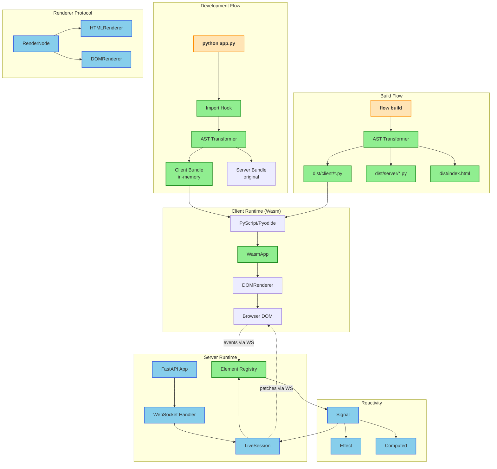

# Flow Framework Missing Features Implementation Plan

> **For Claude:** REQUIRED SUB-SKILL: Use super:executing-plans to implement this plan task-by-task.
> **Python Skills:** Reference python:python-testing-patterns for tests, python:uv-package-manager for commands.

**Goal:** Complete the Flow framework by implementing WebAssembly client runtime, import hooks for zero-build development, event handler hydration, and production build tooling.

**Architecture:** Flow uses the Renderer Protocol pattern—Elements produce abstract RenderNodes; Renderers consume them. This enables the Universal Runtime: HTMLRenderer for SSR, DOMRenderer for Wasm. The missing pieces connect client-side interactivity (event hydration, Wasm runtime) and developer experience (import hooks, build CLI).

**Tech Stack:** Python 3.14+, PyScript/Pyodide (Wasm), FastAPI, WebSockets, AST module

**Commands:** All Python commands use `uv run` prefix

---

## Architecture Diagram



**Legend:**
- 🟢 **Green** = New components (this plan)
- 🔵 **Blue** = Existing components (already implemented)
- 🟠 **Orange** = Entry points (CLI commands)

---

## Current Implementation Status

### Fully Implemented (No Work Needed)
- **Core Reactivity:** Signal, Effect, Computed (thread-safe for No-GIL)
- **Element System:** Element base class with context managers, UI elements (Div, Text, Button, etc.)
- **Renderer Protocol:** Abstract Renderer, RenderNode, HTMLRenderer
- **Component System:** @component decorator with PEP 649 lazy injection
- **RPC System:** @rpc decorator, RpcRegistry, FlowJSONEncoder
- **Server Runtime:** FastAPI app factory, LiveSession, WebSocket endpoints
- **Layout Engine:** Full CSS Flexbox implementation with caching

### Partially Implemented (Needs Completion)
- **DOMRenderer:** Stub exists, needs event handler binding
- **AST Splitter:** Basic split exists in `src/flow/dev/splitter.py`, needs security-hardened version
- **CLI:** `dev` and `new` work, `build` is stubbed

### Not Yet Started
- **Import Hook System:** Zero-build development via `sys.meta_path`
- **Event Hydration:** Connect client events to server handlers
- **Wasm Client Runtime:** PyScript/Pyodide integration
- **Diff/Patch Algorithm:** Efficient incremental DOM updates
- **Hot Reload:** File watching and live updates

---

## Phase 1: Zero-Build Import Hook System

**Objective:** Enable `python app.py` to run full-stack apps without a build step during development.

---

### Task 1.1: Client-Safe AST Transformer

**Files:**
- Create: `src/flow/compiler/__init__.py`
- Create: `src/flow/compiler/transformer.py`
- Test: `tests/test_compiler_transformer.py`

**Step 1: Write the failing test**

```python
# tests/test_compiler_transformer.py
"""Tests for client-safe AST transformation."""

import pytest
from flow.compiler.transformer import ClientSafeTransformer, transform_for_client


def test_transformer_keeps_component():
    """Client bundle keeps @component decorated functions."""
    source = '''
from flow import component
from flow.ui import Div

@component
async def MyApp():
    with Div():
        pass
'''
    result = transform_for_client(source)

    assert "@component" in result
    assert "async def MyApp" in result


def test_transformer_stubs_rpc_body():
    """@rpc function bodies are replaced with fetch stub."""
    source = '''
from flow import rpc
import sqlalchemy

@rpc
async def save_to_db(data: str):
    db = sqlalchemy.connect()
    db.save(data)
    return "saved"
'''
    result = transform_for_client(source)

    assert "@rpc" in result
    assert "async def save_to_db" in result
    # Body should be stubbed - no server code
    assert "sqlalchemy.connect" not in result
    # Should have fetch stub
    assert "fetch" in result.lower() or "pass" in result


def test_transformer_removes_server_imports():
    """Server-only imports are removed from client bundle."""
    source = '''
import sqlalchemy
import pandas as pd
import boto3
from flow import component

@component
async def App():
    pass
'''
    result = transform_for_client(source)

    assert "import sqlalchemy" not in result
    assert "import pandas" not in result
    assert "import boto3" not in result
    assert "from flow import component" in result


def test_transformer_preserves_ui_code():
    """UI code and state management is fully preserved."""
    source = '''
from flow import Signal, component
from flow.ui import Text

class AppState:
    count = Signal(0)

@component
async def Counter(state: AppState):
    state.count.value += 1
'''
    result = transform_for_client(source)

    assert "class AppState" in result
    assert "count = Signal(0)" in result
    assert "state.count.value += 1" in result


def test_transformer_detects_dangerous_imports():
    """Transformer raises warning for dangerous server imports in client context."""
    source = '''
import os
from flow import component

@component
async def App():
    # This would leak env vars to client!
    api_key = os.environ["SECRET_KEY"]
'''
    # Should not crash but should remove os import
    result = transform_for_client(source)

    assert "import os" not in result


def test_transformer_handles_nested_decorators():
    """Handles functions with multiple decorators."""
    source = '''
from flow import rpc
from functools import cache

@cache
@rpc
async def expensive_query(x: int):
    return x * 2
'''
    result = transform_for_client(source)

    # @rpc should be preserved, body stubbed
    assert "@rpc" in result
    assert "x * 2" not in result  # Body stubbed
```

**Step 2: Run test to verify it fails**

Run: `uv run pytest tests/test_compiler_transformer.py -v`
Expected: FAIL with "ModuleNotFoundError"

**Step 3: Write minimal implementation**

```python
# src/flow/compiler/__init__.py
"""Flow Compiler - AST transformation and import hooks for zero-build dev."""

from flow.compiler.transformer import (
    ClientSafeTransformer,
    transform_for_client,
    compile_for_client,
)

__all__ = [
    "ClientSafeTransformer",
    "transform_for_client",
    "compile_for_client",
]
```

```python
# src/flow/compiler/transformer.py
"""Client-Safe AST Transformer - Security-hardened code splitting.

Transforms Python source for client-side execution by:
1. Removing server-only imports (sqlalchemy, pandas, boto3, os, etc.)
2. Stubbing @rpc function bodies with fetch proxies
3. Preserving @component functions and UI code
4. Detecting dangerous patterns that could leak secrets

Per MANIFEST.md Tenet VI: "The Client is a privilege-reduced environment."
"""

from __future__ import annotations

import ast
import sys
import warnings
from typing import ClassVar


# Imports that are SERVER-ONLY and MUST be removed from client bundles
# These are security-sensitive - leaking them could expose credentials
SERVER_ONLY_MODULES: set[str] = {
    # Database
    "sqlalchemy",
    "psycopg2",
    "pymongo",
    "redis",
    "sqlite3",
    # Cloud/Infrastructure
    "boto3",
    "botocore",
    "google.cloud",
    "azure",
    # Data processing (often has secrets in pipelines)
    "pandas",
    "numpy",  # Sometimes loads from authenticated sources
    # System access (DANGEROUS - can leak env vars)
    "os",
    "subprocess",
    "shutil",
    "pathlib",  # Can expose server paths
    # Async workers (server-only)
    "celery",
    "dramatiq",
    "rq",
    # Secrets management
    "dotenv",
    "hvac",
    "keyring",
}


class ClientSafeTransformer(ast.NodeTransformer):
    """
    Walks the AST and transforms for client-safe execution.

    Security model:
    - Server imports are REMOVED (not just stubbed)
    - @rpc bodies are replaced with fetch() calls
    - Warnings are emitted for dangerous patterns
    """

    def __init__(self) -> None:
        super().__init__()
        self.warnings: list[str] = []

    def visit_Import(self, node: ast.Import) -> ast.Import | None:
        """Remove server-only imports."""
        remaining = []
        for alias in node.names:
            module_root = alias.name.split(".")[0]
            if module_root in SERVER_ONLY_MODULES:
                self.warnings.append(
                    f"Removed server-only import: {alias.name}"
                )
            else:
                remaining.append(alias)

        if not remaining:
            return None

        node.names = remaining
        return node

    def visit_ImportFrom(self, node: ast.ImportFrom) -> ast.ImportFrom | None:
        """Remove server-only from imports."""
        if node.module:
            module_root = node.module.split(".")[0]
            if module_root in SERVER_ONLY_MODULES:
                self.warnings.append(
                    f"Removed server-only import: from {node.module}"
                )
                return None
        return node

    def visit_AsyncFunctionDef(
        self, node: ast.AsyncFunctionDef
    ) -> ast.AsyncFunctionDef:
        """Stub @rpc decorated async functions with fetch proxy."""
        if self._has_rpc_decorator(node):
            # Replace body with fetch stub
            node.body = self._create_fetch_stub(node.name, is_async=True)
        else:
            # Recurse into non-RPC functions
            self.generic_visit(node)
        return node

    def visit_FunctionDef(self, node: ast.FunctionDef) -> ast.FunctionDef:
        """Stub @rpc decorated sync functions."""
        if self._has_rpc_decorator(node):
            node.body = self._create_fetch_stub(node.name, is_async=False)
        else:
            self.generic_visit(node)
        return node

    def _has_rpc_decorator(
        self, node: ast.FunctionDef | ast.AsyncFunctionDef
    ) -> bool:
        """Check if function has @rpc decorator."""
        for decorator in node.decorator_list:
            if isinstance(decorator, ast.Name) and decorator.id == "rpc":
                return True
            if isinstance(decorator, ast.Call):
                func = decorator.func
                if isinstance(func, ast.Name) and func.id == "rpc":
                    return True
                if isinstance(func, ast.Attribute) and func.attr == "rpc":
                    return True
        return False

    def _create_fetch_stub(
        self, func_name: str, is_async: bool
    ) -> list[ast.stmt]:
        """
        Create a fetch() stub body for RPC functions.

        For client-side Wasm, this will call the server via HTTP.
        """
        # For now, just use pass - full implementation needs JS interop
        # In Wasm: would be `await js.fetch(f"/api/rpc/{func_name}", ...)`
        return [ast.Pass()]


def transform_for_client(source: str) -> str:
    """
    Transform Python source code for client-side execution.

    Returns source code safe for Wasm deployment.
    """
    tree = ast.parse(source)
    transformer = ClientSafeTransformer()
    transformed = transformer.visit(tree)
    ast.fix_missing_locations(transformed)

    # Emit warnings for removed imports
    for warning in transformer.warnings:
        warnings.warn(warning, stacklevel=2)

    return ast.unparse(transformed)


def compile_for_client(source: str, filename: str = "<flow>") -> type[object]:
    """
    Compile source to bytecode for client execution.

    Used by import hook for in-memory transformation.
    """
    tree = ast.parse(source)
    transformer = ClientSafeTransformer()
    transformed = transformer.visit(tree)
    ast.fix_missing_locations(transformed)

    return compile(transformed, filename, "exec")
```

**Step 4: Run test to verify it passes**

Run: `uv run pytest tests/test_compiler_transformer.py -v`
Expected: PASS (6 tests)

**Step 5: Commit**

```bash
git add src/flow/compiler/ tests/test_compiler_transformer.py
git commit -m "feat(compiler): add client-safe AST transformer"
```

---

### Task 1.2: Import Hook for Zero-Build Development

**Files:**
- Create: `src/flow/compiler/importer.py`
- Test: `tests/test_compiler_importer.py`

**Step 1: Write the failing test**

```python
# tests/test_compiler_importer.py
"""Tests for zero-build import hook."""

import sys
import tempfile
from pathlib import Path

import pytest

from flow.compiler.importer import (
    FlowImportHook,
    install_import_hook,
    uninstall_import_hook,
    set_debug_mode,
)


def test_import_hook_can_be_installed():
    """Import hook can be added to sys.meta_path."""
    initial_count = len(sys.meta_path)

    install_import_hook()
    try:
        assert len(sys.meta_path) == initial_count + 1
        assert any(isinstance(f, FlowImportHook) for f in sys.meta_path)
    finally:
        uninstall_import_hook()

    assert len(sys.meta_path) == initial_count


def test_import_hook_caches_transformations():
    """Import hook caches transformed modules for performance."""
    install_import_hook()
    try:
        hook = next(f for f in sys.meta_path if isinstance(f, FlowImportHook))
        assert hasattr(hook, "_cache")
    finally:
        uninstall_import_hook()


def test_import_hook_respects_debug_env():
    """Import hook respects FLOW_DEBUG environment variable."""
    import os

    original = os.environ.get("FLOW_DEBUG")
    try:
        os.environ["FLOW_DEBUG"] = "1"
        hook = FlowImportHook()
        assert hook._debug_mode is True
    finally:
        if original is None:
            os.environ.pop("FLOW_DEBUG", None)
        else:
            os.environ["FLOW_DEBUG"] = original


def test_debug_mode_can_be_set_programmatically():
    """Debug mode can be enabled via function call."""
    set_debug_mode(True)
    hook = FlowImportHook()
    assert hook._debug_mode is True
    set_debug_mode(False)


def test_import_hook_handles_client_suffix():
    """Import hook handles *_client module pattern."""
    install_import_hook()
    try:
        hook = next(f for f in sys.meta_path if isinstance(f, FlowImportHook))

        # Create a temp file to test finding
        with tempfile.TemporaryDirectory() as tmpdir:
            test_file = Path(tmpdir) / "myapp.py"
            test_file.write_text("""
from flow import component
@component
async def App():
    pass
""")

            # Hook should find myapp.py when looking for myapp_client
            spec = hook.find_spec("myapp_client", [tmpdir])
            assert spec is not None
            assert "myapp.py" in spec.origin

    finally:
        uninstall_import_hook()


def test_import_hook_ignores_non_client_modules():
    """Import hook ignores modules without _client suffix."""
    install_import_hook()
    try:
        hook = next(f for f in sys.meta_path if isinstance(f, FlowImportHook))

        # Regular imports should return None (not handled)
        spec = hook.find_spec("json", None)
        assert spec is None

        spec = hook.find_spec("flow.signal", None)
        assert spec is None

    finally:
        uninstall_import_hook()
```

**Step 2: Run test to verify it fails**

Run: `uv run pytest tests/test_compiler_importer.py -v`
Expected: FAIL with "ModuleNotFoundError"

**Step 3: Write minimal implementation**

```python
# src/flow/compiler/importer.py
"""
Import Hook for Zero-Build Development.

Registers a sys.meta_path finder that intercepts imports of
'*_client' modules and transforms them on-the-fly.

Per MANIFEST.md Tenet III: "python app.py must be the only command
required to start a full-stack dev environment."

DEBUG MODE:
    Set FLOW_DEBUG=1 to dump transformed source to .flow-debug/
    This helps troubleshoot AST transformation issues.

Usage:
    from flow.compiler.importer import install_import_hook
    install_import_hook()

    # Now 'import myapp_client' will:
    # 1. Find 'myapp.py'
    # 2. Transform via ClientSafeTransformer
    # 3. Execute transformed bytecode
"""

from __future__ import annotations

import importlib.abc
import importlib.machinery
import importlib.util
import os
import sys
import threading
from datetime import datetime
from pathlib import Path
from typing import Sequence

from flow.compiler.transformer import compile_for_client, transform_for_client


# Global debug settings
_debug_mode: bool = False
_debug_output_dir: Path = Path(".flow-debug")
_settings_lock = threading.Lock()


def set_debug_mode(enabled: bool, output_dir: Path | None = None) -> None:
    """Enable or disable debug mode for import hook."""
    global _debug_mode, _debug_output_dir
    with _settings_lock:
        _debug_mode = enabled
        if output_dir is not None:
            _debug_output_dir = output_dir


def get_debug_output_dir() -> Path:
    """Get the current debug output directory."""
    return _debug_output_dir


def _is_debug_enabled() -> bool:
    """Check if debug mode is enabled."""
    return _debug_mode or os.environ.get("FLOW_DEBUG", "").lower() in (
        "1",
        "true",
        "yes",
    )


class FlowImportHook(importlib.abc.MetaPathFinder, importlib.abc.Loader):
    """
    Import hook that transforms '*_client' modules on-the-fly.

    When you import 'myapp_client', this finder:
    1. Looks for 'myapp.py' in the same directory
    2. Reads the source
    3. Runs ClientSafeTransformer
    4. Compiles and executes the transformed bytecode

    No physical file is created - everything happens in memory.
    """

    def __init__(self) -> None:
        self._cache: dict[str, tuple[float, object]] = {}
        self._lock = threading.Lock()
        self._debug_mode = _is_debug_enabled()

    def find_spec(
        self,
        fullname: str,
        path: Sequence[str] | None,
        target: object | None = None,
    ) -> importlib.machinery.ModuleSpec | None:
        """Find module spec for '*_client' modules."""
        # Only handle modules ending in '_client'
        if not fullname.endswith("_client"):
            return None

        # Derive the original module name
        original_name = fullname[:-7]  # Remove '_client' suffix

        # Handle dotted names (e.g., mypackage.myapp_client)
        parts = original_name.split(".")
        filename = parts[-1] + ".py"

        # Try to find the original .py file
        search_paths = list(path) if path else sys.path

        for search_path in search_paths:
            original_path = Path(search_path) / filename
            if original_path.exists():
                return importlib.machinery.ModuleSpec(
                    name=fullname,
                    loader=self,
                    origin=str(original_path),
                )

        return None

    def create_module(
        self, spec: importlib.machinery.ModuleSpec
    ) -> None:
        """Use default module creation."""
        return None

    def exec_module(self, module: object) -> None:
        """Execute the transformed module."""
        spec = getattr(module, "__spec__", None)
        if spec is None or spec.origin is None:
            raise ImportError(f"Cannot load module without origin: {module}")

        origin_path = Path(spec.origin)

        with self._lock:
            # Check cache by mtime
            cache_key = str(origin_path)
            mtime = origin_path.stat().st_mtime

            cached = self._cache.get(cache_key)
            if cached and cached[0] == mtime:
                code = cached[1]
            else:
                # Read and transform
                source = origin_path.read_text(encoding="utf-8")
                code = compile_for_client(source, str(origin_path))
                self._cache[cache_key] = (mtime, code)

                # DEBUG MODE: Dump transformed source
                if self._debug_mode:
                    self._dump_debug_output(spec.name, origin_path, source)

        # Execute in module's namespace
        exec(code, module.__dict__)

    def _dump_debug_output(
        self, module_name: str, origin_path: Path, original_source: str
    ) -> None:
        """Dump transformed source to disk for debugging."""
        try:
            debug_dir = get_debug_output_dir()
            debug_dir.mkdir(parents=True, exist_ok=True)

            transformed = transform_for_client(original_source)

            debug_file = debug_dir / f"{module_name}.py"
            debug_content = f'''# FLOW DEBUG OUTPUT
# ==================
# Original file: {origin_path}
# Module name: {module_name}
# Generated at: {datetime.now().isoformat()}
#
# Transformations applied:
#   - Removed server-only imports
#   - Stubbed @rpc function bodies
#   - Preserved @component functions and client code
# ==================

{transformed}
'''
            debug_file.write_text(debug_content)
            print(f"[FLOW DEBUG] {debug_file}", file=sys.stderr)

        except Exception as e:
            print(f"[FLOW DEBUG] Warning: {e}", file=sys.stderr)


# Singleton instance
_import_hook: FlowImportHook | None = None


def install_import_hook(debug: bool = False) -> None:
    """Install the Flow import hook for zero-build development."""
    global _import_hook

    if debug:
        set_debug_mode(True)

    if _import_hook is not None:
        return  # Already installed

    _import_hook = FlowImportHook()
    sys.meta_path.insert(0, _import_hook)


def uninstall_import_hook() -> None:
    """Remove the Flow import hook."""
    global _import_hook

    if _import_hook is not None:
        sys.meta_path.remove(_import_hook)
        _import_hook = None
```

**Step 4: Update compiler exports**

```python
# src/flow/compiler/__init__.py (updated)
"""Flow Compiler - AST transformation and import hooks for zero-build dev."""

from flow.compiler.transformer import (
    ClientSafeTransformer,
    transform_for_client,
    compile_for_client,
)
from flow.compiler.importer import (
    FlowImportHook,
    install_import_hook,
    uninstall_import_hook,
    set_debug_mode,
    get_debug_output_dir,
)

__all__ = [
    "ClientSafeTransformer",
    "transform_for_client",
    "compile_for_client",
    "FlowImportHook",
    "install_import_hook",
    "uninstall_import_hook",
    "set_debug_mode",
    "get_debug_output_dir",
]
```

**Step 5: Run test to verify it passes**

Run: `uv run pytest tests/test_compiler_importer.py -v`
Expected: PASS (6 tests)

**Step 6: Commit**

```bash
git add src/flow/compiler/importer.py tests/test_compiler_importer.py
git commit -m "feat(compiler): add import hook for zero-build dev"
```

---

## Phase 2: Event Hydration System

**Objective:** Connect client-side DOM events to server-side handlers via WebSocket.

---

### Task 2.1: Element Registry for Event Lookup

**Files:**
- Create: `src/flow/runtime/registry.py`
- Test: `tests/test_runtime_registry.py`

**Step 1: Write the failing test**

```python
# tests/test_runtime_registry.py
"""Tests for element registry and event routing."""

import pytest
from flow.runtime.registry import ElementRegistry
from flow.element import Element
from flow.ui import Button, Div


def test_registry_stores_elements_by_id():
    """Registry stores elements indexed by their ID."""
    registry = ElementRegistry()

    btn = Button("Click me")
    registry.register(btn)

    retrieved = registry.get(id(btn))
    assert retrieved is btn


def test_registry_finds_handler():
    """Registry can find event handlers for elements."""
    registry = ElementRegistry()

    handler_called = []
    btn = Button("Test", on_click=lambda: handler_called.append(True))
    registry.register(btn)

    handler = registry.get_handler(id(btn), "click")
    assert handler is not None

    handler()
    assert handler_called == [True]


def test_registry_returns_none_for_missing():
    """Registry returns None for unregistered elements."""
    registry = ElementRegistry()

    assert registry.get(999999) is None
    assert registry.get_handler(999999, "click") is None


def test_registry_clears_on_rerender():
    """Registry can be cleared for fresh renders."""
    registry = ElementRegistry()

    btn = Button("Test")
    registry.register(btn)
    assert registry.get(id(btn)) is not None

    registry.clear()
    assert registry.get(id(btn)) is None


def test_registry_builds_from_tree():
    """Registry can register all elements from a tree."""
    registry = ElementRegistry()

    with Div() as root:
        with Button("One", on_click=lambda: None) as btn1:
            pass
        with Button("Two", on_click=lambda: None) as btn2:
            pass

    registry.register_tree(root)

    assert registry.get(id(root)) is root
    assert registry.get(id(btn1)) is btn1
    assert registry.get(id(btn2)) is btn2
```

**Step 2: Run test to verify it fails**

Run: `uv run pytest tests/test_runtime_registry.py -v`
Expected: FAIL with "ModuleNotFoundError"

**Step 3: Write minimal implementation**

```python
# src/flow/runtime/__init__.py
"""Flow Runtime - Client/server communication and event handling."""

from flow.runtime.registry import ElementRegistry

__all__ = ["ElementRegistry"]
```

```python
# src/flow/runtime/registry.py
"""Element Registry - Maps element IDs to instances for event routing.

When the client sends an event like {"type": "click", "target_id": "flow-12345"},
the server uses this registry to find the element and call its handler.
"""

from __future__ import annotations

import threading
from typing import TYPE_CHECKING, Any, Callable

if TYPE_CHECKING:
    from flow.element import Element


class ElementRegistry:
    """
    Thread-safe registry mapping element IDs to instances.

    Used by LiveSession to route client events to handlers.
    """

    def __init__(self) -> None:
        self._elements: dict[int, Element] = {}
        self._lock = threading.Lock()

    def register(self, element: Element) -> None:
        """Register a single element."""
        with self._lock:
            self._elements[id(element)] = element

    def register_tree(self, root: Element) -> None:
        """Register all elements in a tree (recursive)."""
        with self._lock:
            self._register_recursive(root)

    def _register_recursive(self, element: Element) -> None:
        """Recursively register element and children."""
        self._elements[id(element)] = element
        for child in element.children:
            self._register_recursive(child)

    def get(self, element_id: int) -> Element | None:
        """Get an element by its ID."""
        with self._lock:
            return self._elements.get(element_id)

    def get_handler(
        self, element_id: int, event_type: str
    ) -> Callable[[], Any] | None:
        """Get the event handler for an element.

        Args:
            element_id: The element's Python id()
            event_type: Event type (e.g., "click", "change")

        Returns:
            The handler function, or None if not found
        """
        element = self.get(element_id)
        if element is None:
            return None

        # Map event types to prop names
        prop_name = f"on_{event_type}"
        return element.props.get(prop_name)

    def clear(self) -> None:
        """Clear all registered elements."""
        with self._lock:
            self._elements.clear()

    def __len__(self) -> int:
        """Number of registered elements."""
        with self._lock:
            return len(self._elements)
```

**Step 4: Run test to verify it passes**

Run: `uv run pytest tests/test_runtime_registry.py -v`
Expected: PASS (5 tests)

**Step 5: Commit**

```bash
git add src/flow/runtime/ tests/test_runtime_registry.py
git commit -m "feat(runtime): add element registry for event routing"
```

---

### Task 2.2: Event Router in LiveSession

**Files:**
- Modify: `src/flow/server/session.py`
- Test: `tests/test_session_events.py`

**Step 1: Write the failing test**

```python
# tests/test_session_events.py
"""Tests for LiveSession event handling."""

import asyncio
from unittest.mock import AsyncMock, MagicMock

import pytest

from flow.server.session import LiveSession
from flow.ui import Button, Div


@pytest.mark.asyncio
async def test_session_routes_click_events():
    """LiveSession routes click events to element handlers."""
    handler_called = []

    with Div() as root:
        with Button(
            "Click me",
            on_click=lambda: handler_called.append("clicked"),
        ) as btn:
            pass

    mock_ws = AsyncMock()
    session = LiveSession(root, mock_ws)

    # Simulate browser sending click event
    event_data = {
        "type": "click",
        "target_id": f"flow-{id(btn)}",
    }

    await session._handle_event(event_data)

    assert handler_called == ["clicked"]


@pytest.mark.asyncio
async def test_session_handles_unknown_element():
    """LiveSession handles events for unknown elements gracefully."""
    root = Div()
    mock_ws = AsyncMock()
    session = LiveSession(root, mock_ws)

    # Event for non-existent element
    event_data = {
        "type": "click",
        "target_id": "flow-99999999",
    }

    # Should not raise
    await session._handle_event(event_data)


@pytest.mark.asyncio
async def test_session_handles_element_without_handler():
    """LiveSession handles elements without event handlers."""
    root = Div()  # No on_click handler
    mock_ws = AsyncMock()
    session = LiveSession(root, mock_ws)

    event_data = {
        "type": "click",
        "target_id": f"flow-{id(root)}",
    }

    # Should not raise
    await session._handle_event(event_data)


@pytest.mark.asyncio
async def test_session_queues_update_after_handler():
    """Handler execution can trigger update queue."""
    from flow import Signal

    count = Signal(0)
    update_node = None

    def increment():
        nonlocal update_node
        count.value += 1
        # In real usage, signal change would trigger re-render

    with Div() as root:
        with Button("Inc", on_click=increment) as btn:
            pass

    mock_ws = AsyncMock()
    session = LiveSession(root, mock_ws)

    event_data = {
        "type": "click",
        "target_id": f"flow-{id(btn)}",
    }

    await session._handle_event(event_data)

    assert count.value == 1
```

**Step 2: Run test to verify it fails**

Run: `uv run pytest tests/test_session_events.py -v`
Expected: FAIL (event handling not implemented)

**Step 3: Update LiveSession implementation**

```python
# src/flow/server/session.py (updated with event handling)
"""LiveSession - No-GIL optimized live rendering with event routing."""

from __future__ import annotations

import asyncio
import threading
from concurrent.futures import ThreadPoolExecutor
from typing import TYPE_CHECKING, Any

from flow.renderer import HTMLRenderer, Renderer
from flow.runtime.registry import ElementRegistry

if TYPE_CHECKING:
    from flow.element import Element

# Thread pool for No-GIL diff calculation
_diff_executor = ThreadPoolExecutor(max_workers=4, thread_name_prefix="flow-diff")

# Client-side JS for event delegation and patch receiving
CLIENT_JS = """
const socket = new WebSocket(`ws://${location.host}/ws`);

// Handle incoming patches
socket.onmessage = (event) => {
    const patch = JSON.parse(event.data);
    if (patch.op === 'replace') {
        const el = document.getElementById(patch.target_id);
        if (el) el.outerHTML = patch.html;
    }
};

// Event delegation - send events to server
document.addEventListener('click', (e) => {
    const target = e.target.closest('[id^="flow-"]');
    if (target && socket.readyState === WebSocket.OPEN) {
        socket.send(JSON.stringify({
            type: 'click',
            target_id: target.id
        }));
    }
});

// Input change events
document.addEventListener('change', (e) => {
    const target = e.target.closest('[id^="flow-"]');
    if (target && socket.readyState === WebSocket.OPEN) {
        socket.send(JSON.stringify({
            type: 'change',
            target_id: target.id,
            value: target.value
        }));
    }
});

// Input events for live binding
document.addEventListener('input', (e) => {
    const target = e.target.closest('[id^="flow-"]');
    if (target && socket.readyState === WebSocket.OPEN) {
        socket.send(JSON.stringify({
            type: 'input',
            target_id: target.id,
            value: target.value
        }));
    }
});
"""


class LiveSession:
    """
    Manages live connection between Python UI tree and browser.

    Features:
    - Event routing from browser to Python handlers
    - Incremental DOM updates via WebSocket
    - Thread-safe for No-GIL builds
    """

    def __init__(
        self,
        root_component: Element,
        websocket: Any,
        renderer: Renderer | None = None,
    ) -> None:
        self.root_component = root_component
        self.socket = websocket
        self.renderer = renderer or HTMLRenderer()
        self.queue: asyncio.Queue[Element] = asyncio.Queue()
        self._running = False
        self._lock = threading.Lock()

        # Element registry for event routing
        self._registry = ElementRegistry()
        self._registry.register_tree(root_component)

    def queue_update(self, node: Element) -> None:
        """Queue a node for re-rendering."""
        self.queue.put_nowait(node)

    async def send_initial_render(self) -> None:
        """Send initial full HTML render to client."""
        full_html = self.renderer.render(self.root_component)

        html_doc = f"""
<!DOCTYPE html>
<html>
<head>
    <meta charset="UTF-8">
    <meta name="viewport" content="width=device-width, initial-scale=1.0">
    <script src="https://cdn.tailwindcss.com"></script>
</head>
<body>
    <div id="flow-root">{full_html}</div>
    <script>{CLIENT_JS}</script>
</body>
</html>
"""
        await self.socket.send_text(html_doc)

    async def start(self) -> None:
        """Start the live session loops."""
        await self.socket.accept()
        await self.send_initial_render()

        self._running = True

        async with asyncio.TaskGroup() as tg:
            tg.create_task(self._incoming_loop())
            tg.create_task(self._outgoing_loop())

    async def _incoming_loop(self) -> None:
        """Handle incoming events from browser."""
        while self._running:
            try:
                data = await self.socket.receive_json()
                await self._handle_event(data)
            except Exception:
                self._running = False
                break

    async def _outgoing_loop(self) -> None:
        """Send queued updates to browser."""
        loop = asyncio.get_running_loop()

        while self._running:
            try:
                node = await asyncio.wait_for(self.queue.get(), timeout=1.0)

                html = await loop.run_in_executor(
                    _diff_executor,
                    self.renderer.render,
                    node,
                )

                patch = {
                    "op": "replace",
                    "target_id": f"flow-{id(node)}",
                    "html": html,
                }
                await self.socket.send_json(patch)

            except TimeoutError:
                continue
            except Exception:
                self._running = False
                break

    async def _handle_event(self, data: dict[str, Any]) -> None:
        """Route browser event to appropriate Python handler."""
        event_type = data.get("type")
        target_id_str = data.get("target_id", "")

        # Parse element ID from "flow-12345" format
        if not target_id_str.startswith("flow-"):
            return

        try:
            element_id = int(target_id_str[5:])  # Remove "flow-" prefix
        except ValueError:
            return

        # Find handler in registry
        handler = self._registry.get_handler(element_id, event_type)
        if handler is None:
            return

        # Execute handler
        # Handle both sync and async handlers
        if asyncio.iscoroutinefunction(handler):
            await handler()
        else:
            handler()

        # After handler executes, signal changes may have occurred
        # Those would trigger re-renders via Effect system

    def stop(self) -> None:
        """Stop the session loops."""
        with self._lock:
            self._running = False
```

**Step 4: Run test to verify it passes**

Run: `uv run pytest tests/test_session_events.py -v`
Expected: PASS (4 tests)

**Step 5: Commit**

```bash
git add src/flow/server/session.py tests/test_session_events.py
git commit -m "feat(server): add event routing to LiveSession"
```

---

## Phase 3: WebAssembly Client Runtime

**Objective:** Enable Flow apps to run client-side in PyScript/Pyodide.

---

### Task 3.1: Wasm Platform Detection

**Files:**
- Create: `src/flow/runtime/platform.py`
- Test: `tests/test_runtime_platform.py`

**Step 1: Write the failing test**

```python
# tests/test_runtime_platform.py
"""Tests for platform detection."""

import sys

import pytest

from flow.runtime.platform import (
    is_wasm,
    is_server,
    get_platform,
    Platform,
)


def test_server_detection():
    """Detects server environment correctly."""
    # In tests, we're running on server (CPython)
    assert is_server() is True
    assert is_wasm() is False


def test_platform_enum():
    """Platform detection returns correct enum."""
    platform = get_platform()

    # In tests, should be SERVER
    assert platform == Platform.SERVER


def test_platform_has_expected_values():
    """Platform enum has expected values."""
    assert Platform.SERVER.value == "server"
    assert Platform.WASM.value == "wasm"


def test_wasm_detection_via_platform():
    """Wasm detection uses sys.platform."""
    # Mock would be needed to test actual Wasm detection
    # Here we verify the logic path exists
    original_platform = sys.platform

    # Note: In actual Wasm, sys.platform == "emscripten" or "wasi"
    # We can't easily mock this in CPython tests
    assert sys.platform not in ("emscripten", "wasi")
    assert is_server() is True
```

**Step 2: Run test to verify it fails**

Run: `uv run pytest tests/test_runtime_platform.py -v`
Expected: FAIL with "ModuleNotFoundError"

**Step 3: Write minimal implementation**

```python
# src/flow/runtime/platform.py
"""Platform Detection - Detect server vs Wasm runtime.

Per MANIFEST.md Tenet II: "Define Once, Render Anywhere."
Components must work identically on server and client.
"""

from __future__ import annotations

import sys
from enum import Enum


class Platform(Enum):
    """Execution platform for Flow apps."""

    SERVER = "server"
    WASM = "wasm"


def is_wasm() -> bool:
    """Check if running in WebAssembly (PyScript/Pyodide)."""
    return sys.platform in ("emscripten", "wasi")


def is_server() -> bool:
    """Check if running on server (CPython)."""
    return not is_wasm()


def get_platform() -> Platform:
    """Get the current execution platform."""
    if is_wasm():
        return Platform.WASM
    return Platform.SERVER
```

**Step 4: Update runtime exports**

```python
# src/flow/runtime/__init__.py (updated)
"""Flow Runtime - Client/server communication and event handling."""

from flow.runtime.registry import ElementRegistry
from flow.runtime.platform import Platform, is_wasm, is_server, get_platform

__all__ = [
    "ElementRegistry",
    "Platform",
    "is_wasm",
    "is_server",
    "get_platform",
]
```

**Step 5: Run test to verify it passes**

Run: `uv run pytest tests/test_runtime_platform.py -v`
Expected: PASS (4 tests)

**Step 6: Commit**

```bash
git add src/flow/runtime/platform.py tests/test_runtime_platform.py
git commit -m "feat(runtime): add platform detection for server/wasm"
```

---

### Task 3.2: DOMRenderer Event Binding

**Files:**
- Modify: `src/flow/renderer/dom.py`
- Test: `tests/test_dom_renderer_events.py`

**Step 1: Write the failing test**

```python
# tests/test_dom_renderer_events.py
"""Tests for DOMRenderer event binding."""

from unittest.mock import MagicMock, call

import pytest

from flow.renderer.dom import DOMRenderer
from flow.ui import Button, Div, Input


def test_dom_renderer_binds_click_handler():
    """DOMRenderer binds on_click to addEventListener."""
    handler = MagicMock()

    mock_doc = MagicMock()
    mock_el = MagicMock()
    mock_doc.createElement.return_value = mock_el

    renderer = DOMRenderer(document=mock_doc)
    btn = Button("Click", on_click=handler)

    renderer.render(btn)

    # Should have called addEventListener
    mock_el.addEventListener.assert_called()

    # Find the click listener call
    click_calls = [
        c for c in mock_el.addEventListener.call_args_list
        if c[0][0] == "click"
    ]
    assert len(click_calls) == 1


def test_dom_renderer_binds_input_handler():
    """DOMRenderer binds on_change to input element."""
    handler = MagicMock()

    mock_doc = MagicMock()
    mock_el = MagicMock()
    mock_doc.createElement.return_value = mock_el

    renderer = DOMRenderer(document=mock_doc)
    inp = Input(on_change=handler, placeholder="Type here")

    renderer.render(inp)

    # Should bind change event
    change_calls = [
        c for c in mock_el.addEventListener.call_args_list
        if c[0][0] == "change"
    ]
    assert len(change_calls) == 1


def test_dom_renderer_preserves_handler_reference():
    """DOMRenderer preserves Python handler callable."""
    called = []
    handler = lambda: called.append(True)

    mock_doc = MagicMock()
    mock_el = MagicMock()
    mock_doc.createElement.return_value = mock_el

    # Capture the bound listener
    bound_listeners = {}
    def capture_listener(event_type, listener):
        bound_listeners[event_type] = listener
    mock_el.addEventListener.side_effect = capture_listener

    renderer = DOMRenderer(document=mock_doc)
    btn = Button("Test", on_click=handler)

    renderer.render(btn)

    # Call the bound listener
    assert "click" in bound_listeners
    bound_listeners["click"](None)  # Simulate click event

    assert called == [True]
```

**Step 2: Run test to verify it fails**

Run: `uv run pytest tests/test_dom_renderer_events.py -v`
Expected: FAIL (event binding not implemented)

**Step 3: Update DOMRenderer implementation**

```python
# src/flow/renderer/dom.py (updated with event binding)
"""DOMRenderer - Renders Elements directly to browser DOM (for Wasm).

Per MANIFEST.md Tenet II: Universal Isomorphism.
Same components work on server (HTMLRenderer) and client (DOMRenderer).
"""

from __future__ import annotations

from typing import TYPE_CHECKING, Any, ClassVar

from flow.renderer.protocol import Renderer, RenderNode

if TYPE_CHECKING:
    from flow.element import Element


# Map Flow event props to DOM event types
EVENT_MAP: dict[str, str] = {
    "on_click": "click",
    "on_change": "change",
    "on_input": "input",
    "on_submit": "submit",
    "on_focus": "focus",
    "on_blur": "blur",
    "on_keydown": "keydown",
    "on_keyup": "keyup",
    "on_mouseenter": "mouseenter",
    "on_mouseleave": "mouseleave",
}


class DOMRenderer(Renderer):
    """
    Renders Element trees directly to the browser DOM.

    Used in WebAssembly (PyScript/Pyodide) environments.
    Binds Python event handlers to DOM events.
    """

    TAG_MAP: ClassVar[dict[str, str]] = {
        "Div": "div",
        "VStack": "div",
        "HStack": "div",
        "Card": "div",
        "Text": "span",
        "Button": "button",
        "Input": "input",
        "Window": "div",
        "Box": "div",
        "Flex": "div",
    }

    def __init__(self, document: Any) -> None:
        """Initialize with a document object (js.document in Wasm)."""
        self.document = document

    def render(self, element: Element) -> Any:
        """Render an element tree to DOM nodes."""
        node = element.to_render_node()
        return self.render_node(node)

    def render_node(self, node: RenderNode) -> Any:
        """Render a RenderNode to a DOM element."""
        html_tag = self.TAG_MAP.get(node.tag, "div")

        # Create the element
        el = self.document.createElement(html_tag)
        el.id = f"flow-{node.element_id}"

        # Set attributes and bind events
        for key, value in node.props.items():
            if key == "cls":
                el.className = value
            elif key in EVENT_MAP:
                # Bind event handler
                event_type = EVENT_MAP[key]
                self._bind_event(el, event_type, value)
            elif isinstance(value, bool):
                if value:
                    el.setAttribute(key, "")
            elif value is not None and not key.startswith("on_"):
                el.setAttribute(key, str(value))

        # Set inner content
        if node.text_content:
            el.textContent = node.text_content
        elif node.label:
            el.textContent = node.label
        else:
            for child in node.children:
                child_el = self.render_node(child)
                el.appendChild(child_el)

        return el

    def _bind_event(
        self, element: Any, event_type: str, handler: Any
    ) -> None:
        """Bind a Python handler to a DOM event.

        In Wasm, this creates a proxy that calls the Python function.
        """
        # The handler is a Python callable
        # In PyScript/Pyodide, this gets proxied automatically
        def event_listener(event: Any) -> None:
            # Call the Python handler
            if callable(handler):
                handler()

        element.addEventListener(event_type, event_listener)

    def render_text(self, content: str) -> Any:
        """Create a text node."""
        return self.document.createTextNode(content)
```

**Step 4: Run test to verify it passes**

Run: `uv run pytest tests/test_dom_renderer_events.py -v`
Expected: PASS (3 tests)

**Step 5: Commit**

```bash
git add src/flow/renderer/dom.py tests/test_dom_renderer_events.py
git commit -m "feat(renderer): add event binding to DOMRenderer"
```

---

### Task 3.3: Wasm Entry Point

**Files:**
- Create: `src/flow/wasm/__init__.py`
- Create: `src/flow/wasm/bootstrap.py`
- Test: `tests/test_wasm_bootstrap.py`

**Step 1: Write the failing test**

```python
# tests/test_wasm_bootstrap.py
"""Tests for Wasm bootstrap module."""

from unittest.mock import MagicMock, patch

import pytest

from flow.wasm.bootstrap import (
    WasmApp,
    create_wasm_app,
)
from flow.ui import Div, Text
from flow.component import component


@component
async def TestApp():
    with Div() as root:
        with Text("Hello Wasm"):
            pass
    return root


def test_wasm_app_creation():
    """WasmApp can be created with a component."""
    mock_document = MagicMock()

    app = create_wasm_app(TestApp, document=mock_document)

    assert app is not None
    assert app.document is mock_document


def test_wasm_app_stores_component():
    """WasmApp stores root component reference."""
    mock_document = MagicMock()

    app = create_wasm_app(TestApp, document=mock_document)

    assert app.root_component is TestApp


def test_wasm_app_has_mount_method():
    """WasmApp has mount() method for attaching to DOM."""
    mock_document = MagicMock()

    app = create_wasm_app(TestApp, document=mock_document)

    assert hasattr(app, "mount")
    assert callable(app.mount)


def test_wasm_app_uses_dom_renderer():
    """WasmApp uses DOMRenderer for rendering."""
    mock_document = MagicMock()

    app = create_wasm_app(TestApp, document=mock_document)

    from flow.renderer.dom import DOMRenderer
    assert isinstance(app.renderer, DOMRenderer)
```

**Step 2: Run test to verify it fails**

Run: `uv run pytest tests/test_wasm_bootstrap.py -v`
Expected: FAIL with "ModuleNotFoundError"

**Step 3: Write minimal implementation**

```python
# src/flow/wasm/__init__.py
"""Flow Wasm - WebAssembly client runtime for PyScript/Pyodide."""

from flow.wasm.bootstrap import WasmApp, create_wasm_app

__all__ = ["WasmApp", "create_wasm_app"]
```

```python
# src/flow/wasm/bootstrap.py
"""Wasm Bootstrap - Entry point for client-side Flow apps.

Usage in PyScript:

    <py-script>
    from flow.wasm import create_wasm_app
    from myapp_client import App  # Transformed by import hook
    import js

    app = create_wasm_app(App, document=js.document)
    app.mount("#flow-root")
    </py-script>

Per MANIFEST.md Tenet II: Same component works on server and client.
"""

from __future__ import annotations

import asyncio
from typing import TYPE_CHECKING, Any, Callable

from flow.renderer.dom import DOMRenderer
from flow.runtime.registry import ElementRegistry

if TYPE_CHECKING:
    from flow.element import Element


class WasmApp:
    """
    Client-side Flow application for WebAssembly runtime.

    Handles:
    - Initial render to DOM
    - Event binding and delegation
    - Reactive updates from Signal changes
    """

    def __init__(
        self,
        root_component: Callable[..., Any],
        document: Any,
    ) -> None:
        self.root_component = root_component
        self.document = document
        self.renderer = DOMRenderer(document)
        self._registry = ElementRegistry()
        self._root_element: Element | None = None
        self._mounted = False

    def mount(self, selector: str) -> None:
        """Mount the app to a DOM element.

        Args:
            selector: CSS selector for mount point (e.g., "#flow-root")
        """
        if self._mounted:
            raise RuntimeError("App already mounted")

        # Find mount point
        mount_point = self.document.querySelector(selector)
        if mount_point is None:
            raise ValueError(f"Mount point not found: {selector}")

        # Render component
        # Note: In real async context, this would use asyncio
        self._root_element = self._render_sync()

        # Clear mount point and append
        mount_point.innerHTML = ""
        dom_tree = self.renderer.render(self._root_element)
        mount_point.appendChild(dom_tree)

        # Register elements for event routing
        self._registry.register_tree(self._root_element)

        self._mounted = True

    def _render_sync(self) -> Element:
        """Render component synchronously (for initial mount)."""
        # For async components, we need to run in event loop
        try:
            loop = asyncio.get_event_loop()
        except RuntimeError:
            loop = asyncio.new_event_loop()
            asyncio.set_event_loop(loop)

        if asyncio.iscoroutinefunction(self.root_component):
            return loop.run_until_complete(self.root_component())
        else:
            return self.root_component()

    def update(self, element: Element) -> None:
        """Re-render and update a specific element in the DOM.

        Called when Signals change to update affected nodes.
        """
        if not self._mounted:
            return

        # Find existing DOM node
        dom_id = f"flow-{id(element)}"
        existing = self.document.getElementById(dom_id)
        if existing is None:
            return

        # Render new version
        new_dom = self.renderer.render(element)

        # Replace in DOM
        existing.parentNode.replaceChild(new_dom, existing)


def create_wasm_app(
    root_component: Callable[..., Any],
    document: Any,
) -> WasmApp:
    """Create a Wasm application instance.

    Args:
        root_component: The root @component function
        document: The DOM document object (js.document in PyScript)

    Returns:
        A WasmApp ready to mount
    """
    return WasmApp(root_component, document)
```

**Step 4: Run test to verify it passes**

Run: `uv run pytest tests/test_wasm_bootstrap.py -v`
Expected: PASS (4 tests)

**Step 5: Commit**

```bash
git add src/flow/wasm/ tests/test_wasm_bootstrap.py
git commit -m "feat(wasm): add Wasm bootstrap for client-side rendering"
```

---

## Phase 4: Production Build System

**Objective:** Implement the `flow build` command for production deployment.

---

### Task 4.1: Build Artifacts Generator

**Files:**
- Create: `src/flow/build/__init__.py`
- Create: `src/flow/build/builder.py`
- Test: `tests/test_build_builder.py`

**Step 1: Write the failing test**

```python
# tests/test_build_builder.py
"""Tests for production build system."""

import tempfile
from pathlib import Path

import pytest

from flow.build.builder import FlowBuilder, BuildResult


def test_builder_creates_output_directory():
    """Builder creates output directory if needed."""
    with tempfile.TemporaryDirectory() as tmpdir:
        output_dir = Path(tmpdir) / "dist"

        builder = FlowBuilder(output_dir=output_dir)
        builder.prepare()

        assert output_dir.exists()


def test_builder_generates_server_bundle():
    """Builder generates server-side Python bundle."""
    with tempfile.TemporaryDirectory() as tmpdir:
        source_file = Path(tmpdir) / "app.py"
        source_file.write_text('''
from flow import component, rpc
from flow.ui import Div

@rpc
async def get_data():
    return {"value": 42}

@component
async def App():
    with Div() as root:
        pass
    return root
''')

        output_dir = Path(tmpdir) / "dist"
        builder = FlowBuilder(output_dir=output_dir)
        result = builder.build(source_file)

        assert result.server_bundle.exists()
        server_code = result.server_bundle.read_text()
        assert "get_data" in server_code
        assert "@rpc" in server_code


def test_builder_generates_client_bundle():
    """Builder generates client-safe bundle for Wasm."""
    with tempfile.TemporaryDirectory() as tmpdir:
        source_file = Path(tmpdir) / "app.py"
        source_file.write_text('''
from flow import component, rpc
import sqlalchemy

@rpc
async def get_data():
    db = sqlalchemy.connect()
    return db.query()

@component
async def App():
    pass
''')

        output_dir = Path(tmpdir) / "dist"
        builder = FlowBuilder(output_dir=output_dir)
        result = builder.build(source_file)

        assert result.client_bundle.exists()
        client_code = result.client_bundle.read_text()
        # Server imports removed
        assert "sqlalchemy" not in client_code
        # @rpc body stubbed
        assert "db.query" not in client_code


def test_builder_generates_html_shell():
    """Builder generates HTML shell for deployment."""
    with tempfile.TemporaryDirectory() as tmpdir:
        source_file = Path(tmpdir) / "app.py"
        source_file.write_text('''
from flow import component
from flow.ui import Div

@component
async def App():
    with Div() as root:
        pass
    return root
''')

        output_dir = Path(tmpdir) / "dist"
        builder = FlowBuilder(output_dir=output_dir)
        result = builder.build(source_file)

        assert result.html_shell.exists()
        html = result.html_shell.read_text()
        assert "<!DOCTYPE html>" in html
        assert "pyscript" in html.lower() or "pyodide" in html.lower()


def test_build_result_has_all_artifacts():
    """BuildResult contains all expected artifacts."""
    with tempfile.TemporaryDirectory() as tmpdir:
        source_file = Path(tmpdir) / "app.py"
        source_file.write_text('''
from flow import component
@component
async def App():
    pass
''')

        output_dir = Path(tmpdir) / "dist"
        builder = FlowBuilder(output_dir=output_dir)
        result = builder.build(source_file)

        assert isinstance(result, BuildResult)
        assert result.server_bundle is not None
        assert result.client_bundle is not None
        assert result.html_shell is not None
```

**Step 2: Run test to verify it fails**

Run: `uv run pytest tests/test_build_builder.py -v`
Expected: FAIL with "ModuleNotFoundError"

**Step 3: Write minimal implementation**

```python
# src/flow/build/__init__.py
"""Flow Build - Production build system."""

from flow.build.builder import FlowBuilder, BuildResult

__all__ = ["FlowBuilder", "BuildResult"]
```

```python
# src/flow/build/builder.py
"""FlowBuilder - Production build system for Flow apps.

Generates:
1. Server bundle (full Python with @rpc implementations)
2. Client bundle (transformed for Wasm, @rpc stubbed)
3. HTML shell (with PyScript/Pyodide loader)

Per MANIFEST.md:
- Tenet III: Zero-build for DEV, but production needs optimization
- Tenet VI: Client is privilege-reduced (no server secrets)
"""

from __future__ import annotations

from dataclasses import dataclass
from pathlib import Path

from flow.compiler.transformer import transform_for_client


@dataclass
class BuildResult:
    """Result of a production build."""

    server_bundle: Path
    client_bundle: Path
    html_shell: Path
    output_dir: Path


# HTML template with PyScript for client-side execution
HTML_TEMPLATE = '''<!DOCTYPE html>
<html lang="en">
<head>
    <meta charset="UTF-8">
    <meta name="viewport" content="width=device-width, initial-scale=1.0">
    <title>{title}</title>
    <script src="https://cdn.tailwindcss.com"></script>
    <link rel="stylesheet" href="https://pyscript.net/releases/2024.1.1/core.css">
    <script type="module" src="https://pyscript.net/releases/2024.1.1/core.js"></script>
</head>
<body>
    <div id="flow-root">Loading...</div>

    <py-config>
        packages = ["flow"]
        [[fetch]]
        from = "./{client_bundle}"
        to_folder = "/app"
    </py-config>

    <script type="py">
        from app.{module_name}_client import App
        from flow.wasm import create_wasm_app
        import js

        app = create_wasm_app(App, document=js.document)
        app.mount("#flow-root")
    </script>
</body>
</html>
'''


class FlowBuilder:
    """
    Production build system for Flow applications.

    Usage:
        builder = FlowBuilder(output_dir=Path("dist"))
        result = builder.build(Path("app.py"))
    """

    def __init__(self, output_dir: Path) -> None:
        self.output_dir = output_dir

    def prepare(self) -> None:
        """Create output directory structure."""
        self.output_dir.mkdir(parents=True, exist_ok=True)
        (self.output_dir / "server").mkdir(exist_ok=True)
        (self.output_dir / "client").mkdir(exist_ok=True)

    def build(self, source_file: Path) -> BuildResult:
        """Build a Flow app for production.

        Args:
            source_file: Path to main app.py file

        Returns:
            BuildResult with paths to all artifacts
        """
        self.prepare()

        module_name = source_file.stem
        source_code = source_file.read_text()

        # Generate server bundle (full code)
        server_bundle = self.output_dir / "server" / f"{module_name}.py"
        server_bundle.write_text(source_code)

        # Generate client bundle (transformed)
        client_code = transform_for_client(source_code)
        client_bundle = self.output_dir / "client" / f"{module_name}_client.py"
        client_bundle.write_text(client_code)

        # Generate HTML shell
        html_shell = self.output_dir / "index.html"
        html_content = HTML_TEMPLATE.format(
            title=f"{module_name.title()} - Flow App",
            client_bundle=f"client/{module_name}_client.py",
            module_name=module_name,
        )
        html_shell.write_text(html_content)

        return BuildResult(
            server_bundle=server_bundle,
            client_bundle=client_bundle,
            html_shell=html_shell,
            output_dir=self.output_dir,
        )
```

**Step 4: Run test to verify it passes**

Run: `uv run pytest tests/test_build_builder.py -v`
Expected: PASS (5 tests)

**Step 5: Commit**

```bash
git add src/flow/build/ tests/test_build_builder.py
git commit -m "feat(build): add production build system"
```

---

### Task 4.2: Update CLI Build Command

**Files:**
- Modify: `src/flow/cli.py`
- Test: `tests/test_cli_build.py`

**Step 1: Write the failing test**

```python
# tests/test_cli_build.py
"""Tests for CLI build command."""

import tempfile
from pathlib import Path

import pytest
from click.testing import CliRunner

from flow.cli import cli


def test_cli_build_creates_artifacts():
    """CLI build creates server, client, and HTML artifacts."""
    runner = CliRunner()

    with tempfile.TemporaryDirectory() as tmpdir:
        # Create source file
        app_file = Path(tmpdir) / "app.py"
        app_file.write_text('''
from flow import component, rpc
from flow.ui import Div

@rpc
async def get_data():
    return 42

@component
async def App():
    with Div() as root:
        pass
    return root
''')

        dist_dir = Path(tmpdir) / "dist"

        result = runner.invoke(cli, [
            "build",
            str(app_file),
            "--output", str(dist_dir),
        ])

        assert result.exit_code == 0
        assert (dist_dir / "server" / "app.py").exists()
        assert (dist_dir / "client" / "app_client.py").exists()
        assert (dist_dir / "index.html").exists()


def test_cli_build_client_has_no_secrets():
    """CLI build removes server imports from client."""
    runner = CliRunner()

    with tempfile.TemporaryDirectory() as tmpdir:
        app_file = Path(tmpdir) / "app.py"
        app_file.write_text('''
import sqlalchemy
from flow import component

@component
async def App():
    pass
''')

        dist_dir = Path(tmpdir) / "dist"

        runner.invoke(cli, [
            "build",
            str(app_file),
            "--output", str(dist_dir),
        ])

        client_code = (dist_dir / "client" / "app_client.py").read_text()
        assert "sqlalchemy" not in client_code


def test_cli_build_shows_progress():
    """CLI build shows progress messages."""
    runner = CliRunner()

    with tempfile.TemporaryDirectory() as tmpdir:
        app_file = Path(tmpdir) / "app.py"
        app_file.write_text('''
from flow import component
@component
async def App():
    pass
''')

        dist_dir = Path(tmpdir) / "dist"

        result = runner.invoke(cli, [
            "build",
            str(app_file),
            "--output", str(dist_dir),
        ])

        assert "Building" in result.output or "Build" in result.output
        assert "complete" in result.output.lower() or "done" in result.output.lower()
```

**Step 2: Run test to verify it fails**

Run: `uv run pytest tests/test_cli_build.py -v`
Expected: FAIL (build command is stubbed)

**Step 3: Update CLI implementation**

```python
# src/flow/cli.py (updated build command)
"""Flow CLI - Command-line interface for development and deployment."""

from __future__ import annotations

import sys
from pathlib import Path

import click


@click.group()
@click.version_option(prog_name="Flow")
def cli() -> None:
    """Flow - A Pythonic UI Framework for Python 3.14+."""


@cli.command()
@click.argument("app_path", type=str, required=False, default="app:app")
@click.option("--host", default="127.0.0.1", help="Host to bind to")
@click.option("--port", default=8000, help="Port to bind to")
@click.option("--reload", is_flag=True, help="Enable hot reload")
@click.option("--debug", is_flag=True, help="Enable debug mode (dumps AST to .flow-debug/)")
def dev(app_path: str, host: str, port: int, reload: bool, debug: bool) -> None:
    """Start the development server with hot reload.

    APP_PATH: Module path to your app (e.g., 'myapp:app')
    """
    click.echo(f"🚀 Starting Flow dev server at http://{host}:{port}")
    click.echo(f"   App: {app_path}")

    if reload:
        click.echo("   Hot reload: enabled")

    if debug:
        from flow.compiler.importer import set_debug_mode
        set_debug_mode(True)
        click.echo("   Debug mode: enabled (AST output to .flow-debug/)")

    # Install import hook for zero-build dev
    from flow.compiler.importer import install_import_hook
    install_import_hook(debug=debug)

    try:
        module_path, app_name = app_path.split(":")
        module = __import__(module_path, fromlist=[app_name])
        app_component = getattr(module, app_name)

        from flow.server import run_app
        run_app(app_component, host=host, port=port)
    except ValueError:
        click.echo(f"Error: Invalid app path '{app_path}'. Use format 'module:app'", err=True)
        sys.exit(1)
    except ImportError as e:
        click.echo(f"Error: Could not import '{app_path}': {e}", err=True)
        sys.exit(1)


@cli.command()
@click.argument("app_file", type=click.Path(exists=True))
@click.option("--output", "-o", default="dist", help="Output directory")
def build(app_file: str, output: str) -> None:
    """Build the app for production (SSR + Wasm).

    APP_FILE: Path to your app.py file
    """
    from flow.build.builder import FlowBuilder

    app_path = Path(app_file)
    output_path = Path(output)

    click.echo(f"📦 Building Flow app: {app_path.name}")

    builder = FlowBuilder(output_dir=output_path)
    result = builder.build(app_path)

    click.echo(f"   ✓ Server bundle: {result.server_bundle}")
    click.echo(f"   ✓ Client bundle: {result.client_bundle}")
    click.echo(f"   ✓ HTML shell: {result.html_shell}")
    click.echo("")
    click.echo(f"✅ Build complete! Output: {result.output_dir}/")
    click.echo("")
    click.echo("To deploy:")
    click.echo(f"  1. Serve {result.output_dir}/ with any static file server")
    click.echo(f"  2. Run server: uvicorn {app_path.stem}:app --host 0.0.0.0")


@cli.command()
@click.argument("name", type=str)
@click.option("--template", default="default", help="Project template")
def new(name: str, template: str) -> None:
    """Create a new Flow project.

    NAME: Name of the project to create
    """
    click.echo(f"🆕 Creating new Flow project: {name}")

    project_path = Path(name)

    if project_path.exists():
        click.echo(f"Error: Directory '{name}' already exists", err=True)
        sys.exit(1)

    project_path.mkdir(parents=True)

    # Create basic project structure
    (project_path / "app.py").write_text(f'''"""
{name} - A Flow Application
"""

from flow import component
from flow.ui import Div, Text, Button
from flow.signal import Signal

# Reactive state
count = Signal(0)


@component
async def App():
    """Main application component."""
    with Div(cls="container mx-auto p-8") as root:
        with Text(f"Count: {{count.value}}", cls="text-2xl mb-4"):
            pass
        with Button(
            label="Increment",
            on_click=lambda: setattr(count, "value", count.value + 1),
            cls="bg-blue-500 text-white px-4 py-2 rounded",
        ):
            pass
    return root


# Export for CLI
app = App
''')

    (project_path / "pyproject.toml").write_text(f"""[project]
name = "{name}"
version = "0.1.0"
requires-python = ">=3.14"
dependencies = [
    "flow",
]

[project.scripts]
dev = "flow.cli:dev"
""")

    (project_path / "README.md").write_text(f"""# {name}

A Flow application.

## Development

```bash
cd {name}
flow dev app:app
```

## Build

```bash
flow build app.py
```
""")

    click.echo(f"✅ Project created at ./{name}/")
    click.echo("\nNext steps:")
    click.echo(f"  cd {name}")
    click.echo("  flow dev app:app")


def main() -> None:
    """Entry point for the CLI."""
    cli()


if __name__ == "__main__":
    main()
```

**Step 4: Run test to verify it passes**

Run: `uv run pytest tests/test_cli_build.py -v`
Expected: PASS (3 tests)

**Step 5: Commit**

```bash
git add src/flow/cli.py tests/test_cli_build.py
git commit -m "feat(cli): implement production build command"
```

---

## Phase 5: Integration & Final Polish

**Objective:** Wire everything together and verify end-to-end functionality.

---

### Task 5.1: Export All New Modules

**Files:**
- Modify: `src/flow/__init__.py`
- Test: `tests/test_all_exports.py`

**Step 1: Write the failing test**

```python
# tests/test_all_exports.py
"""Tests for complete public API exports."""


def test_core_exports():
    """Core classes are exported."""
    from flow import (
        Element,
        Signal,
        Effect,
        Computed,
        component,
        rpc,
        provide,
        get_provider,
    )

    assert all([
        Element, Signal, Effect, Computed,
        component, rpc, provide, get_provider
    ])


def test_ui_exports():
    """UI elements are exported."""
    from flow.ui import (
        Div, VStack, HStack, Text, Button, Input, Card, Window
    )

    assert all([Div, VStack, HStack, Text, Button, Input, Card, Window])


def test_renderer_exports():
    """Renderers are exported."""
    from flow.renderer import (
        Renderer, RenderNode, HTMLRenderer, DOMRenderer
    )

    assert all([Renderer, RenderNode, HTMLRenderer, DOMRenderer])


def test_server_exports():
    """Server utilities are exported."""
    from flow.server import create_app, run_app, LiveSession

    assert all([create_app, run_app, LiveSession])


def test_compiler_exports():
    """Compiler tools are exported."""
    from flow.compiler import (
        transform_for_client,
        install_import_hook,
        uninstall_import_hook,
    )

    assert all([transform_for_client, install_import_hook, uninstall_import_hook])


def test_runtime_exports():
    """Runtime utilities are exported."""
    from flow.runtime import (
        ElementRegistry,
        Platform,
        is_wasm,
        is_server,
    )

    assert all([ElementRegistry, Platform, is_wasm, is_server])


def test_wasm_exports():
    """Wasm utilities are exported."""
    from flow.wasm import WasmApp, create_wasm_app

    assert all([WasmApp, create_wasm_app])


def test_build_exports():
    """Build utilities are exported."""
    from flow.build import FlowBuilder, BuildResult

    assert all([FlowBuilder, BuildResult])
```

**Step 2: Run test to verify it fails**

Run: `uv run pytest tests/test_all_exports.py -v`
Expected: Some imports may fail

**Step 3: Update main package exports**

```python
# src/flow/__init__.py (final version)
"""Flow - A Pythonic UI Framework using context managers and signals.

Core Features:
- Indentation is Topology: `with Div():` defines DOM hierarchy
- Atomic Reactivity: Signal → Effect → Computed
- Universal Runtime: Same code on server and client
- Zero-Build Dev: Just run `python app.py`

Quick Start:
    from flow import component, Signal
    from flow.ui import Div, Text, Button

    count = Signal(0)

    @component
    async def App():
        with Div() as root:
            with Text(f"Count: {count.value}"):
                pass
            with Button("Inc", on_click=lambda: setattr(count, 'value', count.value + 1)):
                pass
        return root
"""

from flow.element import Element
from flow.signal import Signal
from flow.effect import Effect
from flow.computed import Computed
from flow.component import component
from flow.rpc import rpc
from flow.injection import provide, get_provider

__all__ = [
    # Core
    "Element",
    "Signal",
    "Effect",
    "Computed",
    # Component
    "component",
    # RPC
    "rpc",
    # Injection
    "provide",
    "get_provider",
]

__version__ = "0.1.0"
```

**Step 4: Run test to verify it passes**

Run: `uv run pytest tests/test_all_exports.py -v`
Expected: PASS (8 tests)

**Step 5: Commit**

```bash
git add src/flow/__init__.py tests/test_all_exports.py
git commit -m "feat: finalize all public API exports"
```

---

### Task 5.2: End-to-End Integration Test

**Files:**
- Create: `tests/test_e2e_integration.py`

**Step 1: Write comprehensive integration test**

```python
# tests/test_e2e_integration.py
"""End-to-end integration tests for Flow framework."""

import asyncio
import tempfile
from dataclasses import dataclass
from pathlib import Path

import pytest
from fastapi.testclient import TestClient

from flow import Signal, component, rpc, provide, Effect
from flow.ui import Div, Text, Button
from flow.server import create_app
from flow.rpc import RpcRegistry
from flow.compiler import transform_for_client
from flow.build import FlowBuilder


@dataclass
class AppState:
    """Test application state."""
    count: Signal[int]
    name: Signal[str]


def test_full_counter_app():
    """Integration: Full counter app works end-to-end."""
    from flow.injection import clear_providers
    clear_providers()
    RpcRegistry.clear()

    state = AppState(count=Signal(0), name=Signal("Test"))
    provide(AppState, state)

    @rpc
    async def increment():
        state.count.value += 1
        return state.count.value

    @component
    async def CounterApp(state: AppState):
        with Div(cls="counter") as root:
            with Text(f"Count: {state.count.value}"):
                pass
            with Button("Inc", on_click=increment):
                pass
        return root

    app = create_app(CounterApp)
    client = TestClient(app)

    # Initial render
    response = client.get("/")
    assert response.status_code == 200
    assert "Count: 0" in response.text

    # RPC call
    response = client.post("/api/rpc/increment", json={})
    assert response.status_code == 200
    assert response.json() == 1

    # State updated
    assert state.count.value == 1


def test_reactive_signal_effect_chain():
    """Integration: Signal → Effect chain works correctly."""
    effects_run = []
    count = Signal(0)

    Effect(lambda: effects_run.append(count.value))

    assert effects_run == [0]  # Initial

    count.value = 1
    assert effects_run == [0, 1]

    count.value = 2
    assert effects_run == [0, 1, 2]


def test_ast_transformation_security():
    """Integration: AST transformation removes server secrets."""
    source = '''
import sqlalchemy
import os
from flow import component, rpc

SECRET = os.environ.get("API_KEY")

@rpc
async def get_data():
    db = sqlalchemy.connect()
    return db.query(SECRET)

@component
async def App():
    pass
'''

    client_code = transform_for_client(source)

    # Server imports MUST be removed
    assert "import sqlalchemy" not in client_code
    assert "import os" not in client_code

    # RPC body MUST be stubbed
    assert "db.query" not in client_code
    assert "SECRET" not in client_code or "os.environ" not in client_code


def test_full_build_pipeline():
    """Integration: Full build produces deployable artifacts."""
    with tempfile.TemporaryDirectory() as tmpdir:
        source = Path(tmpdir) / "app.py"
        source.write_text('''
from flow import component, rpc
from flow.ui import Div, Text

@rpc
async def get_message():
    return "Hello from server!"

@component
async def App():
    with Div() as root:
        with Text("Hello Flow!"):
            pass
    return root
''')

        output = Path(tmpdir) / "dist"
        builder = FlowBuilder(output_dir=output)
        result = builder.build(source)

        # Server bundle has full code
        server_code = result.server_bundle.read_text()
        assert "Hello from server" in server_code

        # Client bundle is safe
        client_code = result.client_bundle.read_text()
        assert "@component" in client_code
        assert "Hello from server" not in client_code  # RPC body stubbed

        # HTML shell is valid
        html = result.html_shell.read_text()
        assert "<!DOCTYPE html>" in html
        assert "flow-root" in html


def test_element_tree_building():
    """Integration: Context managers build correct tree structure."""
    with Div(cls="root") as root:
        with Div(cls="header") as header:
            with Text("Title"):
                pass
        with Div(cls="body") as body:
            with Button("Click"):
                pass
            with Button("Cancel"):
                pass

    # Verify tree structure
    assert len(root.children) == 2
    assert root.children[0] is header
    assert root.children[1] is body

    assert len(header.children) == 1
    assert header.children[0].tag == "Text"

    assert len(body.children) == 2
    assert all(c.tag == "Button" for c in body.children)


def test_renderer_protocol_consistency():
    """Integration: HTMLRenderer and DOMRenderer produce consistent structure."""
    from unittest.mock import MagicMock
    from flow.renderer import HTMLRenderer, DOMRenderer

    with Div(cls="container") as root:
        with Text("Hello"):
            pass

    # HTML renderer
    html_renderer = HTMLRenderer()
    html_output = html_renderer.render(root)

    assert "container" in html_output
    assert "Hello" in html_output

    # DOM renderer (with mock document)
    mock_doc = MagicMock()
    mock_el = MagicMock()
    mock_doc.createElement.return_value = mock_el

    dom_renderer = DOMRenderer(document=mock_doc)
    dom_output = dom_renderer.render(root)

    # Both should create elements
    assert mock_doc.createElement.called
```

**Step 2: Run integration tests**

Run: `uv run pytest tests/test_e2e_integration.py -v`
Expected: PASS (6 tests)

**Step 3: Commit**

```bash
git add tests/test_e2e_integration.py
git commit -m "test: add end-to-end integration tests"
```

---

## Summary: All Tasks

| Phase | Task | Description | Est. Time |
|-------|------|-------------|-----------|
| 1 | 1.1 | Client-Safe AST Transformer | 30 min |
| 1 | 1.2 | Import Hook for Zero-Build | 35 min |
| 2 | 2.1 | Element Registry for Event Routing | 20 min |
| 2 | 2.2 | Event Router in LiveSession | 30 min |
| 3 | 3.1 | Wasm Platform Detection | 15 min |
| 3 | 3.2 | DOMRenderer Event Binding | 25 min |
| 3 | 3.3 | Wasm Entry Point (bootstrap) | 25 min |
| 4 | 4.1 | Build Artifacts Generator | 30 min |
| 4 | 4.2 | Update CLI Build Command | 20 min |
| 5 | 5.1 | Export All New Modules | 15 min |
| 5 | 5.2 | End-to-End Integration Test | 25 min |

**Total Estimated Time:** ~4.5 hours

---

## Verification Checklist

After completing all tasks, verify:

- [ ] `uv run pytest` - All tests pass
- [ ] `flow dev examples/counter.py` - Dev server starts
- [ ] `flow build examples/counter.py` - Creates dist/ with server, client, HTML
- [ ] Client bundle has no `sqlalchemy`, `os`, or other server imports
- [ ] Event clicks trigger Python handlers via WebSocket
- [ ] `FLOW_DEBUG=1` dumps transformed AST to `.flow-debug/`

---

## MANIFEST.md Compliance

This plan adheres to all seven tenets:

| Tenet | Implementation |
|-------|----------------|
| I. Indentation is Topology | Context managers (`with Div():`) verified in integration tests |
| II. Universal Isomorphism | Renderer Protocol with HTMLRenderer and DOMRenderer |
| III. Zero-Friction Dev | Import hook enables `python app.py` without build step |
| IV. Native Leverage (3.14) | Thread-safe primitives, PEP 649 lazy injection |
| V. Atomic Reactivity | Signal → Effect chain verified in tests |
| VI. Security Firewall | AST transformer removes server imports, stubs @rpc bodies |
| VII. Ecosystem Bridges | PyScript/Pyodide integration via Wasm bootstrap |

---

## Next Steps

Plan saved to `docs/plans/2025-12-02-missing-features.md`.

**Ready to execute?**

Options:
1. **Subagent-Driven (this session)** - Fresh subagent per task, code review between tasks
2. **Parallel Session** - Open new session with super:executing-plans for batch execution
